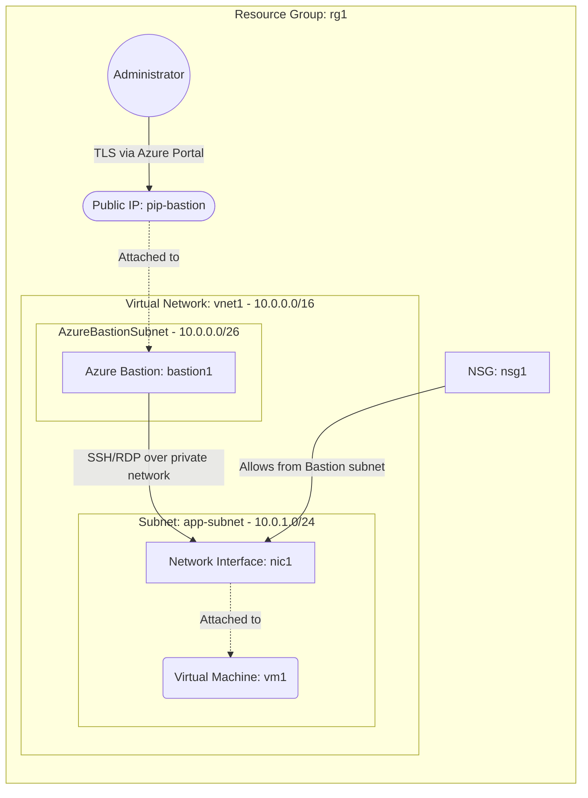

# Deploy a VM Accessible via Azure Bastion

This guide demonstrates how to use MechCloud's stateless Infrastructure-as-Code (IaC) to provision a Virtual Machine that is securely accessible via Azure Bastion, eliminating the need for a public IP on the VM or exposing SSH/RDP ports to the internet.

In this scenario, we deploy Azure Bastion in a dedicated subnet alongside a private VM. Azure Bastion provides secure RDP and SSH connectivity to your VM directly from the Azure portal over TLS, without any exposure of the VM to the public internet.

## Scenario Overview
**Use Case:** Secure remote administration of VMs in production or sensitive environments where exposing SSH/RDP ports to the internet is not acceptable, and a VPN is not available or desired.
**Key MechCloud Features Highlighted:**
- Default scope inheritance (`resource_group: rg1`)
- Cross-resource referencing (`ref:`)
- Dedicated AzureBastionSubnet (required naming convention)

### Architecture Diagram



***

## Step 1: Setting up the VNet with Bastion Subnet

Azure Bastion requires a dedicated subnet named exactly `AzureBastionSubnet` with a minimum /26 prefix. We create the VNet with this subnet plus an application subnet for the VM.

```yaml
defaults:
  resource_group: rg1

resources:
  # 1. VNet with AzureBastionSubnet and app subnet
  - type: "Microsoft.Network/virtualNetworks"
    api_version: "2025-05-01"
    name: vnet1
    props:
      address_space:
        address_prefixes:
          - "10.0.0.0/16"
      subnets:
        - name: AzureBastionSubnet
          props:
            address_prefixes:
              - "10.0.0.0/26"
        - name: app-subnet
          props:
            address_prefixes:
              - "10.0.1.0/24"
```

## Step 2: Creating the NSG and Public IP for Bastion

We create an NSG for the VM that allows SSH only from the Bastion subnet, and a Public IP required by the Bastion resource.

```yaml
# ... (Continuing at the resources block) ...
  # 2. NSG allowing SSH from Bastion subnet only
  - type: "Microsoft.Network/networkSecurityGroups"
    api_version: "2025-05-01"
    name: nsg1
    props:
      security_rules:
        - name: allow-ssh-from-bastion
          props:
            priority: 100
            direction: Inbound
            access: Allow
            protocol: Tcp
            source_port_range: "*"
            destination_port_range: "22"
            source_address_prefix: "10.0.0.0/26"
            destination_address_prefix: "*"
        - name: deny-all-inbound
          props:
            priority: 4096
            direction: Inbound
            access: Deny
            protocol: "*"
            source_port_range: "*"
            destination_port_range: "*"
            source_address_prefix: "*"
            destination_address_prefix: "*"

  # 3. Public IP for Bastion (must be Standard SKU, Static)
  - type: "Microsoft.Network/publicIPAddresses"
    api_version: "2025-05-01"
    name: pip-bastion
    props:
      public_ip_allocation_method: Static
      sku:
        name: Standard
```

## Step 3: Deploying Azure Bastion

We provision the Azure Bastion resource in the dedicated AzureBastionSubnet with the public IP attached.

```yaml
# ... (Continuing at the resources block) ...
  # 4. Azure Bastion Host
  - type: "Microsoft.Network/bastionHosts"
    api_version: "2025-05-01"
    name: bastion1
    props:
      sku:
        name: Basic
      ip_configurations:
        - name: bastion-ipconfig
          props:
            subnet:
              id: "ref:vnet1/subnets/AzureBastionSubnet"
            public_ip_address:
              id: "ref:pip-bastion"
```

## Step 4: Creating the Private VM

We create a NIC with private IP only and provision the VM. No public IP is needed since access is through Bastion.

```yaml
# ... (Continuing at the resources block) ...
  # 5. Network Interface (private only)
  - type: "Microsoft.Network/networkInterfaces"
    api_version: "2025-05-01"
    name: nic1
    props:
      network_security_group:
        id: "ref:nsg1"
      ip_configurations:
        - name: ipconfig1
          props:
            subnet:
              id: "ref:vnet1/subnets/app-subnet"
            private_ip_allocation_method: Dynamic

  # 6. Virtual Machine
  - type: "Microsoft.Compute/virtualMachines"
    api_version: "2025-04-01"
    name: vm1
    props:
      hardware_profile:
        vm_size: Standard_B2pts_v2
      os_profile:
        computer_name: bastionvm
        admin_username: azureuser
        admin_password: P@ssw0rd1234!
      network_profile:
        network_interfaces:
          - id: "ref:nic1"
      storage_profile:
        image_reference:
          publisher: Canonical
          offer: ubuntu-24_04-lts
          sku: server-arm64
          version: latest
        os_disk:
          create_option: FromImage
          managed_disk:
            storage_account_type: StandardSSD_LRS
```

### Complete Unified Template

For your convenience, here is the complete, unified MechCloud template combining all steps:

```yaml
defaults:
  resource_group: rg1
resources:
  - type: "Microsoft.Network/virtualNetworks"
    api_version: "2025-05-01"
    name: vnet1
    props:
      address_space:
        address_prefixes:
          - "10.0.0.0/16"
      subnets:
        - name: AzureBastionSubnet
          props:
            address_prefixes:
              - "10.0.0.0/26"
        - name: app-subnet
          props:
            address_prefixes:
              - "10.0.1.0/24"

  - type: "Microsoft.Network/networkSecurityGroups"
    api_version: "2025-05-01"
    name: nsg1
    props:
      security_rules:
        - name: allow-ssh-from-bastion
          props:
            priority: 100
            direction: Inbound
            access: Allow
            protocol: Tcp
            source_port_range: "*"
            destination_port_range: "22"
            source_address_prefix: "10.0.0.0/26"
            destination_address_prefix: "*"
        - name: deny-all-inbound
          props:
            priority: 4096
            direction: Inbound
            access: Deny
            protocol: "*"
            source_port_range: "*"
            destination_port_range: "*"
            source_address_prefix: "*"
            destination_address_prefix: "*"

  - type: "Microsoft.Network/publicIPAddresses"
    api_version: "2025-05-01"
    name: pip-bastion
    props:
      public_ip_allocation_method: Static
      sku:
        name: Standard

  - type: "Microsoft.Network/bastionHosts"
    api_version: "2025-05-01"
    name: bastion1
    props:
      sku:
        name: Basic
      ip_configurations:
        - name: bastion-ipconfig
          props:
            subnet:
              id: "ref:vnet1/subnets/AzureBastionSubnet"
            public_ip_address:
              id: "ref:pip-bastion"

  - type: "Microsoft.Network/networkInterfaces"
    api_version: "2025-05-01"
    name: nic1
    props:
      network_security_group:
        id: "ref:nsg1"
      ip_configurations:
        - name: ipconfig1
          props:
            subnet:
              id: "ref:vnet1/subnets/app-subnet"
            private_ip_allocation_method: Dynamic

  - type: "Microsoft.Compute/virtualMachines"
    api_version: "2025-04-01"
    name: vm1
    props:
      hardware_profile:
        vm_size: Standard_B2pts_v2
      os_profile:
        computer_name: bastionvm
        admin_username: azureuser
        admin_password: P@ssw0rd1234!
      network_profile:
        network_interfaces:
          - id: "ref:nic1"
      storage_profile:
        image_reference:
          publisher: Canonical
          offer: ubuntu-24_04-lts
          sku: server-arm64
          version: latest
        os_disk:
          create_option: FromImage
          managed_disk:
            storage_account_type: StandardSSD_LRS
```
