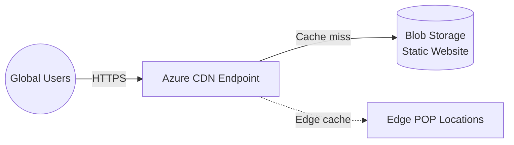

# Deploy Azure CDN with Static Website on Blob Storage on Azure

This guide demonstrates how to use MechCloud's stateless IaC to provision Azure CDN with a Storage Account static website for globally distributed content delivery.

## Scenario Overview
**Use Case:** Hosting a static website (SPA, documentation, marketing site) on Blob Storage with Azure CDN for global edge caching — the most cost-effective way to serve static content with sub-100ms latency worldwide.
**Key MechCloud Features Highlighted:**
- Hierarchical resource nesting (Resource Group → Storage → CDN)
- Cross-resource referencing (`ref:`)
- CDN profile and endpoint configuration as clean YAML

### Architecture Diagram



***

### Complete Unified Template

```yaml
resources:
  - type: Microsoft.Resources/resourceGroups
    name: rg1
    location: "{{CURRENT_REGION}}"
    resources:
      - type: Microsoft.Storage/storageAccounts
        name: mcstaticstorage1
        props:
          kind: StorageV2
          sku:
            name: Standard_LRS
          properties:
            supportsHttpsTrafficOnly: true
            minimumTlsVersion: TLS1_2
            allowBlobPublicAccess: true
          resources:
            - type: Microsoft.Storage/storageAccounts/blobServices
              name: default
              props:
                properties:
                  staticWebsite:
                    enabled: true
                    indexDocument: index.html
                    errorDocument404Path: 404.html

      - type: Microsoft.Cdn/profiles
        name: cdn-profile
        props:
          sku:
            name: Standard_Microsoft
          resources:
            - type: Microsoft.Cdn/profiles/endpoints
              name: mc-static-cdn
              props:
                properties:
                  isHttpAllowed: false
                  isHttpsAllowed: true
                  isCompressionEnabled: true
                  contentTypesToCompress:
                    - "text/html"
                    - "text/css"
                    - "application/javascript"
                    - "application/json"
                    - "image/svg+xml"
                  originHostHeader: "ref:rg1/mcstaticstorage1.primaryEndpoints.web"
                  origins:
                    - name: storage-origin
                      properties:
                        hostName: "ref:rg1/mcstaticstorage1.primaryEndpoints.web"
                        httpsPort: 443
                  deliveryPolicy:
                    rules:
                      - name: EnforceHTTPS
                        order: 1
                        conditions:
                          - name: RequestScheme
                            parameters:
                              matchValues:
                                - HTTP
                              operator: Equal
                        actions:
                          - name: UrlRedirect
                            parameters:
                              redirectType: PermanentRedirect
                              destinationProtocol: Https
```
