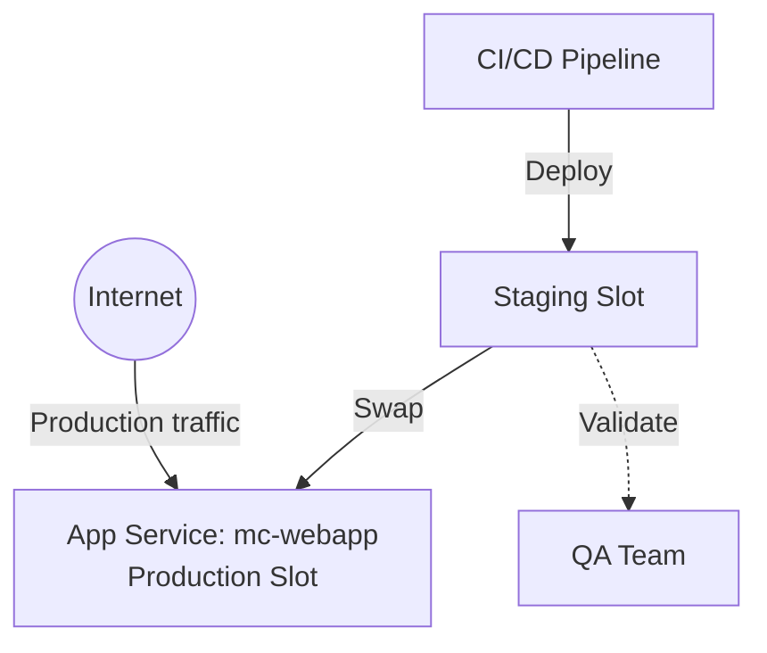

# Deploy App Service with Deployment Slots for Zero-Downtime Deployments on Azure

This guide demonstrates how to use MechCloud's stateless IaC to provision an App Service with staging deployment slots for blue-green deployments and zero-downtime releases.

## Scenario Overview
**Use Case:** Zero-downtime deployments using staging slots — deploy to a staging slot, validate, then swap to production instantly. If issues occur, swap back in seconds. Eliminates deployment windows and reduces risk.
**Key MechCloud Features Highlighted:**
- Hierarchical resource nesting (Resource Group → App Service Plan → Web App → Slots)
- Cross-resource referencing (`ref:`)
- Slot-specific app settings

### Architecture Diagram



***

### Complete Unified Template

```yaml
resources:
  - type: Microsoft.Resources/resourceGroups
    name: rg1
    location: "{{CURRENT_REGION}}"
    resources:
      - type: Microsoft.Insights/components
        name: insights1
        props:
          kind: web
          properties:
            Application_Type: web

      - type: Microsoft.Web/serverfarms
        name: plan1
        props:
          sku:
            name: S1
            tier: Standard
          properties:
            reserved: true

      - type: Microsoft.Web/sites
        name: mc-webapp
        props:
          kind: app,linux
          properties:
            serverFarmId: "ref:rg1/plan1"
            httpsOnly: true
            siteConfig:
              linuxFxVersion: "NODE|20-lts"
              alwaysOn: true
              appSettings:
                - name: APPINSIGHTS_INSTRUMENTATIONKEY
                  value: "ref:rg1/insights1.instrumentationKey"
                - name: ENVIRONMENT
                  value: production
                  slotSetting: true
          resources:
            - type: Microsoft.Web/sites/slots
              name: staging
              props:
                properties:
                  serverFarmId: "ref:rg1/plan1"
                  httpsOnly: true
                  siteConfig:
                    linuxFxVersion: "NODE|20-lts"
                    alwaysOn: true
                    appSettings:
                      - name: APPINSIGHTS_INSTRUMENTATIONKEY
                        value: "ref:rg1/insights1.instrumentationKey"
                      - name: ENVIRONMENT
                        value: staging
                        slotSetting: true
            - type: Microsoft.Web/sites/slots
              name: canary
              props:
                properties:
                  serverFarmId: "ref:rg1/plan1"
                  httpsOnly: true
                  siteConfig:
                    linuxFxVersion: "NODE|20-lts"
                    appSettings:
                      - name: ENVIRONMENT
                        value: canary
                        slotSetting: true
```
