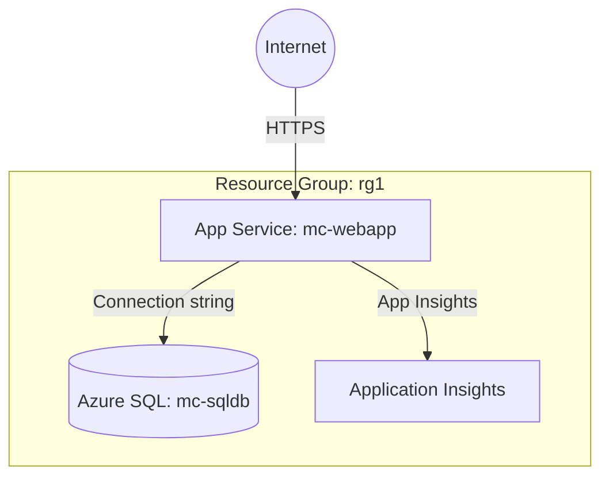

# Deploy an App Service with Azure SQL Backend on Azure

This guide demonstrates how to use MechCloud's stateless IaC to provision an Azure App Service (Web App) connected to an Azure SQL Database for a fully managed web application stack.

## Scenario Overview
**Use Case:** A fully managed web application platform with a managed SQL database backend — ideal for .NET, Java, Python, or Node.js applications that need automatic scaling, deployment slots, and integrated CI/CD without managing any infrastructure.
**Key MechCloud Features Highlighted:**
- Hierarchical resource nesting (Resource Group → App Service Plan → Web App)
- Cross-resource referencing (`ref:`)
- Connection string and app settings as clean YAML

### Architecture Diagram



***

### Complete Unified Template

```yaml
resources:
  - type: Microsoft.Resources/resourceGroups
    name: rg1
    location: "{{CURRENT_REGION}}"
    resources:
      - type: Microsoft.Insights/components
        name: insights1
        props:
          kind: web
          properties:
            Application_Type: web
            RetentionInDays: 30

      - type: Microsoft.Sql/servers
        name: mc-sql-srv
        props:
          properties:
            administratorLogin: sqladmin
            administratorLoginPassword: "ChangeMe123!"
            version: "12.0"
            minimalTlsVersion: "1.2"
          resources:
            - type: Microsoft.Sql/servers/firewallRules
              name: allow-azure-services
              props:
                properties:
                  startIpAddress: "0.0.0.0"
                  endIpAddress: "0.0.0.0"
            - type: Microsoft.Sql/servers/databases
              name: mc-sqldb
              props:
                sku:
                  name: S1
                  tier: Standard
                properties:
                  collation: SQL_Latin1_General_CP1_CI_AS
                  maxSizeBytes: 2147483648

      - type: Microsoft.Web/serverfarms
        name: plan1
        props:
          sku:
            name: P1v3
            tier: PremiumV3
          properties:
            reserved: true

      - type: Microsoft.Web/sites
        name: mc-webapp
        props:
          kind: app,linux
          properties:
            serverFarmId: "ref:rg1/plan1"
            httpsOnly: true
            siteConfig:
              linuxFxVersion: "DOTNETCORE|8.0"
              alwaysOn: true
              minTlsVersion: "1.2"
              appSettings:
                - name: APPINSIGHTS_INSTRUMENTATIONKEY
                  value: "ref:rg1/insights1.instrumentationKey"
                - name: ApplicationInsightsAgent_EXTENSION_VERSION
                  value: "~3"
              connectionStrings:
                - name: DefaultConnection
                  connectionString: "Server=ref:rg1/mc-sql-srv.fullyQualifiedDomainName;Database=mc-sqldb;User Id=sqladmin;Password=ChangeMe123!"
                  type: SQLAzure
```
