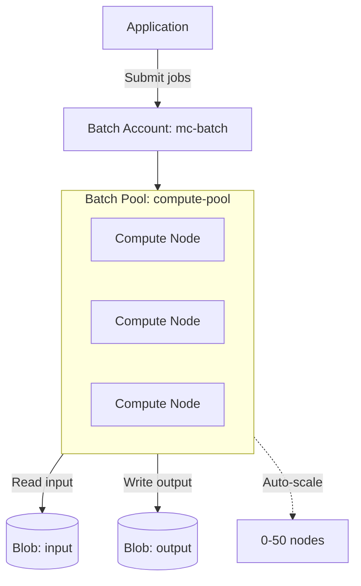

# Deploy Azure Batch Account for Large-Scale Parallel Computing on Azure

This guide demonstrates how to use MechCloud's stateless IaC to provision an Azure Batch account with pools for running large-scale parallel and HPC workloads.

## Scenario Overview
**Use Case:** Large-scale parallel computing for batch processing, rendering, simulations, or data transformation — Azure Batch automatically manages VM provisioning, scaling, and job scheduling, eliminating the need to build custom compute infrastructure.
**Key MechCloud Features Highlighted:**
- Hierarchical resource nesting (Resource Group → Batch Account → Pool)
- Cross-resource referencing (`ref:`)
- Pool and autoscale configuration as clean YAML

### Architecture Diagram



***

### Complete Unified Template

```yaml
resources:
  - type: Microsoft.Resources/resourceGroups
    name: rg1
    location: "{{CURRENT_REGION}}"
    resources:
      - type: Microsoft.Storage/storageAccounts
        name: mcbatchstorage1
        props:
          kind: StorageV2
          sku:
            name: Standard_LRS
          properties:
            supportsHttpsTrafficOnly: true
          resources:
            - type: Microsoft.Storage/storageAccounts/blobServices
              name: default
              resources:
                - type: Microsoft.Storage/storageAccounts/blobServices/containers
                  name: input
                  props:
                    properties:
                      publicAccess: None
                - type: Microsoft.Storage/storageAccounts/blobServices/containers
                  name: output
                  props:
                    properties:
                      publicAccess: None

      - type: Microsoft.Batch/batchAccounts
        name: mc-batch
        props:
          properties:
            autoStorage:
              storageAccountId: "ref:rg1/mcbatchstorage1"
            poolAllocationMode: BatchService
            publicNetworkAccess: Enabled
          resources:
            - type: Microsoft.Batch/batchAccounts/pools
              name: compute-pool
              props:
                properties:
                  vmSize: Standard_D4ps_v5
                  deploymentConfiguration:
                    virtualMachineConfiguration:
                      imageReference:
                        publisher: Canonical
                        offer: ubuntu-24_04-lts
                        sku: server-arm64
                        version: latest
                      nodeAgentSkuId: "batch.node.ubuntu 24.04"
                  scaleSettings:
                    autoScale:
                      evaluationInterval: PT5M
                      formula: |
                        startingNumberOfVMs = 0;
                        maxNumberofVMs = 50;
                        pendingTaskSamplePercent = $PendingTasks.GetSamplePercent(180 * TimeInterval_Second);
                        pendingTaskSamples = pendingTaskSamplePercent < 70 ? startingNumberOfVMs : avg($PendingTasks.GetSample(180 * TimeInterval_Second));
                        $TargetDedicatedNodes = min(maxNumberofVMs, pendingTaskSamples);
                  taskSlotsPerNode: 4
                  taskSchedulingPolicy:
                    nodeFillType: Pack
                  startTask:
                    commandLine: "/bin/bash -c 'apt-get update && apt-get install -y python3-pip'"
                    waitForSuccess: true
                    userIdentity:
                      autoUser:
                        scope: Pool
                        elevationLevel: Admin
```
