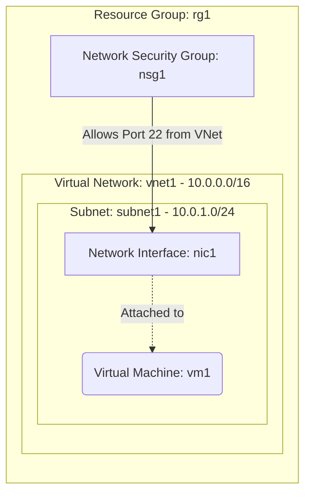

# Deploy a Private Virtual Machine without a Public IP on Azure

This guide demonstrates how to use MechCloud's stateless Infrastructure-as-Code (IaC) to provision a private Virtual Machine on Azure that has no direct internet exposure. 

In this scenario, we will provision a VM inside a Virtual Network (VNet) with only a private IP address. SSH access is restricted to a specific IP range through a Network Security Group. This is a common pattern for backend services, databases, or internal microservices that should not be directly reachable from the public internet.

## Scenario Overview
**Use Case:** Deploying an internal backend service, database server, or worker node that should only be accessible from within the VNet or via a VPN/Bastion host.
**Key MechCloud Features Highlighted:**
- Default scope inheritance (`resource_group: rg1`)
- Dynamic macros (`{{CURRENT_IP}}`)
- Cross-resource referencing (`ref:`)

### Architecture Diagram



***

## Step 1: Setting up Networking and Security

We start by creating a Virtual Network with a single subnet. The Network Security Group only allows SSH access from within the VNet address space, keeping the VM completely private.

```yaml
defaults:
  resource_group: rg1

resources:
  # 1. Define the Virtual Network and Subnet
  - type: "Microsoft.Network/virtualNetworks"
    api_version: "2025-05-01"
    name: vnet1
    props:
      address_space:
        address_prefixes:
          - "10.0.0.0/16"
      subnets:
        - name: subnet1
          props:
            address_prefixes:
              - "10.0.1.0/24"

  # 2. Security Group for internal SSH access only
  - type: "Microsoft.Network/networkSecurityGroups"
    api_version: "2025-05-01"
    name: nsg1
    props:
      security_rules:
        - name: allow-ssh-from-vnet
          props:
            priority: 100
            direction: Inbound
            access: Allow
            protocol: Tcp
            source_port_range: "*"
            destination_port_range: "22"
            source_address_prefix: "10.0.0.0/16"
            destination_address_prefix: "*"
        - name: deny-all-inbound
          props:
            priority: 4096
            direction: Inbound
            access: Deny
            protocol: "*"
            source_port_range: "*"
            destination_port_range: "*"
            source_address_prefix: "*"
            destination_address_prefix: "*"
```

## Step 2: Creating a Network Interface (Private IP Only)

Unlike the public-facing scenario, this Network Interface has no Public IP attached. The VM will only receive a private IP address from the subnet's address range.

```yaml
# ... (Continuing at the resources block) ...
  # 3. Create the Network Interface with private IP only
  - type: "Microsoft.Network/networkInterfaces"
    api_version: "2025-05-01"
    name: nic1
    props:
      network_security_group:
        id: "ref:nsg1"
      ip_configurations:
        - name: ipconfig1
          props:
            subnet:
              id: "ref:vnet1/subnets/subnet1"
            private_ip_allocation_method: Dynamic
```

## Step 3: Provisioning the VM

With the private networking in place, we provision an Ubuntu VM attached to the private-only NIC. This VM will have no public internet access unless a NAT Gateway, Azure Firewall, or VPN is configured separately.

```yaml
# ... (Continuing at the resources block) ...
  # 4. Create the Virtual Machine
  - type: "Microsoft.Compute/virtualMachines"
    api_version: "2025-04-01"
    name: vm1
    props:
      hardware_profile:
        vm_size: Standard_B2pts_v2
      os_profile:
        computer_name: privatevm
        admin_username: azureuser
        admin_password: P@ssw0rd1234!
      network_profile:
        network_interfaces:
          - id: "ref:nic1"
      storage_profile:
        image_reference:
          publisher: Canonical
          offer: ubuntu-24_04-lts
          sku: server-arm64
          version: latest
        os_disk:
          create_option: FromImage
          managed_disk:
            storage_account_type: StandardSSD_LRS
```

### Complete Unified Template

For your convenience, here is the complete, unified MechCloud template combining all three steps:

```yaml
defaults:
  resource_group: rg1
resources:
  - type: "Microsoft.Network/virtualNetworks"
    api_version: "2025-05-01"
    name: vnet1
    props:
      address_space:
        address_prefixes:
          - "10.0.0.0/16"
      subnets:
        - name: subnet1
          props:
            address_prefixes:
              - "10.0.1.0/24"

  - type: "Microsoft.Network/networkSecurityGroups"
    api_version: "2025-05-01"
    name: nsg1
    props:
      security_rules:
        - name: allow-ssh-from-vnet
          props:
            priority: 100
            direction: Inbound
            access: Allow
            protocol: Tcp
            source_port_range: "*"
            destination_port_range: "22"
            source_address_prefix: "10.0.0.0/16"
            destination_address_prefix: "*"
        - name: deny-all-inbound
          props:
            priority: 4096
            direction: Inbound
            access: Deny
            protocol: "*"
            source_port_range: "*"
            destination_port_range: "*"
            source_address_prefix: "*"
            destination_address_prefix: "*"

  - type: "Microsoft.Network/networkInterfaces"
    api_version: "2025-05-01"
    name: nic1
    props:
      network_security_group:
        id: "ref:nsg1"
      ip_configurations:
        - name: ipconfig1
          props:
            subnet:
              id: "ref:vnet1/subnets/subnet1"
            private_ip_allocation_method: Dynamic

  - type: "Microsoft.Compute/virtualMachines"
    api_version: "2025-04-01"
    name: vm1
    props:
      hardware_profile:
        vm_size: Standard_B2pts_v2
      os_profile:
        computer_name: privatevm
        admin_username: azureuser
        admin_password: P@ssw0rd1234!
      network_profile:
        network_interfaces:
          - id: "ref:nic1"
      storage_profile:
        image_reference:
          publisher: Canonical
          offer: ubuntu-24_04-lts
          sku: server-arm64
          version: latest
        os_disk:
          create_option: FromImage
          managed_disk:
            storage_account_type: StandardSSD_LRS
```
