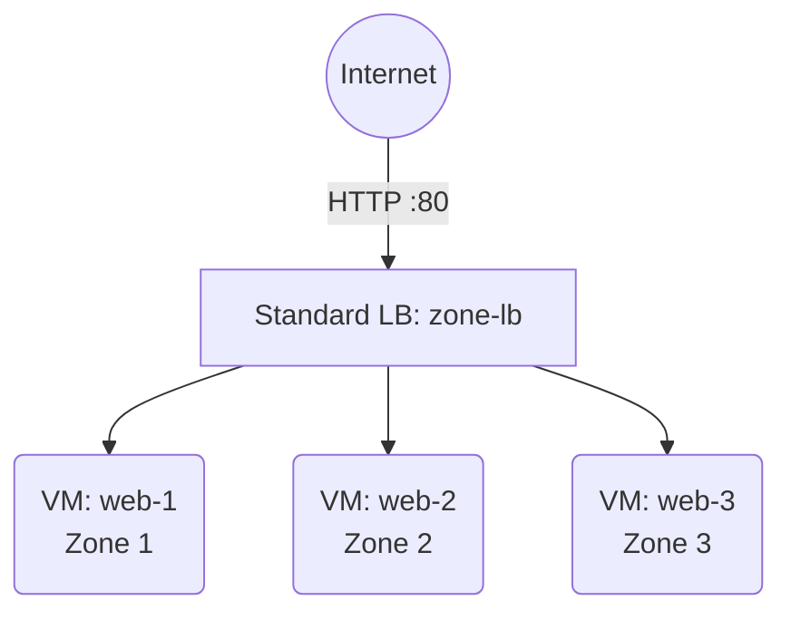

# Deploy VMs Across Availability Zones on Azure

This guide demonstrates how to use MechCloud's stateless IaC to provision VMs across multiple availability zones for high availability with a zone-redundant load balancer.

## Scenario Overview
**Use Case:** A highly available application deployed across three availability zones within a region — ensuring 99.99% uptime SLA by protecting against datacenter-level failures with a zone-redundant Standard Load Balancer.
**Key MechCloud Features Highlighted:**
- Hierarchical resource nesting (Resource Group → VNet → VMs)
- Cross-resource referencing (`ref:`)
- Multi-zone deployment in a single template

### Architecture Diagram



***

### Complete Unified Template

```yaml
resources:
  - type: Microsoft.Resources/resourceGroups
    name: rg1
    location: "{{CURRENT_REGION}}"
    resources:
      - type: Microsoft.Network/virtualNetworks
        name: vnet1
        props:
          properties:
            addressSpace:
              addressPrefixes:
                - "10.0.0.0/16"
          resources:
            - type: Microsoft.Network/virtualNetworks/subnets
              name: subnet1
              props:
                properties:
                  addressPrefix: "10.0.1.0/24"

      - type: Microsoft.Network/networkSecurityGroups
        name: nsg1
        props:
          properties:
            securityRules:
              - name: allow-http
                properties:
                  priority: 100
                  direction: Inbound
                  access: Allow
                  protocol: Tcp
                  sourceAddressPrefix: "*"
                  sourcePortRange: "*"
                  destinationAddressPrefix: "*"
                  destinationPortRange: "80"

      - type: Microsoft.Network/publicIPAddresses
        name: lb-pip
        props:
          sku:
            name: Standard
          zones:
            - "1"
            - "2"
            - "3"
          properties:
            publicIPAllocationMethod: Static

      - type: Microsoft.Network/loadBalancers
        name: zone-lb
        props:
          sku:
            name: Standard
          properties:
            frontendIPConfigurations:
              - name: frontend
                properties:
                  publicIPAddress:
                    id: "ref:rg1/lb-pip"
            backendAddressPools:
              - name: backend-pool
            probes:
              - name: http-probe
                properties:
                  protocol: Http
                  port: 80
                  requestPath: "/"
                  intervalInSeconds: 15
            loadBalancingRules:
              - name: http-rule
                properties:
                  frontendIPConfiguration:
                    id: "ref:rg1/zone-lb.frontendIPConfigurations[0]"
                  backendAddressPool:
                    id: "ref:rg1/zone-lb.backendAddressPools[0]"
                  probe:
                    id: "ref:rg1/zone-lb.probes[0]"
                  protocol: Tcp
                  frontendPort: 80
                  backendPort: 80

      - type: Microsoft.Network/networkInterfaces
        name: nic1
        props:
          properties:
            ipConfigurations:
              - name: ipconfig1
                properties:
                  subnet:
                    id: "ref:rg1/vnet1/subnet1"
                  loadBalancerBackendAddressPools:
                    - id: "ref:rg1/zone-lb.backendAddressPools[0]"
            networkSecurityGroup:
              id: "ref:rg1/nsg1"

      - type: Microsoft.Network/networkInterfaces
        name: nic2
        props:
          properties:
            ipConfigurations:
              - name: ipconfig1
                properties:
                  subnet:
                    id: "ref:rg1/vnet1/subnet1"
                  loadBalancerBackendAddressPools:
                    - id: "ref:rg1/zone-lb.backendAddressPools[0]"
            networkSecurityGroup:
              id: "ref:rg1/nsg1"

      - type: Microsoft.Network/networkInterfaces
        name: nic3
        props:
          properties:
            ipConfigurations:
              - name: ipconfig1
                properties:
                  subnet:
                    id: "ref:rg1/vnet1/subnet1"
                  loadBalancerBackendAddressPools:
                    - id: "ref:rg1/zone-lb.backendAddressPools[0]"
            networkSecurityGroup:
              id: "ref:rg1/nsg1"

      - type: Microsoft.Compute/virtualMachines
        name: web-1
        zones:
          - "1"
        props:
          properties:
            hardwareProfile:
              vmSize: Standard_B2ps_v2
            osProfile:
              computerName: web-1
              adminUsername: azureuser
              linuxConfiguration:
                disablePasswordAuthentication: true
                ssh:
                  publicKeys:
                    - path: /home/azureuser/.ssh/authorized_keys
                      keyData: "ssh-rsa AAAA...your-key"
            storageProfile:
              imageReference:
                publisher: Canonical
                offer: ubuntu-24_04-lts
                sku: server-arm64
                version: latest
              osDisk:
                createOption: FromImage
                managedDisk:
                  storageAccountType: Premium_LRS
            networkProfile:
              networkInterfaces:
                - id: "ref:rg1/nic1"

      - type: Microsoft.Compute/virtualMachines
        name: web-2
        zones:
          - "2"
        props:
          properties:
            hardwareProfile:
              vmSize: Standard_B2ps_v2
            osProfile:
              computerName: web-2
              adminUsername: azureuser
              linuxConfiguration:
                disablePasswordAuthentication: true
                ssh:
                  publicKeys:
                    - path: /home/azureuser/.ssh/authorized_keys
                      keyData: "ssh-rsa AAAA...your-key"
            storageProfile:
              imageReference:
                publisher: Canonical
                offer: ubuntu-24_04-lts
                sku: server-arm64
                version: latest
              osDisk:
                createOption: FromImage
                managedDisk:
                  storageAccountType: Premium_LRS
            networkProfile:
              networkInterfaces:
                - id: "ref:rg1/nic2"

      - type: Microsoft.Compute/virtualMachines
        name: web-3
        zones:
          - "3"
        props:
          properties:
            hardwareProfile:
              vmSize: Standard_B2ps_v2
            osProfile:
              computerName: web-3
              adminUsername: azureuser
              linuxConfiguration:
                disablePasswordAuthentication: true
                ssh:
                  publicKeys:
                    - path: /home/azureuser/.ssh/authorized_keys
                      keyData: "ssh-rsa AAAA...your-key"
            storageProfile:
              imageReference:
                publisher: Canonical
                offer: ubuntu-24_04-lts
                sku: server-arm64
                version: latest
              osDisk:
                createOption: FromImage
                managedDisk:
                  storageAccountType: Premium_LRS
            networkProfile:
              networkInterfaces:
                - id: "ref:rg1/nic3"
```
