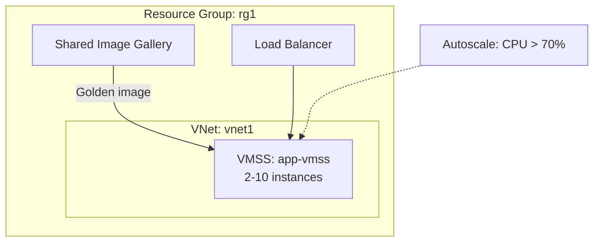

# Deploy a VM Scale Set with Custom Image on Azure

This guide demonstrates how to use MechCloud's stateless IaC to provision a VM Scale Set using a custom image from a Shared Image Gallery for consistent, pre-configured deployments.

## Scenario Overview
**Use Case:** Deploying a fleet of identical VMs from a golden image with pre-installed software, security hardening, and configuration — ensuring consistency across all instances and faster boot times compared to user-data scripts.
**Key MechCloud Features Highlighted:**
- Hierarchical resource nesting (Resource Group → VNet → VMSS)
- Cross-resource referencing (`ref:`)
- Scale set autoscale rules as nested YAML

### Architecture Diagram



***

### Complete Unified Template

```yaml
resources:
  - type: Microsoft.Resources/resourceGroups
    name: rg1
    location: "{{CURRENT_REGION}}"
    resources:
      - type: Microsoft.Network/virtualNetworks
        name: vnet1
        props:
          properties:
            addressSpace:
              addressPrefixes:
                - "10.0.0.0/16"
          resources:
            - type: Microsoft.Network/virtualNetworks/subnets
              name: vmss-subnet
              props:
                properties:
                  addressPrefix: "10.0.1.0/24"

      - type: Microsoft.Network/publicIPAddresses
        name: lb-pip
        props:
          sku:
            name: Standard
          properties:
            publicIPAllocationMethod: Static

      - type: Microsoft.Network/loadBalancers
        name: lb1
        props:
          sku:
            name: Standard
          properties:
            frontendIPConfigurations:
              - name: frontend
                properties:
                  publicIPAddress:
                    id: "ref:rg1/lb-pip"
            backendAddressPools:
              - name: backend-pool
            probes:
              - name: http-probe
                properties:
                  protocol: Http
                  port: 80
                  requestPath: "/health"
                  intervalInSeconds: 15
            loadBalancingRules:
              - name: http-rule
                properties:
                  frontendIPConfiguration:
                    id: "ref:rg1/lb1.frontendIPConfigurations[0]"
                  backendAddressPool:
                    id: "ref:rg1/lb1.backendAddressPools[0]"
                  probe:
                    id: "ref:rg1/lb1.probes[0]"
                  protocol: Tcp
                  frontendPort: 80
                  backendPort: 80

      - type: Microsoft.Compute/virtualMachineScaleSets
        name: app-vmss
        props:
          sku:
            name: Standard_B2ps_v2
            capacity: 2
          properties:
            upgradePolicy:
              mode: Rolling
              rollingUpgradePolicy:
                maxBatchInstancePercent: 20
                maxUnhealthyInstancePercent: 20
                pauseTimeBetweenBatches: PT5S
            virtualMachineProfile:
              osProfile:
                computerNamePrefix: mc-vm
                adminUsername: azureuser
                linuxConfiguration:
                  disablePasswordAuthentication: true
                  ssh:
                    publicKeys:
                      - path: /home/azureuser/.ssh/authorized_keys
                        keyData: "ssh-rsa AAAA...your-key"
              storageProfile:
                imageReference:
                  publisher: Canonical
                  offer: ubuntu-24_04-lts
                  sku: server-arm64
                  version: latest
                osDisk:
                  createOption: FromImage
                  managedDisk:
                    storageAccountType: Premium_LRS
              networkProfile:
                networkInterfaceConfigurations:
                  - name: nic-config
                    properties:
                      primary: true
                      ipConfigurations:
                        - name: ipconfig1
                          properties:
                            subnet:
                              id: "ref:rg1/vnet1/vmss-subnet"
                            loadBalancerBackendAddressPools:
                              - id: "ref:rg1/lb1.backendAddressPools[0]"

      - type: Microsoft.Insights/autoscaleSettings
        name: vmss-autoscale
        props:
          properties:
            enabled: true
            targetResourceUri: "ref:rg1/app-vmss"
            profiles:
              - name: default
                capacity:
                  minimum: "2"
                  maximum: "10"
                  default: "2"
                rules:
                  - metricTrigger:
                      metricName: Percentage CPU
                      metricResourceUri: "ref:rg1/app-vmss"
                      operator: GreaterThan
                      threshold: 70
                      timeAggregation: Average
                      timeGrain: PT1M
                      timeWindow: PT5M
                      statistic: Average
                    scaleAction:
                      direction: Increase
                      type: ChangeCount
                      value: "1"
                      cooldown: PT5M
                  - metricTrigger:
                      metricName: Percentage CPU
                      metricResourceUri: "ref:rg1/app-vmss"
                      operator: LessThan
                      threshold: 30
                      timeAggregation: Average
                      timeGrain: PT1M
                      timeWindow: PT5M
                      statistic: Average
                    scaleAction:
                      direction: Decrease
                      type: ChangeCount
                      value: "1"
                      cooldown: PT5M
```
