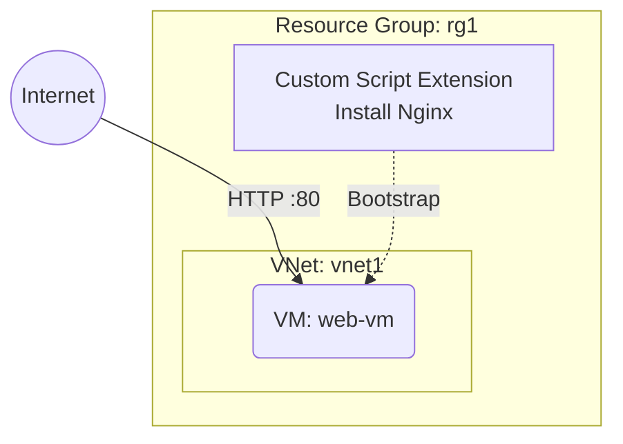

# Deploy a VM with Custom Script Extension on Azure

This guide demonstrates how to use MechCloud's stateless IaC to provision a VM with a Custom Script Extension that automatically installs and configures software at boot time.

## Scenario Overview
**Use Case:** Automating VM provisioning with custom software installation (Nginx, Docker, agents) — the Custom Script Extension downloads and runs scripts post-deployment, replacing manual SSH configuration steps.
**Key MechCloud Features Highlighted:**
- Hierarchical resource nesting (Resource Group → VNet → VM → Extension)
- Cross-resource referencing (`ref:`)
- Script configuration inline

### Architecture Diagram



***

### Complete Unified Template

```yaml
resources:
  - type: Microsoft.Resources/resourceGroups
    name: rg1
    location: "{{CURRENT_REGION}}"
    resources:
      - type: Microsoft.Network/virtualNetworks
        name: vnet1
        props:
          properties:
            addressSpace:
              addressPrefixes:
                - "10.0.0.0/16"
          resources:
            - type: Microsoft.Network/virtualNetworks/subnets
              name: subnet1
              props:
                properties:
                  addressPrefix: "10.0.1.0/24"

      - type: Microsoft.Network/networkSecurityGroups
        name: nsg1
        props:
          properties:
            securityRules:
              - name: allow-http
                properties:
                  priority: 100
                  direction: Inbound
                  access: Allow
                  protocol: Tcp
                  sourceAddressPrefix: "*"
                  sourcePortRange: "*"
                  destinationAddressPrefix: "*"
                  destinationPortRange: "80"
              - name: allow-ssh
                properties:
                  priority: 200
                  direction: Inbound
                  access: Allow
                  protocol: Tcp
                  sourceAddressPrefix: "{{CURRENT_IP}}/32"
                  sourcePortRange: "*"
                  destinationAddressPrefix: "*"
                  destinationPortRange: "22"

      - type: Microsoft.Network/publicIPAddresses
        name: pip1
        props:
          sku:
            name: Standard
          properties:
            publicIPAllocationMethod: Static

      - type: Microsoft.Network/networkInterfaces
        name: nic1
        props:
          properties:
            ipConfigurations:
              - name: ipconfig1
                properties:
                  subnet:
                    id: "ref:rg1/vnet1/subnet1"
                  privateIPAllocationMethod: Dynamic
                  publicIPAddress:
                    id: "ref:rg1/pip1"
            networkSecurityGroup:
              id: "ref:rg1/nsg1"

      - type: Microsoft.Compute/virtualMachines
        name: web-vm
        props:
          properties:
            hardwareProfile:
              vmSize: Standard_B2ps_v2
            osProfile:
              computerName: web-vm
              adminUsername: azureuser
              linuxConfiguration:
                disablePasswordAuthentication: true
                ssh:
                  publicKeys:
                    - path: /home/azureuser/.ssh/authorized_keys
                      keyData: "ssh-rsa AAAA...your-key"
            storageProfile:
              imageReference:
                publisher: Canonical
                offer: ubuntu-24_04-lts
                sku: server-arm64
                version: latest
              osDisk:
                createOption: FromImage
                managedDisk:
                  storageAccountType: Premium_LRS
            networkProfile:
              networkInterfaces:
                - id: "ref:rg1/nic1"
          resources:
            - type: Microsoft.Compute/virtualMachines/extensions
              name: install-nginx
              props:
                properties:
                  publisher: Microsoft.Azure.Extensions
                  type: CustomScript
                  typeHandlerVersion: "2.1"
                  autoUpgradeMinorVersion: true
                  settings:
                    commandToExecute: "apt-get update && apt-get install -y nginx && systemctl enable nginx && systemctl start nginx"
```
