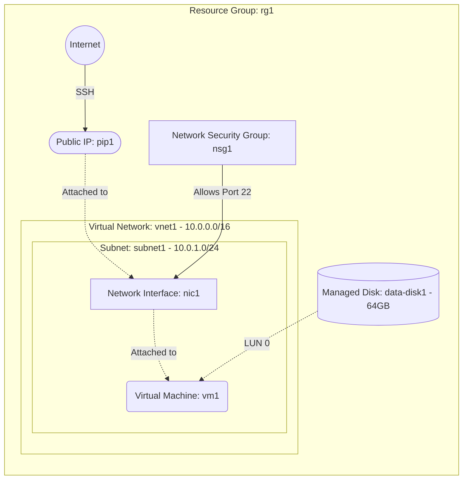

# Deploy a VM with an Additional Managed Data Disk on Azure

This guide demonstrates how to use MechCloud's stateless Infrastructure-as-Code (IaC) to provision a Virtual Machine with an additional managed data disk for persistent storage on Azure.

In this scenario, we will provision a VM with a separate managed data disk attached. This is a common pattern for database servers, file storage, or any workload where data persistence must be decoupled from the OS disk for better backup, snapshot, and lifecycle management.

## Scenario Overview
**Use Case:** Running a database server or file storage system where application data is stored on a separate managed disk, enabling independent snapshots, backups, and disk resizing without affecting the OS.
**Key MechCloud Features Highlighted:**
- Default scope inheritance (`resource_group: rg1`)
- Dynamic macros (`{{CURRENT_IP}}`)
- Cross-resource referencing (`ref:`)
- Managed disk as a standalone resource attached to a VM

### Architecture Diagram



***

## Step 1: Setting up Networking and Security

We create a VNet, subnet, and NSG with SSH access restricted to your current IP.

```yaml
defaults:
  resource_group: rg1

resources:
  # 1. Define the Virtual Network and Subnet
  - type: "Microsoft.Network/virtualNetworks"
    api_version: "2025-05-01"
    name: vnet1
    props:
      address_space:
        address_prefixes:
          - "10.0.0.0/16"
      subnets:
        - name: subnet1
          props:
            address_prefixes:
              - "10.0.1.0/24"

  # 2. Security Group for SSH access
  - type: "Microsoft.Network/networkSecurityGroups"
    api_version: "2025-05-01"
    name: nsg1
    props:
      security_rules:
        - name: allow-ssh
          props:
            priority: 100
            direction: Inbound
            access: Allow
            protocol: Tcp
            source_port_range: "*"
            destination_port_range: "22"
            source_address_prefix: "{{CURRENT_IP}}/32"
            destination_address_prefix: "*"
```

## Step 2: Creating Public IP, NIC, and Managed Disk

We allocate a Public IP, create a NIC, and provision a standalone 64GB Premium SSD managed disk.

```yaml
# ... (Continuing at the resources block) ...
  # 3. Public IP
  - type: "Microsoft.Network/publicIPAddresses"
    api_version: "2025-05-01"
    name: pip1
    props:
      public_ip_allocation_method: Static
      sku:
        name: Standard

  # 4. Network Interface
  - type: "Microsoft.Network/networkInterfaces"
    api_version: "2025-05-01"
    name: nic1
    props:
      network_security_group:
        id: "ref:nsg1"
      ip_configurations:
        - name: ipconfig1
          props:
            subnet:
              id: "ref:vnet1/subnets/subnet1"
            private_ip_allocation_method: Dynamic
            public_ip_address:
              id: "ref:pip1"

  # 5. Managed Data Disk
  - type: "Microsoft.Compute/disks"
    api_version: "2025-04-01"
    name: data-disk1
    props:
      sku:
        name: Premium_LRS
      creation_data:
        create_option: Empty
      disk_size_gb: 64
```

## Step 3: Provisioning the VM with Data Disk Attached

We create the VM and attach both the OS disk and the additional managed data disk at LUN 0.

```yaml
# ... (Continuing at the resources block) ...
  # 6. Virtual Machine with data disk
  - type: "Microsoft.Compute/virtualMachines"
    api_version: "2025-04-01"
    name: vm1
    props:
      hardware_profile:
        vm_size: Standard_B2pts_v2
      os_profile:
        computer_name: datavm
        admin_username: azureuser
        admin_password: P@ssw0rd1234!
      network_profile:
        network_interfaces:
          - id: "ref:nic1"
      storage_profile:
        image_reference:
          publisher: Canonical
          offer: ubuntu-24_04-lts
          sku: server-arm64
          version: latest
        os_disk:
          create_option: FromImage
          managed_disk:
            storage_account_type: StandardSSD_LRS
        data_disks:
          - lun: 0
            create_option: Attach
            managed_disk:
              id: "ref:data-disk1"
```

### Complete Unified Template

For your convenience, here is the complete, unified MechCloud template combining all steps:

```yaml
defaults:
  resource_group: rg1
resources:
  - type: "Microsoft.Network/virtualNetworks"
    api_version: "2025-05-01"
    name: vnet1
    props:
      address_space:
        address_prefixes:
          - "10.0.0.0/16"
      subnets:
        - name: subnet1
          props:
            address_prefixes:
              - "10.0.1.0/24"

  - type: "Microsoft.Network/networkSecurityGroups"
    api_version: "2025-05-01"
    name: nsg1
    props:
      security_rules:
        - name: allow-ssh
          props:
            priority: 100
            direction: Inbound
            access: Allow
            protocol: Tcp
            source_port_range: "*"
            destination_port_range: "22"
            source_address_prefix: "{{CURRENT_IP}}/32"
            destination_address_prefix: "*"

  - type: "Microsoft.Network/publicIPAddresses"
    api_version: "2025-05-01"
    name: pip1
    props:
      public_ip_allocation_method: Static
      sku:
        name: Standard

  - type: "Microsoft.Network/networkInterfaces"
    api_version: "2025-05-01"
    name: nic1
    props:
      network_security_group:
        id: "ref:nsg1"
      ip_configurations:
        - name: ipconfig1
          props:
            subnet:
              id: "ref:vnet1/subnets/subnet1"
            private_ip_allocation_method: Dynamic
            public_ip_address:
              id: "ref:pip1"

  - type: "Microsoft.Compute/disks"
    api_version: "2025-04-01"
    name: data-disk1
    props:
      sku:
        name: Premium_LRS
      creation_data:
        create_option: Empty
      disk_size_gb: 64

  - type: "Microsoft.Compute/virtualMachines"
    api_version: "2025-04-01"
    name: vm1
    props:
      hardware_profile:
        vm_size: Standard_B2pts_v2
      os_profile:
        computer_name: datavm
        admin_username: azureuser
        admin_password: P@ssw0rd1234!
      network_profile:
        network_interfaces:
          - id: "ref:nic1"
      storage_profile:
        image_reference:
          publisher: Canonical
          offer: ubuntu-24_04-lts
          sku: server-arm64
          version: latest
        os_disk:
          create_option: FromImage
          managed_disk:
            storage_account_type: StandardSSD_LRS
        data_disks:
          - lun: 0
            create_option: Attach
            managed_disk:
              id: "ref:data-disk1"
```
