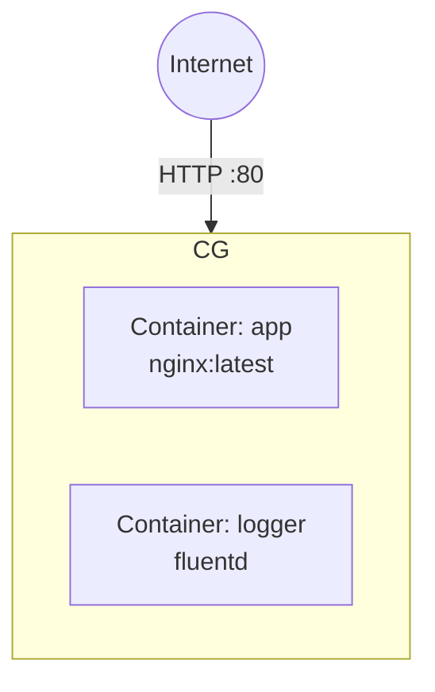

# Deploy Azure Container Instances (ACI) Container Group on Azure

This guide demonstrates how to use MechCloud's stateless IaC to provision an Azure Container Instances group for running serverless containers without managing VMs.

## Scenario Overview
**Use Case:** Running containerized workloads without managing infrastructure — ideal for batch jobs, dev/test environments, and quick container deployments that need fast startup times and per-second billing.
**Key MechCloud Features Highlighted:**
- Hierarchical resource nesting (Resource Group → Container Group)
- Multi-container group configuration
- No state management needed

### Architecture Diagram



***

### Complete Unified Template

```yaml
resources:
  - type: Microsoft.Resources/resourceGroups
    name: rg1
    location: "{{CURRENT_REGION}}"
    resources:
      - type: Microsoft.ContainerInstance/containerGroups
        name: app-cg
        props:
          properties:
            osType: Linux
            containers:
              - name: app
                properties:
                  image: "nginx:latest"
                  ports:
                    - port: 80
                      protocol: TCP
                  resources:
                    requests:
                      cpu: 1.0
                      memoryInGB: 1.5
                  environmentVariables:
                    - name: ENVIRONMENT
                      value: production
              - name: logger
                properties:
                  image: "fluentd:latest"
                  resources:
                    requests:
                      cpu: 0.5
                      memoryInGB: 0.5
            ipAddress:
              type: Public
              ports:
                - port: 80
                  protocol: TCP
              dnsNameLabel: "mc-app-cg"
            restartPolicy: Always
```
