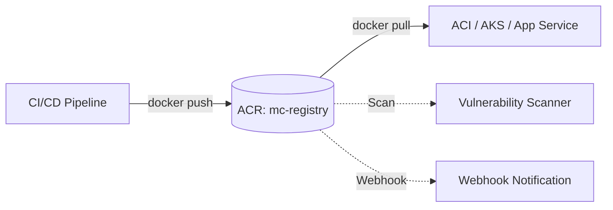

# Deploy Azure Container Registry on Azure

This guide demonstrates how to use MechCloud's stateless IaC to provision an Azure Container Registry (ACR) for storing and managing container images.

## Scenario Overview
**Use Case:** A private container registry for storing Docker images with built-in vulnerability scanning, geo-replication, and Azure AD authentication — essential for any containerized CI/CD pipeline on Azure.
**Key MechCloud Features Highlighted:**
- Simple resource provisioning
- Nested webhook configuration
- No state management overhead

### Architecture Diagram



***

### Complete Unified Template

```yaml
resources:
  - type: Microsoft.Resources/resourceGroups
    name: rg1
    location: "{{CURRENT_REGION}}"
    resources:
      - type: Microsoft.ContainerRegistry/registries
        name: mcregistry1
        props:
          sku:
            name: Standard
          properties:
            adminUserEnabled: false
            policies:
              quarantinePolicy:
                status: disabled
              trustPolicy:
                type: Notary
                status: disabled
              retentionPolicy:
                days: 30
                status: enabled
          resources:
            - type: Microsoft.ContainerRegistry/registries/webhooks
              name: deploywebhook
              props:
                properties:
                  serviceUri: "https://example.com/webhook"
                  actions:
                    - push
                    - delete
                  status: enabled
```
