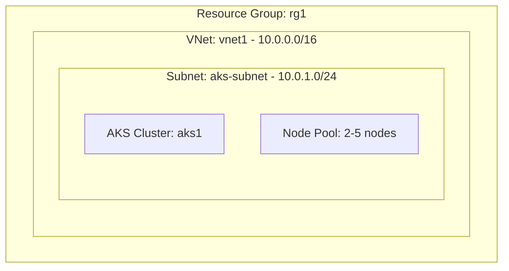

# Deploy an AKS Cluster with Node Pool on Azure

This guide demonstrates how to use MechCloud's stateless IaC to provision an Azure Kubernetes Service (AKS) cluster with a managed node pool for container orchestration.

## Scenario Overview
**Use Case:** A production-grade Kubernetes cluster for running containerized microservices with automatic node scaling, integrated with Azure networking and identity — ideal for teams adopting Kubernetes without managing the control plane.
**Key MechCloud Features Highlighted:**
- Hierarchical resource nesting (Resource Group → VNet → AKS)
- Cross-resource referencing (`ref:`)
- Complex cluster configuration as clean YAML

### Architecture Diagram



***

### Complete Unified Template

```yaml
resources:
  - type: Microsoft.Resources/resourceGroups
    name: rg1
    location: "{{CURRENT_REGION}}"
    resources:
      - type: Microsoft.Network/virtualNetworks
        name: vnet1
        props:
          properties:
            addressSpace:
              addressPrefixes:
                - "10.0.0.0/16"
          resources:
            - type: Microsoft.Network/virtualNetworks/subnets
              name: aks-subnet
              props:
                properties:
                  addressPrefix: "10.0.1.0/24"

      - type: Microsoft.ContainerService/managedClusters
        name: aks1
        props:
          properties:
            kubernetesVersion: "1.29"
            dnsPrefix: "mc-aks"
            networkProfile:
              networkPlugin: azure
              serviceCidr: "10.1.0.0/16"
              dnsServiceIP: "10.1.0.10"
            agentPoolProfiles:
              - name: system
                count: 2
                vmSize: Standard_B4ps_v2
                osType: Linux
                mode: System
                enableAutoScaling: true
                minCount: 2
                maxCount: 5
                vnetSubnetID: "ref:rg1/vnet1/aks-subnet"
            identity:
              type: SystemAssigned
            addonProfiles:
              omsAgent:
                enabled: true
```
