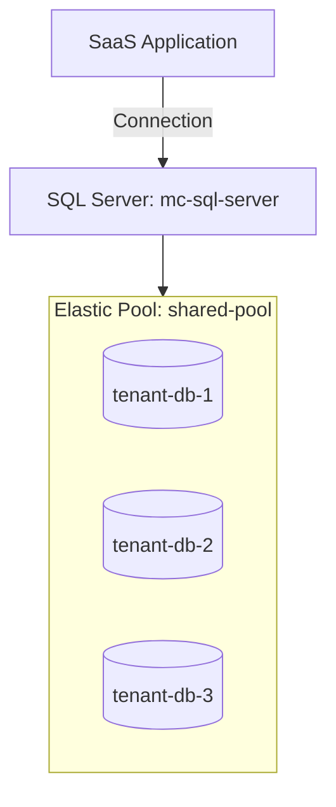

# Deploy Azure SQL Elastic Pool with Multiple Databases on Azure

This guide demonstrates how to use MechCloud's stateless IaC to provision an Azure SQL Elastic Pool for cost-effective management of multiple databases with variable usage patterns.

## Scenario Overview
**Use Case:** A SaaS application with many tenant databases that have unpredictable individual usage but predictable aggregate usage — Elastic Pools share eDTUs/vCores across databases, reducing costs by up to 80% compared to individual databases.
**Key MechCloud Features Highlighted:**
- Hierarchical resource nesting (Resource Group → SQL Server → Elastic Pool → Databases)
- Cross-resource referencing (`ref:`)
- Pool and per-database limits as clean YAML

### Architecture Diagram



***

### Complete Unified Template

```yaml
resources:
  - type: Microsoft.Resources/resourceGroups
    name: rg1
    location: "{{CURRENT_REGION}}"
    resources:
      - type: Microsoft.Sql/servers
        name: mc-sql-server
        props:
          properties:
            administratorLogin: sqladmin
            administratorLoginPassword: "ChangeMe123!"
            version: "12.0"
            minimalTlsVersion: "1.2"
            publicNetworkAccess: Enabled
          resources:
            - type: Microsoft.Sql/servers/firewallRules
              name: allow-azure
              props:
                properties:
                  startIpAddress: "0.0.0.0"
                  endIpAddress: "0.0.0.0"
            - type: Microsoft.Sql/servers/elasticPools
              name: shared-pool
              props:
                sku:
                  name: StandardPool
                  tier: Standard
                  capacity: 200
                properties:
                  perDatabaseSettings:
                    minCapacity: 0
                    maxCapacity: 100
            - type: Microsoft.Sql/servers/databases
              name: tenant-db-1
              props:
                properties:
                  elasticPoolId: "ref:rg1/mc-sql-server/shared-pool"
                  collation: SQL_Latin1_General_CP1_CI_AS
            - type: Microsoft.Sql/servers/databases
              name: tenant-db-2
              props:
                properties:
                  elasticPoolId: "ref:rg1/mc-sql-server/shared-pool"
                  collation: SQL_Latin1_General_CP1_CI_AS
            - type: Microsoft.Sql/servers/databases
              name: tenant-db-3
              props:
                properties:
                  elasticPoolId: "ref:rg1/mc-sql-server/shared-pool"
                  collation: SQL_Latin1_General_CP1_CI_AS
```
