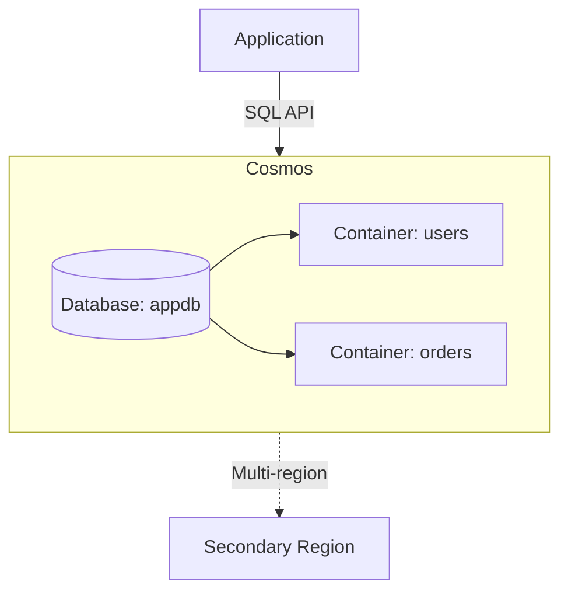

# Deploy Azure Cosmos DB with Multiple Containers on Azure

This guide demonstrates how to use MechCloud's stateless IaC to provision an Azure Cosmos DB account with SQL API databases and containers for globally distributed NoSQL workloads.

## Scenario Overview
**Use Case:** A globally distributed, multi-model database for applications requiring single-digit millisecond response times, automatic scaling, and multi-region writes — ideal for e-commerce catalogs, IoT telemetry, and real-time personalization.
**Key MechCloud Features Highlighted:**
- Hierarchical resource nesting (Resource Group → Cosmos DB → Database → Container)
- Cross-resource referencing (`ref:`)
- Partition key and indexing policy as clean YAML

### Architecture Diagram



***

### Complete Unified Template

```yaml
resources:
  - type: Microsoft.Resources/resourceGroups
    name: rg1
    location: "{{CURRENT_REGION}}"
    resources:
      - type: Microsoft.DocumentDB/databaseAccounts
        name: mc-cosmos
        props:
          kind: GlobalDocumentDB
          properties:
            databaseAccountOfferType: Standard
            consistencyPolicy:
              defaultConsistencyLevel: Session
            locations:
              - locationName: "{{CURRENT_REGION}}"
                failoverPriority: 0
                isZoneRedundant: false
            enableAutomaticFailover: true
            enableMultipleWriteLocations: false
            backupPolicy:
              type: Continuous
              continuousModeProperties:
                tier: Continuous7Days
          resources:
            - type: Microsoft.DocumentDB/databaseAccounts/sqlDatabases
              name: appdb
              props:
                properties:
                  resource:
                    id: appdb
                  options:
                    autoscaleSettings:
                      maxThroughput: 4000
              resources:
                - type: Microsoft.DocumentDB/databaseAccounts/sqlDatabases/containers
                  name: users
                  props:
                    properties:
                      resource:
                        id: users
                        partitionKey:
                          paths:
                            - /userId
                          kind: Hash
                          version: 2
                        indexingPolicy:
                          automatic: true
                          indexingMode: consistent
                          includedPaths:
                            - path: "/*"
                          excludedPaths:
                            - path: '/"_etag"/?'
                        defaultTtl: -1
                - type: Microsoft.DocumentDB/databaseAccounts/sqlDatabases/containers
                  name: orders
                  props:
                    properties:
                      resource:
                        id: orders
                        partitionKey:
                          paths:
                            - /customerId
                          kind: Hash
                          version: 2
                        uniqueKeyPolicy:
                          uniqueKeys:
                            - paths:
                                - /orderId
```
