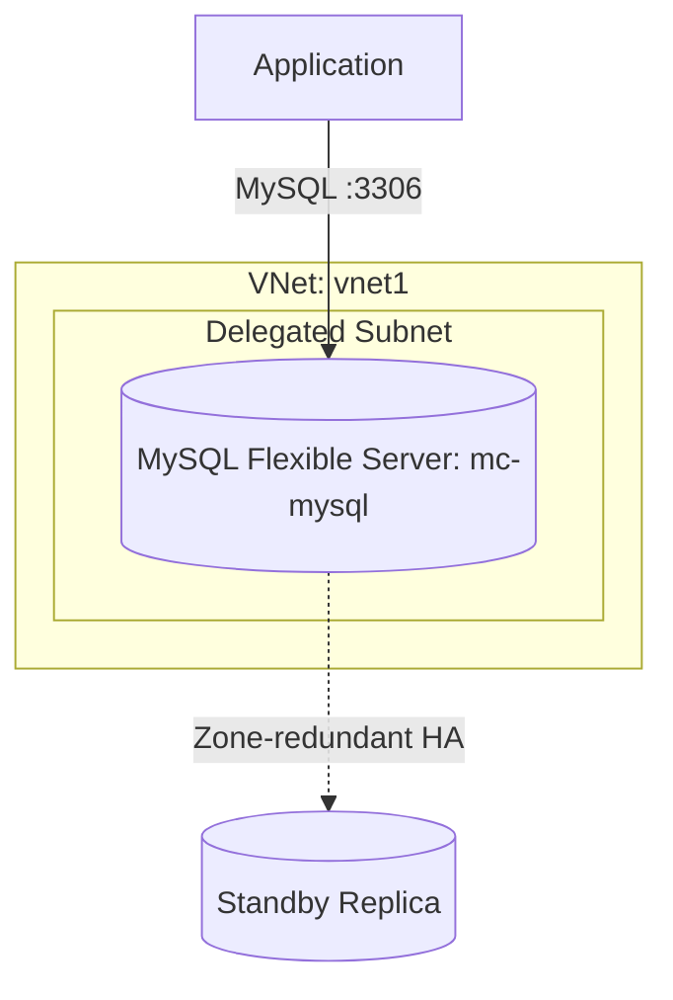

# Deploy Azure Database for MySQL Flexible Server on Azure

This guide demonstrates how to use MechCloud's stateless IaC to provision an Azure Database for MySQL Flexible Server with high availability and VNet integration.

## Scenario Overview
**Use Case:** A fully managed MySQL database with flexible compute tiers, zone-redundant high availability, and automated backups — ideal for WordPress, Magento, and custom applications migrating from on-premises or self-managed MySQL.
**Key MechCloud Features Highlighted:**
- Hierarchical resource nesting (Resource Group → VNet → MySQL)
- Cross-resource referencing (`ref:`)
- Server parameters and firewall rules as clean YAML

### Architecture Diagram



***

### Complete Unified Template

```yaml
resources:
  - type: Microsoft.Resources/resourceGroups
    name: rg1
    location: "{{CURRENT_REGION}}"
    resources:
      - type: Microsoft.Network/virtualNetworks
        name: vnet1
        props:
          properties:
            addressSpace:
              addressPrefixes:
                - "10.0.0.0/16"
          resources:
            - type: Microsoft.Network/virtualNetworks/subnets
              name: mysql-subnet
              props:
                properties:
                  addressPrefix: "10.0.1.0/24"
                  delegations:
                    - name: mysql-delegation
                      properties:
                        serviceName: Microsoft.DBforMySQL/flexibleServers

      - type: Microsoft.Network/privateDnsZones
        name: mysql-dns
        props:
          name: "mc-mysql.private.mysql.database.azure.com"
          resources:
            - type: Microsoft.Network/privateDnsZones/virtualNetworkLinks
              name: mysql-dns-link
              props:
                properties:
                  virtualNetwork:
                    id: "ref:rg1/vnet1"
                  registrationEnabled: false

      - type: Microsoft.DBforMySQL/flexibleServers
        name: mc-mysql
        props:
          sku:
            name: Standard_B2s
            tier: Burstable
          properties:
            version: "8.0.21"
            administratorLogin: mysqladmin
            administratorLoginPassword: "ChangeMe123!"
            storage:
              storageSizeGB: 128
              autoGrow: Enabled
              autoIoScaling: Enabled
            backup:
              backupRetentionDays: 7
              geoRedundantBackup: Disabled
            highAvailability:
              mode: ZoneRedundant
            network:
              delegatedSubnetResourceId: "ref:rg1/vnet1/mysql-subnet"
              privateDnsZoneResourceId: "ref:rg1/mysql-dns"
          resources:
            - type: Microsoft.DBforMySQL/flexibleServers/databases
              name: appdb
              props:
                properties:
                  charset: utf8mb4
                  collation: utf8mb4_unicode_ci
            - type: Microsoft.DBforMySQL/flexibleServers/configurations
              name: slow_query_log
              props:
                properties:
                  value: "ON"
                  source: user-override
```
