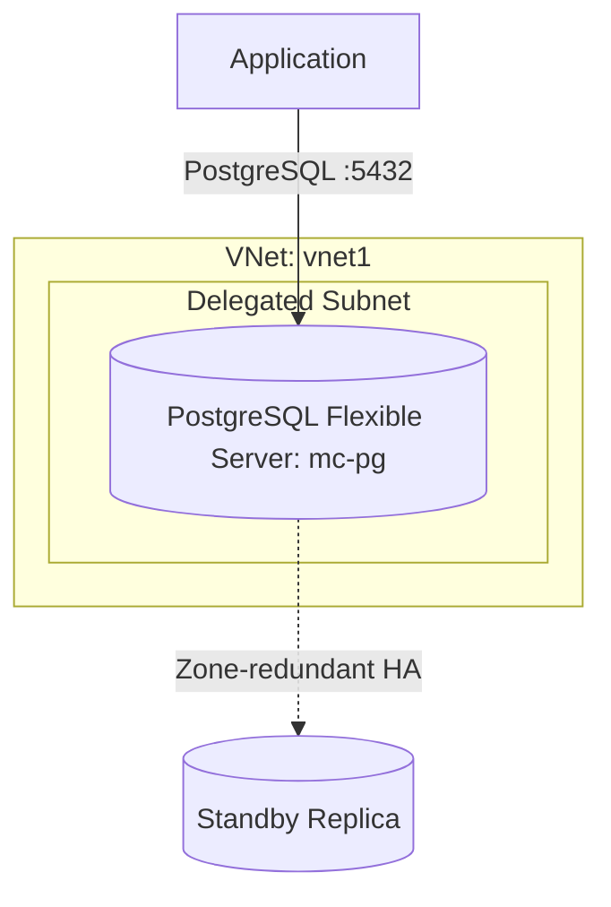

# Deploy Azure Database for PostgreSQL Flexible Server on Azure

This guide demonstrates how to use MechCloud's stateless IaC to provision an Azure Database for PostgreSQL Flexible Server with VNet integration for production workloads.

## Scenario Overview
**Use Case:** A fully managed PostgreSQL database with flexible compute and storage scaling, zone-redundant high availability, and VNet integration — ideal for enterprise applications migrating from on-premises PostgreSQL.
**Key MechCloud Features Highlighted:**
- Hierarchical resource nesting (Resource Group → VNet → PostgreSQL)
- Cross-resource referencing (`ref:`)
- Server configuration and firewall rules as clean YAML

### Architecture Diagram



***

### Complete Unified Template

```yaml
resources:
  - type: Microsoft.Resources/resourceGroups
    name: rg1
    location: "{{CURRENT_REGION}}"
    resources:
      - type: Microsoft.Network/virtualNetworks
        name: vnet1
        props:
          properties:
            addressSpace:
              addressPrefixes:
                - "10.0.0.0/16"
          resources:
            - type: Microsoft.Network/virtualNetworks/subnets
              name: pg-subnet
              props:
                properties:
                  addressPrefix: "10.0.1.0/24"
                  delegations:
                    - name: pg-delegation
                      properties:
                        serviceName: Microsoft.DBforPostgreSQL/flexibleServers

      - type: Microsoft.Network/privateDnsZones
        name: pg-dns
        props:
          name: "mc-pg.private.postgres.database.azure.com"
          resources:
            - type: Microsoft.Network/privateDnsZones/virtualNetworkLinks
              name: pg-dns-link
              props:
                properties:
                  virtualNetwork:
                    id: "ref:rg1/vnet1"
                  registrationEnabled: false

      - type: Microsoft.DBforPostgreSQL/flexibleServers
        name: mc-pg
        props:
          sku:
            name: Standard_B2s
            tier: Burstable
          properties:
            version: "16"
            administratorLogin: pgadmin
            administratorLoginPassword: "ChangeMe123!"
            storage:
              storageSizeGB: 128
              autoGrow: Enabled
            backup:
              backupRetentionDays: 7
              geoRedundantBackup: Disabled
            highAvailability:
              mode: ZoneRedundant
            network:
              delegatedSubnetResourceId: "ref:rg1/vnet1/pg-subnet"
              privateDnsZoneArmResourceId: "ref:rg1/pg-dns"
          resources:
            - type: Microsoft.DBforPostgreSQL/flexibleServers/configurations
              name: log_checkpoints
              props:
                properties:
                  value: "on"
                  source: user-override
            - type: Microsoft.DBforPostgreSQL/flexibleServers/configurations
              name: log_connections
              props:
                properties:
                  value: "on"
                  source: user-override
            - type: Microsoft.DBforPostgreSQL/flexibleServers/databases
              name: appdb
              props:
                properties:
                  charset: UTF8
                  collation: en_US.utf8
```
