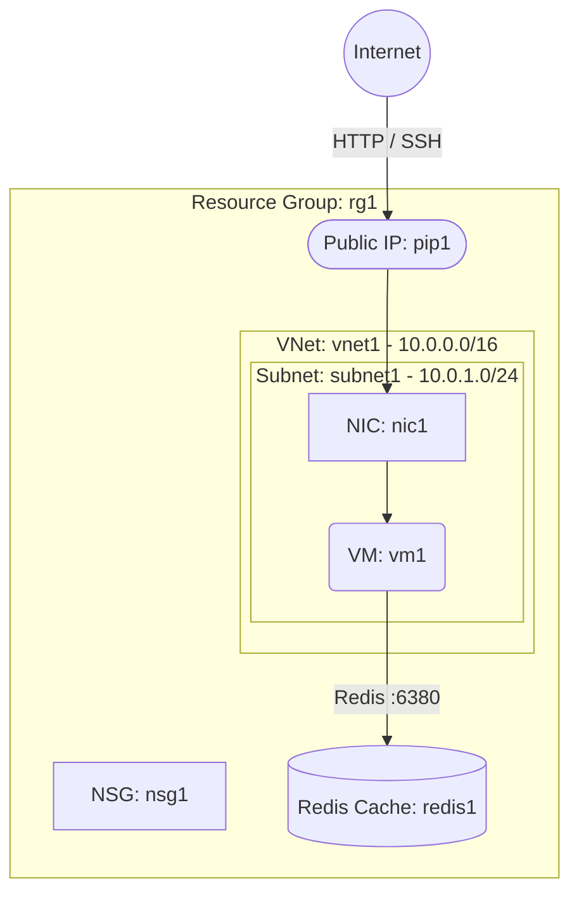

# Deploy a VM with Azure Cache for Redis on Azure

This guide demonstrates how to use MechCloud's stateless Infrastructure-as-Code (IaC) to provision a Virtual Machine with Azure Cache for Redis for in-memory caching on Azure.

In this scenario, we deploy a public-facing VM as the application server and an Azure Cache for Redis instance for low-latency data caching. Redis is commonly used for session management, leaderboards, and frequently accessed query results.

## Scenario Overview
**Use Case:** A web application that requires sub-millisecond data access for session caching, real-time analytics, or frequently accessed database results using a fully managed Redis service.
**Key MechCloud Features Highlighted:**
- Hierarchical resource nesting (Resource Group → VNet → Subnet → VM)
- Dynamic macros (`{{CURRENT_REGION}}`, `{{CURRENT_IP}}`, `{{Image|arm64_ubuntu_24_04}}`)
- Cross-resource referencing (`ref:`)
- Azure Cache for Redis provisioning

### Architecture Diagram



***

### Complete Unified Template

```yaml
resources:
  - type: Microsoft.Resources/resourceGroups
    name: rg1
    location: "{{CURRENT_REGION}}"
    resources:
      - type: Microsoft.Network/virtualNetworks
        name: vnet1
        props:
          properties:
            addressSpace:
              addressPrefixes:
                - "10.0.0.0/16"
          resources:
            - type: Microsoft.Network/virtualNetworks/subnets
              name: subnet1
              props:
                properties:
                  addressPrefix: "10.0.1.0/24"

      - type: Microsoft.Network/networkSecurityGroups
        name: nsg1
        props:
          properties:
            securityRules:
              - name: AllowSSH
                properties:
                  priority: 100
                  direction: Inbound
                  access: Allow
                  protocol: Tcp
                  sourcePortRange: "*"
                  destinationPortRange: "22"
                  sourceAddressPrefix: "{{CURRENT_IP}}/32"
                  destinationAddressPrefix: "*"
              - name: AllowHTTP
                properties:
                  priority: 200
                  direction: Inbound
                  access: Allow
                  protocol: Tcp
                  sourcePortRange: "*"
                  destinationPortRange: "80"
                  sourceAddressPrefix: "*"
                  destinationAddressPrefix: "*"

      - type: Microsoft.Network/publicIPAddresses
        name: pip1
        props:
          properties:
            publicIPAllocationMethod: Static
          sku:
            name: Standard

      - type: Microsoft.Network/networkInterfaces
        name: nic1
        props:
          properties:
            ipConfigurations:
              - name: ipconfig1
                properties:
                  subnet:
                    id: "ref:rg1/vnet1/subnet1"
                  publicIPAddress:
                    id: "ref:rg1/pip1"
            networkSecurityGroup:
              id: "ref:rg1/nsg1"

      - type: Microsoft.Compute/virtualMachines
        name: vm1
        props:
          properties:
            hardwareProfile:
              vmSize: Standard_B2ps_v2
            osProfile:
              computerName: mc-web-vm
              adminUsername: azureuser
            storageProfile:
              imageReference: "{{Image|arm64_ubuntu_24_04}}"
            networkProfile:
              networkInterfaces:
                - id: "ref:rg1/nic1"

      - type: Microsoft.Cache/redis
        name: redis1
        props:
          properties:
            sku:
              name: Basic
              family: C
              capacity: 1
            enableNonSslPort: false
            minimumTlsVersion: "1.2"
```
