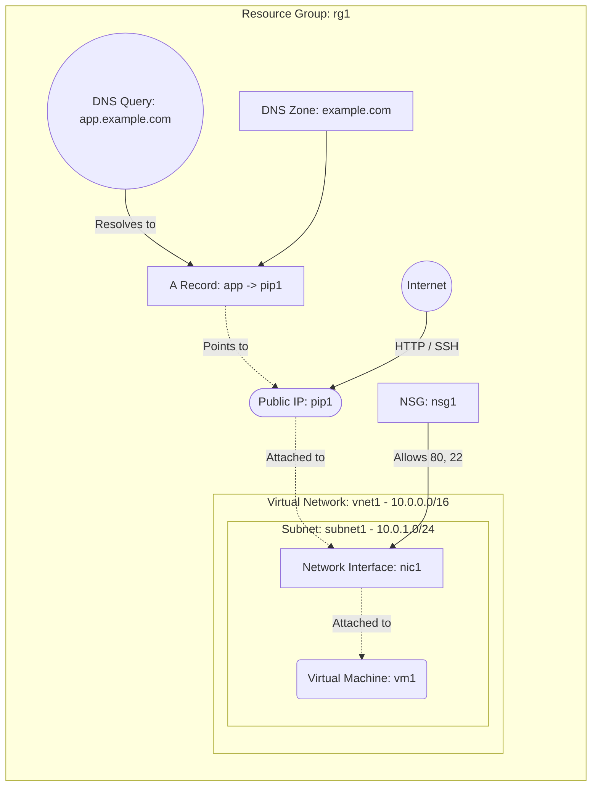

# Deploy a VM with Azure DNS Zone and A Record

This guide demonstrates how to use MechCloud's stateless Infrastructure-as-Code (IaC) to provision a Virtual Machine with an Azure DNS Zone and an A record pointing to the VM's Public IP.

In this scenario, we deploy a public-facing VM and configure an Azure DNS Zone with A records to provide a human-readable domain name for the application. This pattern is commonly used when you want to manage DNS records for your domain directly within Azure.

## Scenario Overview
**Use Case:** Hosting a web application or API with a custom domain name managed via Azure DNS, where DNS A records point directly to the VM's public IP address.
**Key MechCloud Features Highlighted:**
- Default scope inheritance (`resource_group: rg1`)
- Dynamic macros (`{{CURRENT_IP}}`)
- Cross-resource referencing (`ref:`)
- Azure DNS Zone and record set provisioning

### Architecture Diagram



***

## Step 1: Setting up Networking and Security

We create a VNet, subnet, and NSG allowing SSH from your IP and HTTP from the internet.

```yaml
defaults:
  resource_group: rg1

resources:
  # 1. Virtual Network and Subnet
  - type: "Microsoft.Network/virtualNetworks"
    api_version: "2025-05-01"
    name: vnet1
    props:
      address_space:
        address_prefixes:
          - "10.0.0.0/16"
      subnets:
        - name: subnet1
          props:
            address_prefixes:
              - "10.0.1.0/24"

  # 2. NSG allowing SSH and HTTP
  - type: "Microsoft.Network/networkSecurityGroups"
    api_version: "2025-05-01"
    name: nsg1
    props:
      security_rules:
        - name: allow-ssh
          props:
            priority: 100
            direction: Inbound
            access: Allow
            protocol: Tcp
            source_port_range: "*"
            destination_port_range: "22"
            source_address_prefix: "{{CURRENT_IP}}/32"
            destination_address_prefix: "*"
        - name: allow-http-80
          props:
            priority: 110
            direction: Inbound
            access: Allow
            protocol: Tcp
            source_port_range: "*"
            destination_port_range: "80"
            source_address_prefix: "*"
            destination_address_prefix: "*"
```

## Step 2: Creating Public IP and Network Interface

We allocate a Static Public IP and create a NIC with both the Public IP and NSG attached.

```yaml
# ... (Continuing at the resources block) ...
  # 3. Public IP
  - type: "Microsoft.Network/publicIPAddresses"
    api_version: "2025-05-01"
    name: pip1
    props:
      public_ip_allocation_method: Static
      sku:
        name: Standard

  # 4. Network Interface
  - type: "Microsoft.Network/networkInterfaces"
    api_version: "2025-05-01"
    name: nic1
    props:
      network_security_group:
        id: "ref:nsg1"
      ip_configurations:
        - name: ipconfig1
          props:
            subnet:
              id: "ref:vnet1/subnets/subnet1"
            private_ip_allocation_method: Dynamic
            public_ip_address:
              id: "ref:pip1"
```

## Step 3: Creating the DNS Zone and A Record

We provision an Azure DNS Zone for the domain and create an A record set that maps a subdomain to the VM's Public IP.

```yaml
# ... (Continuing at the resources block) ...
  # 5. Azure DNS Zone
  - type: "Microsoft.Network/dnsZones"
    api_version: "2023-07-01-preview"
    name: example.com
    props:
      zone_type: Public

  # 6. A Record pointing to the VM's Public IP
  - type: "Microsoft.Network/dnsZones/A"
    api_version: "2023-07-01-preview"
    name: "example.com/app"
    props:
      ttl: 300
      target_resource:
        id: "ref:pip1"
```

## Step 4: Provisioning the VM

We deploy the VM attached to the NIC. The VM will be reachable via `app.example.com` once DNS delegation is configured.

```yaml
# ... (Continuing at the resources block) ...
  # 7. Virtual Machine
  - type: "Microsoft.Compute/virtualMachines"
    api_version: "2025-04-01"
    name: vm1
    props:
      hardware_profile:
        vm_size: Standard_B2pts_v2
      os_profile:
        computer_name: dnsvm
        admin_username: azureuser
        admin_password: P@ssw0rd1234!
      network_profile:
        network_interfaces:
          - id: "ref:nic1"
      storage_profile:
        image_reference:
          publisher: Canonical
          offer: ubuntu-24_04-lts
          sku: server-arm64
          version: latest
        os_disk:
          create_option: FromImage
          managed_disk:
            storage_account_type: StandardSSD_LRS
```

### Complete Unified Template

For your convenience, here is the complete, unified MechCloud template combining all steps:

```yaml
defaults:
  resource_group: rg1
resources:
  - type: "Microsoft.Network/virtualNetworks"
    api_version: "2025-05-01"
    name: vnet1
    props:
      address_space:
        address_prefixes:
          - "10.0.0.0/16"
      subnets:
        - name: subnet1
          props:
            address_prefixes:
              - "10.0.1.0/24"

  - type: "Microsoft.Network/networkSecurityGroups"
    api_version: "2025-05-01"
    name: nsg1
    props:
      security_rules:
        - name: allow-ssh
          props:
            priority: 100
            direction: Inbound
            access: Allow
            protocol: Tcp
            source_port_range: "*"
            destination_port_range: "22"
            source_address_prefix: "{{CURRENT_IP}}/32"
            destination_address_prefix: "*"
        - name: allow-http-80
          props:
            priority: 110
            direction: Inbound
            access: Allow
            protocol: Tcp
            source_port_range: "*"
            destination_port_range: "80"
            source_address_prefix: "*"
            destination_address_prefix: "*"

  - type: "Microsoft.Network/publicIPAddresses"
    api_version: "2025-05-01"
    name: pip1
    props:
      public_ip_allocation_method: Static
      sku:
        name: Standard

  - type: "Microsoft.Network/networkInterfaces"
    api_version: "2025-05-01"
    name: nic1
    props:
      network_security_group:
        id: "ref:nsg1"
      ip_configurations:
        - name: ipconfig1
          props:
            subnet:
              id: "ref:vnet1/subnets/subnet1"
            private_ip_allocation_method: Dynamic
            public_ip_address:
              id: "ref:pip1"

  - type: "Microsoft.Network/dnsZones"
    api_version: "2023-07-01-preview"
    name: example.com
    props:
      zone_type: Public

  - type: "Microsoft.Network/dnsZones/A"
    api_version: "2023-07-01-preview"
    name: "example.com/app"
    props:
      ttl: 300
      target_resource:
        id: "ref:pip1"

  - type: "Microsoft.Compute/virtualMachines"
    api_version: "2025-04-01"
    name: vm1
    props:
      hardware_profile:
        vm_size: Standard_B2pts_v2
      os_profile:
        computer_name: dnsvm
        admin_username: azureuser
        admin_password: P@ssw0rd1234!
      network_profile:
        network_interfaces:
          - id: "ref:nic1"
      storage_profile:
        image_reference:
          publisher: Canonical
          offer: ubuntu-24_04-lts
          sku: server-arm64
          version: latest
        os_disk:
          create_option: FromImage
          managed_disk:
            storage_account_type: StandardSSD_LRS
```
