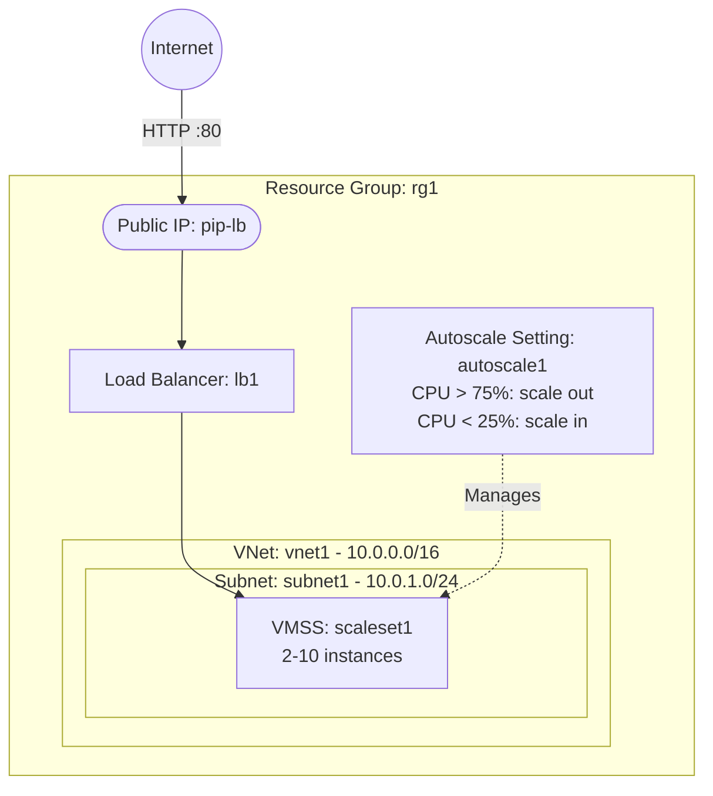

# Deploy a VM Scale Set with Autoscaling and Load Balancer on Azure

This guide demonstrates how to use MechCloud's stateless Infrastructure-as-Code (IaC) to provision a Virtual Machine Scale Set (VMSS) with autoscaling rules and a Standard Load Balancer on Azure.

In this scenario, we deploy a VMSS that automatically scales between 2 and 10 instances based on CPU utilization. A Standard Load Balancer distributes incoming HTTP traffic across all healthy instances, ensuring high availability and elastic scaling.

## Scenario Overview
**Use Case:** A web application that experiences variable traffic patterns and needs to automatically scale horizontally to handle peak loads while minimizing costs during low-traffic periods.
**Key MechCloud Features Highlighted:**
- Hierarchical resource nesting (Resource Group → VNet → Subnet)
- Dynamic macros (`{{CURRENT_REGION}}`, `{{Image|arm64_ubuntu_24_04}}`)
- Cross-resource referencing (`ref:`)
- VMSS with autoscale configuration

### Architecture Diagram



***

### Complete Unified Template

```yaml
resources:
  - type: Microsoft.Resources/resourceGroups
    name: rg1
    location: "{{CURRENT_REGION}}"
    resources:
      - type: Microsoft.Network/virtualNetworks
        name: vnet1
        props:
          properties:
            addressSpace:
              addressPrefixes:
                - "10.0.0.0/16"
          resources:
            - type: Microsoft.Network/virtualNetworks/subnets
              name: subnet1
              props:
                properties:
                  addressPrefix: "10.0.1.0/24"

      - type: Microsoft.Network/publicIPAddresses
        name: pip-lb
        props:
          properties:
            publicIPAllocationMethod: Static
          sku:
            name: Standard

      - type: Microsoft.Network/loadBalancers
        name: lb1
        props:
          sku:
            name: Standard
          properties:
            frontendIPConfigurations:
              - name: frontend1
                properties:
                  publicIPAddress:
                    id: "ref:rg1/pip-lb"
            backendAddressPools:
              - name: backend-pool
            probes:
              - name: http-probe
                properties:
                  protocol: Http
                  port: 80
                  requestPath: "/"
                  intervalInSeconds: 15
                  numberOfProbes: 2
            loadBalancingRules:
              - name: http-rule
                properties:
                  frontendIPConfiguration:
                    id: "ref:rg1/lb1/frontendIPConfigurations/frontend1"
                  backendAddressPool:
                    id: "ref:rg1/lb1/backendAddressPools/backend-pool"
                  probe:
                    id: "ref:rg1/lb1/probes/http-probe"
                  protocol: Tcp
                  frontendPort: 80
                  backendPort: 80

      - type: Microsoft.Compute/virtualMachineScaleSets
        name: scaleset1
        props:
          sku:
            name: Standard_B2ps_v2
            capacity: 2
          properties:
            upgradePolicy:
              mode: Automatic
            virtualMachineProfile:
              osProfile:
                computerNamePrefix: mc-vm
                adminUsername: azureuser
              storageProfile:
                imageReference: "{{Image|arm64_ubuntu_24_04}}"
              networkProfile:
                networkInterfaceConfigurations:
                  - name: nic-config
                    properties:
                      primary: true
                      ipConfigurations:
                        - name: ipconfig1
                          properties:
                            subnet:
                              id: "ref:rg1/vnet1/subnet1"
                            loadBalancerBackendAddressPools:
                              - id: "ref:rg1/lb1/backendAddressPools/backend-pool"

      - type: Microsoft.Insights/autoscaleSettings
        name: autoscale1
        props:
          properties:
            targetResourceUri: "ref:rg1/scaleset1"
            enabled: true
            profiles:
              - name: default-profile
                capacity:
                  minimum: "2"
                  maximum: "10"
                  default: "2"
                rules:
                  - metricTrigger:
                      metricName: Percentage CPU
                      metricResourceUri: "ref:rg1/scaleset1"
                      timeGrain: PT1M
                      statistic: Average
                      timeWindow: PT5M
                      timeAggregation: Average
                      operator: GreaterThan
                      threshold: 75
                    scaleAction:
                      direction: Increase
                      type: ChangeCount
                      value: "1"
                      cooldown: PT5M
                  - metricTrigger:
                      metricName: Percentage CPU
                      metricResourceUri: "ref:rg1/scaleset1"
                      timeGrain: PT1M
                      statistic: Average
                      timeWindow: PT5M
                      timeAggregation: Average
                      operator: LessThan
                      threshold: 25
                    scaleAction:
                      direction: Decrease
                      type: ChangeCount
                      value: "1"
                      cooldown: PT5M
```
