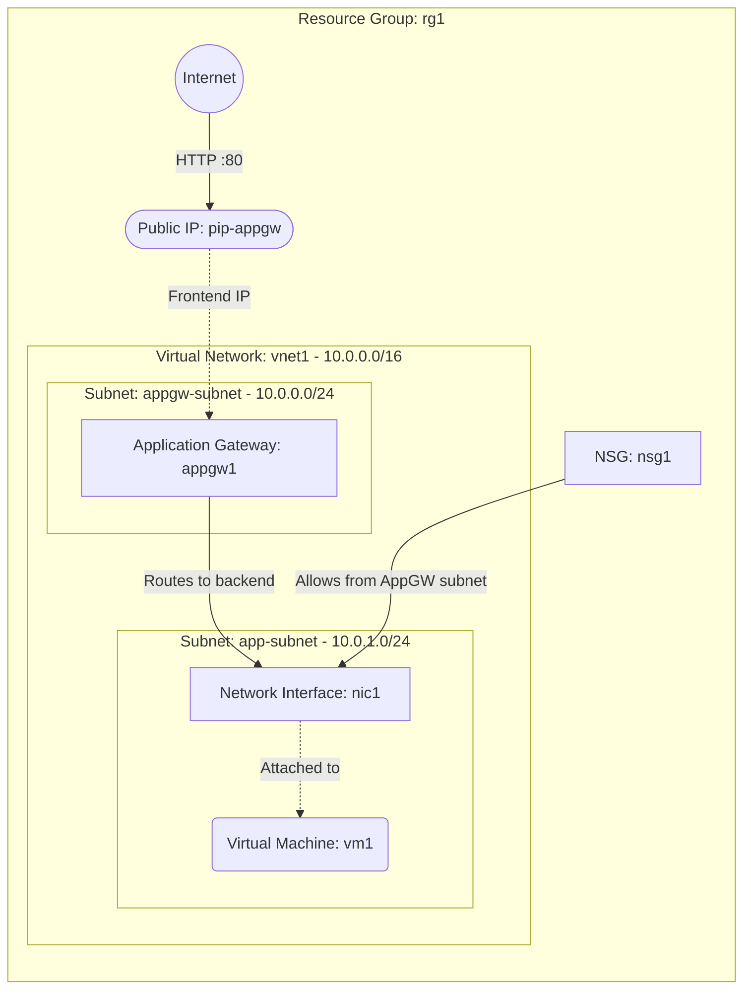

# Deploy a VM behind an Azure Application Gateway

This guide demonstrates how to use MechCloud's stateless Infrastructure-as-Code (IaC) to provision a Virtual Machine behind an Azure Application Gateway for Layer 7 (HTTP/HTTPS) load balancing and web application firewall capabilities.

In this scenario, we will provision an Application Gateway with a public frontend IP that routes HTTP traffic to a backend VM. The Application Gateway operates at the application layer (Layer 7), enabling URL-based routing, SSL termination, and advanced traffic management compared to a basic Layer 4 Load Balancer.

## Scenario Overview
**Use Case:** Hosting a web application that requires Layer 7 load balancing, URL-based routing, SSL offloading, or WAF protection for compliance and security requirements.
**Key MechCloud Features Highlighted:**
- Default scope inheritance (`resource_group: rg1`)
- Cross-resource referencing (`ref:`)
- Dedicated subnet for Application Gateway
- Complex nested resource configurations

### Architecture Diagram



***

## Step 1: Setting up the VNet with Dedicated Subnets

Application Gateway requires its own dedicated subnet. We create a VNet with two subnets: one for the Application Gateway and one for the backend application VMs.

```yaml
defaults:
  resource_group: rg1

resources:
  # 1. VNet with dedicated subnets
  - type: "Microsoft.Network/virtualNetworks"
    api_version: "2025-05-01"
    name: vnet1
    props:
      address_space:
        address_prefixes:
          - "10.0.0.0/16"
      subnets:
        - name: appgw-subnet
          props:
            address_prefixes:
              - "10.0.0.0/24"
        - name: app-subnet
          props:
            address_prefixes:
              - "10.0.1.0/24"
```

## Step 2: Creating the NSG and Public IP

We create an NSG for the backend VMs allowing traffic from the Application Gateway subnet, and a Public IP for the gateway's frontend.

```yaml
# ... (Continuing at the resources block) ...
  # 2. NSG allowing traffic from AppGW subnet
  - type: "Microsoft.Network/networkSecurityGroups"
    api_version: "2025-05-01"
    name: nsg1
    props:
      security_rules:
        - name: allow-http-from-appgw
          props:
            priority: 100
            direction: Inbound
            access: Allow
            protocol: Tcp
            source_port_range: "*"
            destination_port_range: "80"
            source_address_prefix: "10.0.0.0/24"
            destination_address_prefix: "*"

  # 3. Public IP for Application Gateway
  - type: "Microsoft.Network/publicIPAddresses"
    api_version: "2025-05-01"
    name: pip-appgw
    props:
      public_ip_allocation_method: Static
      sku:
        name: Standard
```

## Step 3: Configuring the Application Gateway

We configure the Application Gateway with a frontend IP, backend address pool, HTTP settings, listener, and routing rule to direct traffic to the backend VM.

```yaml
# ... (Continuing at the resources block) ...
  # 4. Application Gateway
  - type: "Microsoft.Network/applicationGateways"
    api_version: "2025-05-01"
    name: appgw1
    props:
      sku:
        name: Standard_v2
        tier: Standard_v2
        capacity: 1
      gateway_ip_configurations:
        - name: appgw-ip-config
          props:
            subnet:
              id: "ref:vnet1/subnets/appgw-subnet"
      frontend_ip_configurations:
        - name: appgw-frontend-ip
          props:
            public_ip_address:
              id: "ref:pip-appgw"
      frontend_ports:
        - name: port-80
          props:
            port: 80
      backend_address_pools:
        - name: appgw-backend-pool
      backend_http_settings_collection:
        - name: appgw-http-settings
          props:
            port: 80
            protocol: Http
            cookie_based_affinity: Disabled
            request_timeout: 30
      http_listeners:
        - name: appgw-http-listener
          props:
            frontend_ip_configuration:
              id: "ref:appgw1/frontendIPConfigurations/appgw-frontend-ip"
            frontend_port:
              id: "ref:appgw1/frontendPorts/port-80"
            protocol: Http
      request_routing_rules:
        - name: appgw-routing-rule
          props:
            rule_type: Basic
            priority: 100
            http_listener:
              id: "ref:appgw1/httpListeners/appgw-http-listener"
            backend_address_pool:
              id: "ref:appgw1/backendAddressPools/appgw-backend-pool"
            backend_http_settings:
              id: "ref:appgw1/backendHttpSettingsCollection/appgw-http-settings"
```

## Step 4: Creating the NIC and VM

We create a NIC in the app subnet associated with the Application Gateway's backend pool, then provision the VM.

```yaml
# ... (Continuing at the resources block) ...
  # 5. Network Interface for backend VM
  - type: "Microsoft.Network/networkInterfaces"
    api_version: "2025-05-01"
    name: nic1
    props:
      network_security_group:
        id: "ref:nsg1"
      ip_configurations:
        - name: ipconfig1
          props:
            subnet:
              id: "ref:vnet1/subnets/app-subnet"
            private_ip_allocation_method: Dynamic
            application_gateway_backend_address_pools:
              - id: "ref:appgw1/backendAddressPools/appgw-backend-pool"

  # 6. Backend Virtual Machine
  - type: "Microsoft.Compute/virtualMachines"
    api_version: "2025-04-01"
    name: vm1
    props:
      hardware_profile:
        vm_size: Standard_B2pts_v2
      os_profile:
        computer_name: appvm
        admin_username: azureuser
        admin_password: P@ssw0rd1234!
      network_profile:
        network_interfaces:
          - id: "ref:nic1"
      storage_profile:
        image_reference:
          publisher: Canonical
          offer: ubuntu-24_04-lts
          sku: server-arm64
          version: latest
        os_disk:
          create_option: FromImage
          managed_disk:
            storage_account_type: StandardSSD_LRS
```

### Complete Unified Template

For your convenience, here is the complete, unified MechCloud template combining all steps:

```yaml
defaults:
  resource_group: rg1
resources:
  - type: "Microsoft.Network/virtualNetworks"
    api_version: "2025-05-01"
    name: vnet1
    props:
      address_space:
        address_prefixes:
          - "10.0.0.0/16"
      subnets:
        - name: appgw-subnet
          props:
            address_prefixes:
              - "10.0.0.0/24"
        - name: app-subnet
          props:
            address_prefixes:
              - "10.0.1.0/24"

  - type: "Microsoft.Network/networkSecurityGroups"
    api_version: "2025-05-01"
    name: nsg1
    props:
      security_rules:
        - name: allow-http-from-appgw
          props:
            priority: 100
            direction: Inbound
            access: Allow
            protocol: Tcp
            source_port_range: "*"
            destination_port_range: "80"
            source_address_prefix: "10.0.0.0/24"
            destination_address_prefix: "*"

  - type: "Microsoft.Network/publicIPAddresses"
    api_version: "2025-05-01"
    name: pip-appgw
    props:
      public_ip_allocation_method: Static
      sku:
        name: Standard

  - type: "Microsoft.Network/applicationGateways"
    api_version: "2025-05-01"
    name: appgw1
    props:
      sku:
        name: Standard_v2
        tier: Standard_v2
        capacity: 1
      gateway_ip_configurations:
        - name: appgw-ip-config
          props:
            subnet:
              id: "ref:vnet1/subnets/appgw-subnet"
      frontend_ip_configurations:
        - name: appgw-frontend-ip
          props:
            public_ip_address:
              id: "ref:pip-appgw"
      frontend_ports:
        - name: port-80
          props:
            port: 80
      backend_address_pools:
        - name: appgw-backend-pool
      backend_http_settings_collection:
        - name: appgw-http-settings
          props:
            port: 80
            protocol: Http
            cookie_based_affinity: Disabled
            request_timeout: 30
      http_listeners:
        - name: appgw-http-listener
          props:
            frontend_ip_configuration:
              id: "ref:appgw1/frontendIPConfigurations/appgw-frontend-ip"
            frontend_port:
              id: "ref:appgw1/frontendPorts/port-80"
            protocol: Http
      request_routing_rules:
        - name: appgw-routing-rule
          props:
            rule_type: Basic
            priority: 100
            http_listener:
              id: "ref:appgw1/httpListeners/appgw-http-listener"
            backend_address_pool:
              id: "ref:appgw1/backendAddressPools/appgw-backend-pool"
            backend_http_settings:
              id: "ref:appgw1/backendHttpSettingsCollection/appgw-http-settings"

  - type: "Microsoft.Network/networkInterfaces"
    api_version: "2025-05-01"
    name: nic1
    props:
      network_security_group:
        id: "ref:nsg1"
      ip_configurations:
        - name: ipconfig1
          props:
            subnet:
              id: "ref:vnet1/subnets/app-subnet"
            private_ip_allocation_method: Dynamic
            application_gateway_backend_address_pools:
              - id: "ref:appgw1/backendAddressPools/appgw-backend-pool"

  - type: "Microsoft.Compute/virtualMachines"
    api_version: "2025-04-01"
    name: vm1
    props:
      hardware_profile:
        vm_size: Standard_B2pts_v2
      os_profile:
        computer_name: appvm
        admin_username: azureuser
        admin_password: P@ssw0rd1234!
      network_profile:
        network_interfaces:
          - id: "ref:nic1"
      storage_profile:
        image_reference:
          publisher: Canonical
          offer: ubuntu-24_04-lts
          sku: server-arm64
          version: latest
        os_disk:
          create_option: FromImage
          managed_disk:
            storage_account_type: StandardSSD_LRS
```
