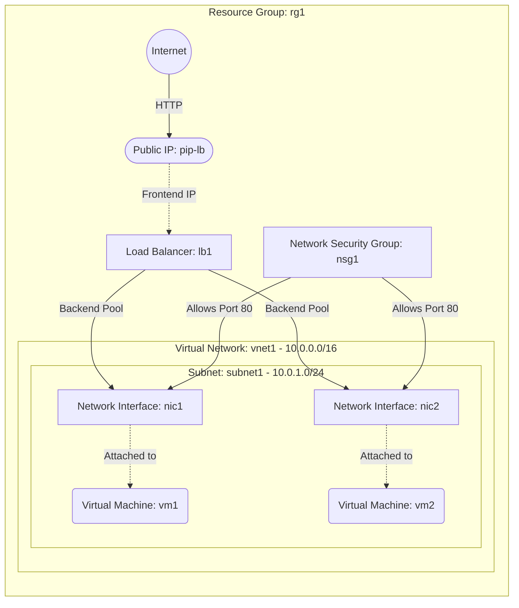

# Deploy VMs behind an Azure Load Balancer

This guide demonstrates how to use MechCloud's stateless Infrastructure-as-Code (IaC) to provision Virtual Machines behind an Azure Standard Load Balancer for high availability and traffic distribution.

In this scenario, we will provision two VMs inside a Virtual Network and place them behind a public-facing Azure Load Balancer. The Load Balancer distributes incoming HTTP traffic across the VMs using a health probe to ensure only healthy instances receive traffic.

## Scenario Overview
**Use Case:** Hosting a highly available web application where traffic is distributed across multiple VM instances, with automatic health checking and failover.
**Key MechCloud Features Highlighted:**
- Default scope inheritance (`resource_group: rg1`)
- Cross-resource referencing (`ref:`)
- Multiple resources of the same type with distinct names

### Architecture Diagram



***

## Step 1: Setting up Networking and Security

We create a VNet with a subnet and an NSG that allows inbound HTTP traffic on port 80 from the internet.

```yaml
defaults:
  resource_group: rg1

resources:
  # 1. Define the Virtual Network and Subnet
  - type: "Microsoft.Network/virtualNetworks"
    api_version: "2025-05-01"
    name: vnet1
    props:
      address_space:
        address_prefixes:
          - "10.0.0.0/16"
      subnets:
        - name: subnet1
          props:
            address_prefixes:
              - "10.0.1.0/24"

  # 2. Security Group allowing HTTP traffic
  - type: "Microsoft.Network/networkSecurityGroups"
    api_version: "2025-05-01"
    name: nsg1
    props:
      security_rules:
        - name: allow-http-80
          props:
            priority: 100
            direction: Inbound
            access: Allow
            protocol: Tcp
            source_port_range: "*"
            destination_port_range: "80"
            source_address_prefix: "*"
            destination_address_prefix: "*"
```

## Step 2: Creating the Load Balancer with Public IP

We allocate a Static Public IP for the Load Balancer's frontend, configure a backend address pool, a health probe on port 80, and a load balancing rule to distribute HTTP traffic.

```yaml
# ... (Continuing at the resources block) ...
  # 3. Public IP for the Load Balancer
  - type: "Microsoft.Network/publicIPAddresses"
    api_version: "2025-05-01"
    name: pip-lb
    props:
      public_ip_allocation_method: Static
      sku:
        name: Standard

  # 4. Load Balancer
  - type: "Microsoft.Network/loadBalancers"
    api_version: "2025-05-01"
    name: lb1
    props:
      sku:
        name: Standard
      frontend_ip_configurations:
        - name: lb-frontend
          props:
            public_ip_address:
              id: "ref:pip-lb"
      backend_address_pools:
        - name: lb-backend-pool
      probes:
        - name: http-probe
          props:
            protocol: Http
            port: 80
            request_path: "/"
            interval_in_seconds: 15
            number_of_probes: 2
      load_balancing_rules:
        - name: http-rule
          props:
            frontend_ip_configuration:
              id: "ref:lb1/frontendIPConfigurations/lb-frontend"
            backend_address_pool:
              id: "ref:lb1/backendAddressPools/lb-backend-pool"
            probe:
              id: "ref:lb1/probes/http-probe"
            protocol: Tcp
            frontend_port: 80
            backend_port: 80
            idle_timeout_in_minutes: 4
            enable_floating_ip: false
```

## Step 3: Creating Network Interfaces for Backend VMs

Each NIC is associated with the Load Balancer's backend pool, the subnet, and the NSG. No public IPs are needed on the NICs since traffic arrives through the Load Balancer.

```yaml
# ... (Continuing at the resources block) ...
  # 5. Network Interface for VM1
  - type: "Microsoft.Network/networkInterfaces"
    api_version: "2025-05-01"
    name: nic1
    props:
      network_security_group:
        id: "ref:nsg1"
      ip_configurations:
        - name: ipconfig1
          props:
            subnet:
              id: "ref:vnet1/subnets/subnet1"
            private_ip_allocation_method: Dynamic
            load_balancer_backend_address_pools:
              - id: "ref:lb1/backendAddressPools/lb-backend-pool"

  # 6. Network Interface for VM2
  - type: "Microsoft.Network/networkInterfaces"
    api_version: "2025-05-01"
    name: nic2
    props:
      network_security_group:
        id: "ref:nsg1"
      ip_configurations:
        - name: ipconfig1
          props:
            subnet:
              id: "ref:vnet1/subnets/subnet1"
            private_ip_allocation_method: Dynamic
            load_balancer_backend_address_pools:
              - id: "ref:lb1/backendAddressPools/lb-backend-pool"
```

## Step 4: Provisioning the VMs

We provision two identical Ubuntu VMs, each attached to its respective NIC. These VMs form the backend pool for the Load Balancer.

```yaml
# ... (Continuing at the resources block) ...
  # 7. Virtual Machine 1
  - type: "Microsoft.Compute/virtualMachines"
    api_version: "2025-04-01"
    name: vm1
    props:
      hardware_profile:
        vm_size: Standard_B2pts_v2
      os_profile:
        computer_name: webvm1
        admin_username: azureuser
        admin_password: P@ssw0rd1234!
      network_profile:
        network_interfaces:
          - id: "ref:nic1"
      storage_profile:
        image_reference:
          publisher: Canonical
          offer: ubuntu-24_04-lts
          sku: server-arm64
          version: latest
        os_disk:
          create_option: FromImage
          managed_disk:
            storage_account_type: StandardSSD_LRS

  # 8. Virtual Machine 2
  - type: "Microsoft.Compute/virtualMachines"
    api_version: "2025-04-01"
    name: vm2
    props:
      hardware_profile:
        vm_size: Standard_B2pts_v2
      os_profile:
        computer_name: webvm2
        admin_username: azureuser
        admin_password: P@ssw0rd1234!
      network_profile:
        network_interfaces:
          - id: "ref:nic2"
      storage_profile:
        image_reference:
          publisher: Canonical
          offer: ubuntu-24_04-lts
          sku: server-arm64
          version: latest
        os_disk:
          create_option: FromImage
          managed_disk:
            storage_account_type: StandardSSD_LRS
```

### Complete Unified Template

For your convenience, here is the complete, unified MechCloud template combining all steps:

```yaml
defaults:
  resource_group: rg1
resources:
  - type: "Microsoft.Network/virtualNetworks"
    api_version: "2025-05-01"
    name: vnet1
    props:
      address_space:
        address_prefixes:
          - "10.0.0.0/16"
      subnets:
        - name: subnet1
          props:
            address_prefixes:
              - "10.0.1.0/24"

  - type: "Microsoft.Network/networkSecurityGroups"
    api_version: "2025-05-01"
    name: nsg1
    props:
      security_rules:
        - name: allow-http-80
          props:
            priority: 100
            direction: Inbound
            access: Allow
            protocol: Tcp
            source_port_range: "*"
            destination_port_range: "80"
            source_address_prefix: "*"
            destination_address_prefix: "*"

  - type: "Microsoft.Network/publicIPAddresses"
    api_version: "2025-05-01"
    name: pip-lb
    props:
      public_ip_allocation_method: Static
      sku:
        name: Standard

  - type: "Microsoft.Network/loadBalancers"
    api_version: "2025-05-01"
    name: lb1
    props:
      sku:
        name: Standard
      frontend_ip_configurations:
        - name: lb-frontend
          props:
            public_ip_address:
              id: "ref:pip-lb"
      backend_address_pools:
        - name: lb-backend-pool
      probes:
        - name: http-probe
          props:
            protocol: Http
            port: 80
            request_path: "/"
            interval_in_seconds: 15
            number_of_probes: 2
      load_balancing_rules:
        - name: http-rule
          props:
            frontend_ip_configuration:
              id: "ref:lb1/frontendIPConfigurations/lb-frontend"
            backend_address_pool:
              id: "ref:lb1/backendAddressPools/lb-backend-pool"
            probe:
              id: "ref:lb1/probes/http-probe"
            protocol: Tcp
            frontend_port: 80
            backend_port: 80
            idle_timeout_in_minutes: 4
            enable_floating_ip: false

  - type: "Microsoft.Network/networkInterfaces"
    api_version: "2025-05-01"
    name: nic1
    props:
      network_security_group:
        id: "ref:nsg1"
      ip_configurations:
        - name: ipconfig1
          props:
            subnet:
              id: "ref:vnet1/subnets/subnet1"
            private_ip_allocation_method: Dynamic
            load_balancer_backend_address_pools:
              - id: "ref:lb1/backendAddressPools/lb-backend-pool"

  - type: "Microsoft.Network/networkInterfaces"
    api_version: "2025-05-01"
    name: nic2
    props:
      network_security_group:
        id: "ref:nsg1"
      ip_configurations:
        - name: ipconfig1
          props:
            subnet:
              id: "ref:vnet1/subnets/subnet1"
            private_ip_allocation_method: Dynamic
            load_balancer_backend_address_pools:
              - id: "ref:lb1/backendAddressPools/lb-backend-pool"

  - type: "Microsoft.Compute/virtualMachines"
    api_version: "2025-04-01"
    name: vm1
    props:
      hardware_profile:
        vm_size: Standard_B2pts_v2
      os_profile:
        computer_name: webvm1
        admin_username: azureuser
        admin_password: P@ssw0rd1234!
      network_profile:
        network_interfaces:
          - id: "ref:nic1"
      storage_profile:
        image_reference:
          publisher: Canonical
          offer: ubuntu-24_04-lts
          sku: server-arm64
          version: latest
        os_disk:
          create_option: FromImage
          managed_disk:
            storage_account_type: StandardSSD_LRS

  - type: "Microsoft.Compute/virtualMachines"
    api_version: "2025-04-01"
    name: vm2
    props:
      hardware_profile:
        vm_size: Standard_B2pts_v2
      os_profile:
        computer_name: webvm2
        admin_username: azureuser
        admin_password: P@ssw0rd1234!
      network_profile:
        network_interfaces:
          - id: "ref:nic2"
      storage_profile:
        image_reference:
          publisher: Canonical
          offer: ubuntu-24_04-lts
          sku: server-arm64
          version: latest
        os_disk:
          create_option: FromImage
          managed_disk:
            storage_account_type: StandardSSD_LRS
```
