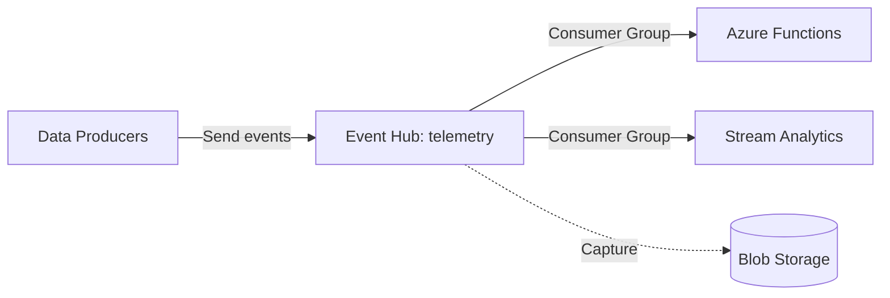

# Deploy Azure Event Hubs for Real-Time Data Streaming on Azure

This guide demonstrates how to use MechCloud's stateless IaC to provision Azure Event Hubs for high-throughput real-time event ingestion and streaming.

## Scenario Overview
**Use Case:** Real-time data ingestion for telemetry, clickstream analytics, log aggregation, or IoT data processing — Event Hubs handles millions of events per second with low latency and integrates with Azure Stream Analytics and Functions.
**Key MechCloud Features Highlighted:**
- Hierarchical resource nesting (Resource Group → Namespace → Event Hubs → Consumer Groups)
- Cross-resource referencing (`ref:`)
- Partitioned event hub with capture

### Architecture Diagram



***

### Complete Unified Template

```yaml
resources:
  - type: Microsoft.Resources/resourceGroups
    name: rg1
    location: "{{CURRENT_REGION}}"
    resources:
      - type: Microsoft.Storage/storageAccounts
        name: mcehcapture1
        props:
          kind: StorageV2
          sku:
            name: Standard_LRS
          resources:
            - type: Microsoft.Storage/storageAccounts/blobServices
              name: default
              resources:
                - type: Microsoft.Storage/storageAccounts/blobServices/containers
                  name: capture

      - type: Microsoft.EventHub/namespaces
        name: mc-eh-ns
        props:
          sku:
            name: Standard
            tier: Standard
            capacity: 2
          properties:
            isAutoInflateEnabled: true
            maximumThroughputUnits: 10
            kafkaEnabled: true
          resources:
            - type: Microsoft.EventHub/namespaces/eventhubs
              name: telemetry
              props:
                properties:
                  messageRetentionInDays: 7
                  partitionCount: 8
                  captureDescription:
                    enabled: true
                    encoding: Avro
                    intervalInSeconds: 300
                    sizeLimitInBytes: 314572800
                    destination:
                      name: EventHubArchive.AzureBlockBlob
                      properties:
                        storageAccountResourceId: "ref:rg1/mcehcapture1"
                        blobContainer: capture
                        archiveNameFormat: "{Namespace}/{EventHub}/{PartitionId}/{Year}/{Month}/{Day}/{Hour}/{Minute}/{Second}"
              resources:
                - type: Microsoft.EventHub/namespaces/eventhubs/consumergroups
                  name: analytics
                  props:
                    properties:
                      userMetadata: "Stream Analytics consumer"
                - type: Microsoft.EventHub/namespaces/eventhubs/consumergroups
                  name: functions
                  props:
                    properties:
                      userMetadata: "Azure Functions consumer"

            - type: Microsoft.EventHub/namespaces/eventhubs
              name: commands
              props:
                properties:
                  messageRetentionInDays: 1
                  partitionCount: 4
```
