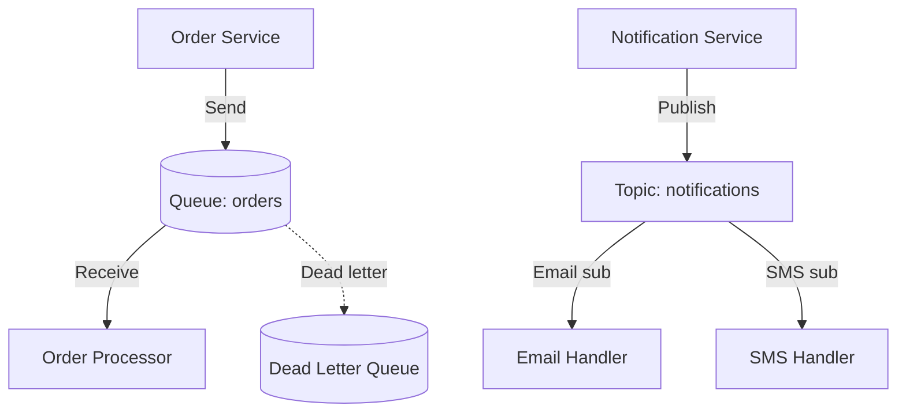

# Deploy Azure Service Bus with Queues and Topics on Azure

This guide demonstrates how to use MechCloud's stateless IaC to provision an Azure Service Bus namespace with queues, topics, and subscriptions for enterprise messaging.

## Scenario Overview
**Use Case:** Enterprise-grade message broker for decoupling microservices with queues (point-to-point) and topics (publish-subscribe) — supporting transactions, dead-lettering, sessions, and duplicate detection for reliable message processing.
**Key MechCloud Features Highlighted:**
- Hierarchical resource nesting (Resource Group → Namespace → Queues/Topics → Subscriptions)
- Cross-resource referencing (`ref:`)
- Complex messaging topology in a single template

### Architecture Diagram



***

### Complete Unified Template

```yaml
resources:
  - type: Microsoft.Resources/resourceGroups
    name: rg1
    location: "{{CURRENT_REGION}}"
    resources:
      - type: Microsoft.ServiceBus/namespaces
        name: mc-sb-ns
        props:
          sku:
            name: Standard
            tier: Standard
          resources:
            - type: Microsoft.ServiceBus/namespaces/queues
              name: orders
              props:
                properties:
                  maxSizeInMegabytes: 1024
                  defaultMessageTimeToLive: P14D
                  lockDuration: PT1M
                  maxDeliveryCount: 10
                  deadLetteringOnMessageExpiration: true
                  enablePartitioning: false
                  requiresDuplicateDetection: true
                  duplicateDetectionHistoryTimeWindow: PT10M

            - type: Microsoft.ServiceBus/namespaces/queues
              name: orders-dlq
              props:
                properties:
                  maxSizeInMegabytes: 1024
                  defaultMessageTimeToLive: P30D

            - type: Microsoft.ServiceBus/namespaces/topics
              name: notifications
              props:
                properties:
                  maxSizeInMegabytes: 1024
                  defaultMessageTimeToLive: P7D
                  enablePartitioning: false
              resources:
                - type: Microsoft.ServiceBus/namespaces/topics/subscriptions
                  name: email-handler
                  props:
                    properties:
                      maxDeliveryCount: 5
                      lockDuration: PT30S
                      deadLetteringOnMessageExpiration: true
                      defaultMessageTimeToLive: P1D
                  resources:
                    - type: Microsoft.ServiceBus/namespaces/topics/subscriptions/rules
                      name: email-filter
                      props:
                        properties:
                          filterType: SqlFilter
                          sqlFilter:
                            sqlExpression: "channel = 'email'"

                - type: Microsoft.ServiceBus/namespaces/topics/subscriptions
                  name: sms-handler
                  props:
                    properties:
                      maxDeliveryCount: 5
                      lockDuration: PT30S
                      deadLetteringOnMessageExpiration: true
                  resources:
                    - type: Microsoft.ServiceBus/namespaces/topics/subscriptions/rules
                      name: sms-filter
                      props:
                        properties:
                          filterType: SqlFilter
                          sqlFilter:
                            sqlExpression: "channel = 'sms'"

            - type: Microsoft.ServiceBus/namespaces/AuthorizationRules
              name: app-sender
              props:
                properties:
                  rights:
                    - Send

            - type: Microsoft.ServiceBus/namespaces/AuthorizationRules
              name: app-listener
              props:
                properties:
                  rights:
                    - Listen
```
