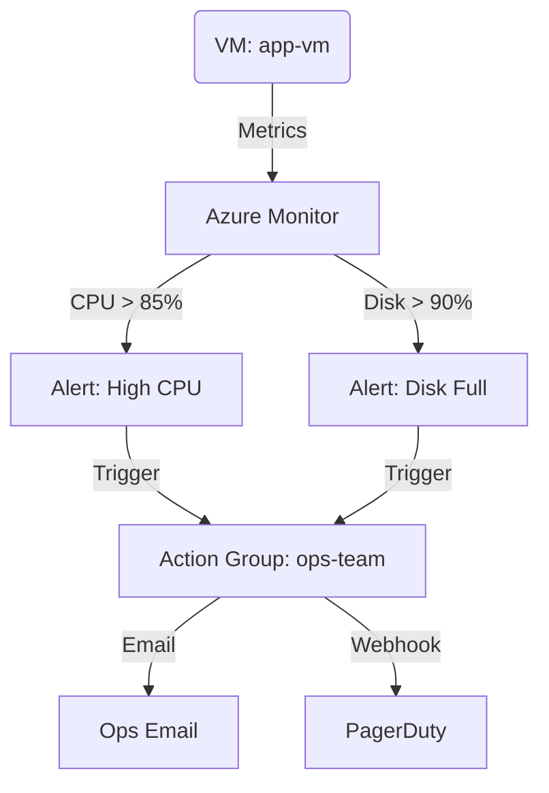

# Deploy Azure Monitor Metric Alerts for VM Monitoring on Azure

This guide demonstrates how to use MechCloud's stateless IaC to provision Azure Monitor metric alerts with action groups for proactive VM monitoring and notification.

## Scenario Overview
**Use Case:** Proactive monitoring of VM performance with automated alerts when CPU, memory, or disk metrics breach thresholds — essential for SLA compliance, capacity planning, and rapid incident response.
**Key MechCloud Features Highlighted:**
- Hierarchical resource nesting (Resource Group → resources)
- Cross-resource referencing (`ref:`)
- Multiple metric alert rules in a single template

### Architecture Diagram



***

### Complete Unified Template

```yaml
resources:
  - type: Microsoft.Resources/resourceGroups
    name: rg1
    location: "{{CURRENT_REGION}}"
    resources:
      - type: Microsoft.Network/virtualNetworks
        name: vnet1
        props:
          properties:
            addressSpace:
              addressPrefixes:
                - "10.0.0.0/16"
          resources:
            - type: Microsoft.Network/virtualNetworks/subnets
              name: subnet1
              props:
                properties:
                  addressPrefix: "10.0.1.0/24"

      - type: Microsoft.Network/networkInterfaces
        name: nic1
        props:
          properties:
            ipConfigurations:
              - name: ipconfig1
                properties:
                  subnet:
                    id: "ref:rg1/vnet1/subnet1"
                  privateIPAllocationMethod: Dynamic

      - type: Microsoft.Compute/virtualMachines
        name: app-vm
        props:
          properties:
            hardwareProfile:
              vmSize: Standard_B2ps_v2
            osProfile:
              computerName: app-vm
              adminUsername: azureuser
              linuxConfiguration:
                disablePasswordAuthentication: true
                ssh:
                  publicKeys:
                    - path: /home/azureuser/.ssh/authorized_keys
                      keyData: "ssh-rsa AAAA...your-key"
            storageProfile:
              imageReference:
                publisher: Canonical
                offer: ubuntu-24_04-lts
                sku: server-arm64
                version: latest
              osDisk:
                createOption: FromImage
            networkProfile:
              networkInterfaces:
                - id: "ref:rg1/nic1"

      - type: Microsoft.Insights/actionGroups
        name: ops-team
        props:
          properties:
            enabled: true
            groupShortName: ops
            emailReceivers:
              - name: ops-email
                emailAddress: "ops@example.com"
                useCommonAlertSchema: true
            webhookReceivers:
              - name: pagerduty
                serviceUri: "https://events.pagerduty.com/integration/placeholder/enqueue"
                useCommonAlertSchema: true

      - type: Microsoft.Insights/metricAlerts
        name: high-cpu-alert
        props:
          properties:
            description: "CPU usage exceeds 85% for 5 minutes"
            severity: 2
            enabled: true
            evaluationFrequency: PT1M
            windowSize: PT5M
            scopes:
              - "ref:rg1/app-vm"
            criteria:
              "odata.type": Microsoft.Azure.Monitor.SingleResourceMultipleMetricCriteria
              allOf:
                - name: high-cpu
                  metricName: Percentage CPU
                  operator: GreaterThan
                  threshold: 85
                  timeAggregation: Average
                  criterionType: StaticThresholdCriterion
            actions:
              - actionGroupId: "ref:rg1/ops-team"

      - type: Microsoft.Insights/metricAlerts
        name: disk-alert
        props:
          properties:
            description: "OS Disk usage exceeds 90%"
            severity: 1
            enabled: true
            evaluationFrequency: PT5M
            windowSize: PT15M
            scopes:
              - "ref:rg1/app-vm"
            criteria:
              "odata.type": Microsoft.Azure.Monitor.SingleResourceMultipleMetricCriteria
              allOf:
                - name: disk-full
                  metricName: OS Disk Used Percentage
                  operator: GreaterThan
                  threshold: 90
                  timeAggregation: Average
                  criterionType: StaticThresholdCriterion
            actions:
              - actionGroupId: "ref:rg1/ops-team"
```
