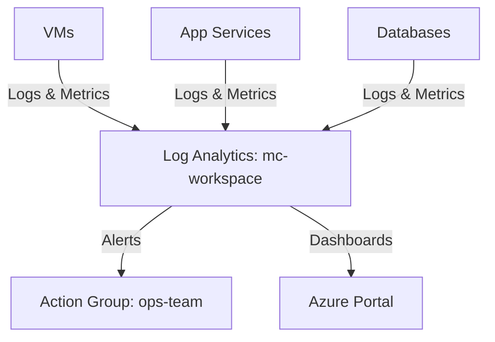

# Deploy Log Analytics Workspace with Diagnostic Settings on Azure

This guide demonstrates how to use MechCloud's stateless IaC to provision a Log Analytics workspace with diagnostic settings for centralized monitoring and log aggregation.

## Scenario Overview
**Use Case:** Centralized log collection and monitoring across all Azure resources — required for security operations, compliance auditing, and operational troubleshooting with KQL-based querying.
**Key MechCloud Features Highlighted:**
- Hierarchical resource nesting (Resource Group → Workspace → Solutions)
- Cross-resource referencing (`ref:`)
- Diagnostic settings as clean YAML

### Architecture Diagram



***

### Complete Unified Template

```yaml
resources:
  - type: Microsoft.Resources/resourceGroups
    name: rg1
    location: "{{CURRENT_REGION}}"
    resources:
      - type: Microsoft.OperationalInsights/workspaces
        name: mc-workspace
        props:
          properties:
            sku:
              name: PerGB2018
            retentionInDays: 90
            features:
              enableLogAccessUsingOnlyResourcePermissions: true

      - type: Microsoft.Insights/actionGroups
        name: ops-team
        props:
          properties:
            enabled: true
            groupShortName: ops
            emailReceivers:
              - name: ops-email
                emailAddress: "ops@example.com"
                useCommonAlertSchema: true

      - type: Microsoft.Insights/scheduledQueryRules
        name: high-cpu-alert
        props:
          properties:
            enabled: true
            severity: 2
            evaluationFrequency: PT5M
            windowSize: PT15M
            scopes:
              - "ref:rg1/mc-workspace"
            criteria:
              allOf:
                - query: "Perf | where ObjectName == 'Processor' and CounterName == '% Processor Time' | summarize AggregatedValue = avg(CounterValue) by bin(TimeGenerated, 5m), Computer | where AggregatedValue > 90"
                  timeAggregation: Average
                  metricMeasureColumn: AggregatedValue
                  operator: GreaterThan
                  threshold: 90
            actions:
              actionGroups:
                - "ref:rg1/ops-team"
```
