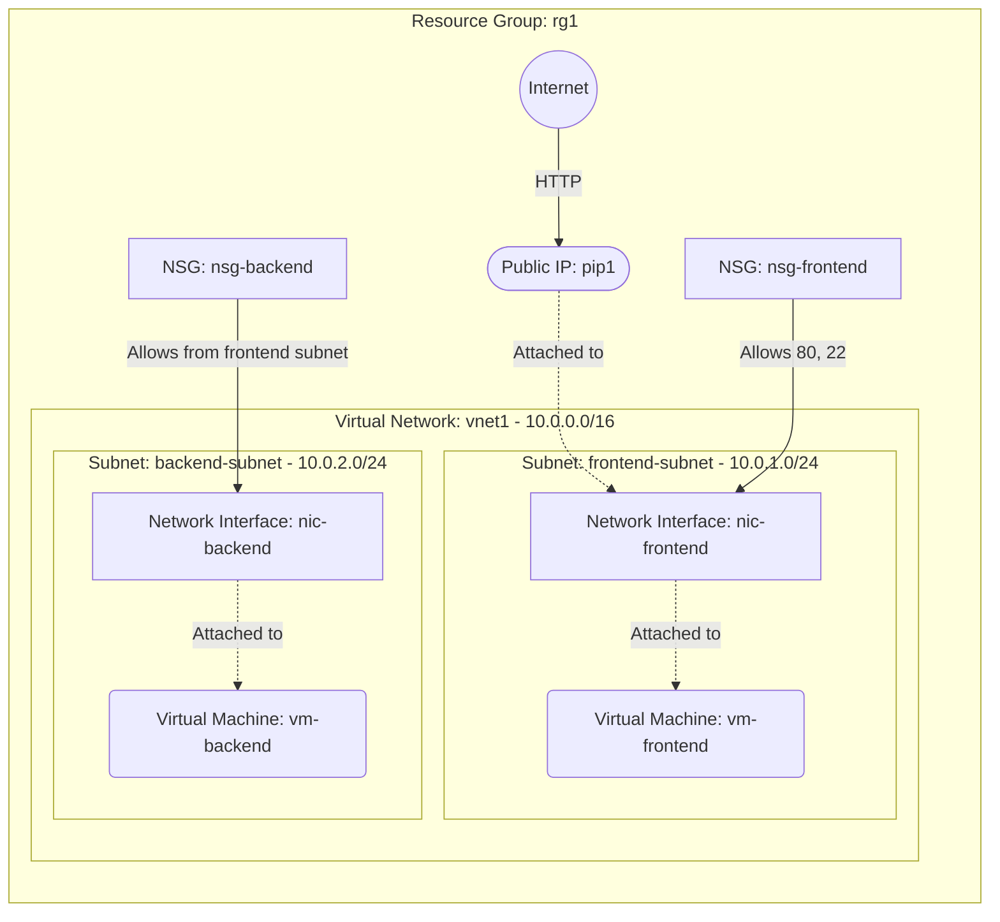

# Deploy a Multi-Subnet VNet with Frontend and Backend VMs on Azure

This guide demonstrates how to use MechCloud's stateless Infrastructure-as-Code (IaC) to provision a Virtual Network with multiple subnets hosting separate frontend and backend VMs with different security policies.

In this scenario, we create a VNet with two subnets — a public-facing frontend subnet and a private backend subnet. The frontend VM serves HTTP traffic from the internet, while the backend VM is only accessible from the frontend subnet, implementing a classic two-tier architecture.

## Scenario Overview
**Use Case:** A two-tier application architecture where a web frontend communicates with a private backend service (e.g., API server or database), each isolated in their own subnet with tailored security rules.
**Key MechCloud Features Highlighted:**
- Default scope inheritance (`resource_group: rg1`)
- Dynamic macros (`{{CURRENT_IP}}`)
- Cross-resource referencing (`ref:`)
- Multiple subnets within a single VNet

### Architecture Diagram



***

## Step 1: Setting up the Multi-Subnet VNet

We create a single VNet with two subnets: one for the frontend tier and one for the backend tier, each with its own address space.

```yaml
defaults:
  resource_group: rg1

resources:
  # 1. Define the Virtual Network with two subnets
  - type: "Microsoft.Network/virtualNetworks"
    api_version: "2025-05-01"
    name: vnet1
    props:
      address_space:
        address_prefixes:
          - "10.0.0.0/16"
      subnets:
        - name: frontend-subnet
          props:
            address_prefixes:
              - "10.0.1.0/24"
        - name: backend-subnet
          props:
            address_prefixes:
              - "10.0.2.0/24"
```

## Step 2: Creating Security Groups for Each Tier

The frontend NSG allows HTTP from the internet and SSH from your IP. The backend NSG only allows traffic from the frontend subnet, enforcing isolation.

```yaml
# ... (Continuing at the resources block) ...
  # 2. Frontend NSG - allows HTTP and SSH
  - type: "Microsoft.Network/networkSecurityGroups"
    api_version: "2025-05-01"
    name: nsg-frontend
    props:
      security_rules:
        - name: allow-ssh
          props:
            priority: 100
            direction: Inbound
            access: Allow
            protocol: Tcp
            source_port_range: "*"
            destination_port_range: "22"
            source_address_prefix: "{{CURRENT_IP}}/32"
            destination_address_prefix: "*"
        - name: allow-http-80
          props:
            priority: 110
            direction: Inbound
            access: Allow
            protocol: Tcp
            source_port_range: "*"
            destination_port_range: "80"
            source_address_prefix: "*"
            destination_address_prefix: "*"

  # 3. Backend NSG - allows traffic only from frontend subnet
  - type: "Microsoft.Network/networkSecurityGroups"
    api_version: "2025-05-01"
    name: nsg-backend
    props:
      security_rules:
        - name: allow-from-frontend
          props:
            priority: 100
            direction: Inbound
            access: Allow
            protocol: Tcp
            source_port_range: "*"
            destination_port_range: "8080"
            source_address_prefix: "10.0.1.0/24"
            destination_address_prefix: "*"
        - name: allow-ssh-from-frontend
          props:
            priority: 110
            direction: Inbound
            access: Allow
            protocol: Tcp
            source_port_range: "*"
            destination_port_range: "22"
            source_address_prefix: "10.0.1.0/24"
            destination_address_prefix: "*"
        - name: deny-all-inbound
          props:
            priority: 4096
            direction: Inbound
            access: Deny
            protocol: "*"
            source_port_range: "*"
            destination_port_range: "*"
            source_address_prefix: "*"
            destination_address_prefix: "*"
```

## Step 3: Creating Network Interfaces

The frontend NIC gets a Public IP while the backend NIC remains private-only. Each NIC is associated with its respective subnet and NSG.

```yaml
# ... (Continuing at the resources block) ...
  # 4. Public IP for frontend VM
  - type: "Microsoft.Network/publicIPAddresses"
    api_version: "2025-05-01"
    name: pip1
    props:
      public_ip_allocation_method: Static
      sku:
        name: Standard

  # 5. Frontend Network Interface
  - type: "Microsoft.Network/networkInterfaces"
    api_version: "2025-05-01"
    name: nic-frontend
    props:
      network_security_group:
        id: "ref:nsg-frontend"
      ip_configurations:
        - name: ipconfig1
          props:
            subnet:
              id: "ref:vnet1/subnets/frontend-subnet"
            private_ip_allocation_method: Dynamic
            public_ip_address:
              id: "ref:pip1"

  # 6. Backend Network Interface (private only)
  - type: "Microsoft.Network/networkInterfaces"
    api_version: "2025-05-01"
    name: nic-backend
    props:
      network_security_group:
        id: "ref:nsg-backend"
      ip_configurations:
        - name: ipconfig1
          props:
            subnet:
              id: "ref:vnet1/subnets/backend-subnet"
            private_ip_allocation_method: Dynamic
```

## Step 4: Provisioning the VMs

We provision two VMs: a frontend web server accessible from the internet and a backend service accessible only from the frontend subnet.

```yaml
# ... (Continuing at the resources block) ...
  # 7. Frontend Virtual Machine
  - type: "Microsoft.Compute/virtualMachines"
    api_version: "2025-04-01"
    name: vm-frontend
    props:
      hardware_profile:
        vm_size: Standard_B2pts_v2
      os_profile:
        computer_name: frontendvm
        admin_username: azureuser
        admin_password: P@ssw0rd1234!
      network_profile:
        network_interfaces:
          - id: "ref:nic-frontend"
      storage_profile:
        image_reference:
          publisher: Canonical
          offer: ubuntu-24_04-lts
          sku: server-arm64
          version: latest
        os_disk:
          create_option: FromImage
          managed_disk:
            storage_account_type: StandardSSD_LRS

  # 8. Backend Virtual Machine
  - type: "Microsoft.Compute/virtualMachines"
    api_version: "2025-04-01"
    name: vm-backend
    props:
      hardware_profile:
        vm_size: Standard_B2pts_v2
      os_profile:
        computer_name: backendvm
        admin_username: azureuser
        admin_password: P@ssw0rd1234!
      network_profile:
        network_interfaces:
          - id: "ref:nic-backend"
      storage_profile:
        image_reference:
          publisher: Canonical
          offer: ubuntu-24_04-lts
          sku: server-arm64
          version: latest
        os_disk:
          create_option: FromImage
          managed_disk:
            storage_account_type: StandardSSD_LRS
```

### Complete Unified Template

For your convenience, here is the complete, unified MechCloud template combining all steps:

```yaml
defaults:
  resource_group: rg1
resources:
  - type: "Microsoft.Network/virtualNetworks"
    api_version: "2025-05-01"
    name: vnet1
    props:
      address_space:
        address_prefixes:
          - "10.0.0.0/16"
      subnets:
        - name: frontend-subnet
          props:
            address_prefixes:
              - "10.0.1.0/24"
        - name: backend-subnet
          props:
            address_prefixes:
              - "10.0.2.0/24"

  - type: "Microsoft.Network/networkSecurityGroups"
    api_version: "2025-05-01"
    name: nsg-frontend
    props:
      security_rules:
        - name: allow-ssh
          props:
            priority: 100
            direction: Inbound
            access: Allow
            protocol: Tcp
            source_port_range: "*"
            destination_port_range: "22"
            source_address_prefix: "{{CURRENT_IP}}/32"
            destination_address_prefix: "*"
        - name: allow-http-80
          props:
            priority: 110
            direction: Inbound
            access: Allow
            protocol: Tcp
            source_port_range: "*"
            destination_port_range: "80"
            source_address_prefix: "*"
            destination_address_prefix: "*"

  - type: "Microsoft.Network/networkSecurityGroups"
    api_version: "2025-05-01"
    name: nsg-backend
    props:
      security_rules:
        - name: allow-from-frontend
          props:
            priority: 100
            direction: Inbound
            access: Allow
            protocol: Tcp
            source_port_range: "*"
            destination_port_range: "8080"
            source_address_prefix: "10.0.1.0/24"
            destination_address_prefix: "*"
        - name: allow-ssh-from-frontend
          props:
            priority: 110
            direction: Inbound
            access: Allow
            protocol: Tcp
            source_port_range: "*"
            destination_port_range: "22"
            source_address_prefix: "10.0.1.0/24"
            destination_address_prefix: "*"
        - name: deny-all-inbound
          props:
            priority: 4096
            direction: Inbound
            access: Deny
            protocol: "*"
            source_port_range: "*"
            destination_port_range: "*"
            source_address_prefix: "*"
            destination_address_prefix: "*"

  - type: "Microsoft.Network/publicIPAddresses"
    api_version: "2025-05-01"
    name: pip1
    props:
      public_ip_allocation_method: Static
      sku:
        name: Standard

  - type: "Microsoft.Network/networkInterfaces"
    api_version: "2025-05-01"
    name: nic-frontend
    props:
      network_security_group:
        id: "ref:nsg-frontend"
      ip_configurations:
        - name: ipconfig1
          props:
            subnet:
              id: "ref:vnet1/subnets/frontend-subnet"
            private_ip_allocation_method: Dynamic
            public_ip_address:
              id: "ref:pip1"

  - type: "Microsoft.Network/networkInterfaces"
    api_version: "2025-05-01"
    name: nic-backend
    props:
      network_security_group:
        id: "ref:nsg-backend"
      ip_configurations:
        - name: ipconfig1
          props:
            subnet:
              id: "ref:vnet1/subnets/backend-subnet"
            private_ip_allocation_method: Dynamic

  - type: "Microsoft.Compute/virtualMachines"
    api_version: "2025-04-01"
    name: vm-frontend
    props:
      hardware_profile:
        vm_size: Standard_B2pts_v2
      os_profile:
        computer_name: frontendvm
        admin_username: azureuser
        admin_password: P@ssw0rd1234!
      network_profile:
        network_interfaces:
          - id: "ref:nic-frontend"
      storage_profile:
        image_reference:
          publisher: Canonical
          offer: ubuntu-24_04-lts
          sku: server-arm64
          version: latest
        os_disk:
          create_option: FromImage
          managed_disk:
            storage_account_type: StandardSSD_LRS

  - type: "Microsoft.Compute/virtualMachines"
    api_version: "2025-04-01"
    name: vm-backend
    props:
      hardware_profile:
        vm_size: Standard_B2pts_v2
      os_profile:
        computer_name: backendvm
        admin_username: azureuser
        admin_password: P@ssw0rd1234!
      network_profile:
        network_interfaces:
          - id: "ref:nic-backend"
      storage_profile:
        image_reference:
          publisher: Canonical
          offer: ubuntu-24_04-lts
          sku: server-arm64
          version: latest
        os_disk:
          create_option: FromImage
          managed_disk:
            storage_account_type: StandardSSD_LRS
```
