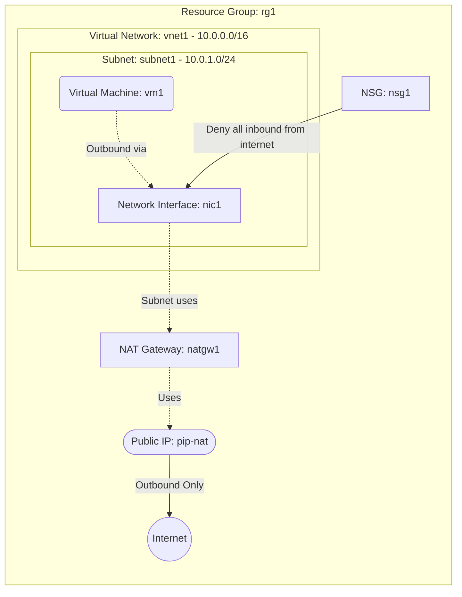

# Deploy a Private VM with Outbound Internet via NAT Gateway

This guide demonstrates how to use MechCloud's stateless Infrastructure-as-Code (IaC) to provision a private Virtual Machine that accesses the internet for outbound traffic through an Azure NAT Gateway, without exposing any inbound public IP.

In this scenario, we deploy a VM with no public IP that uses a NAT Gateway for outbound connectivity. This is ideal for workloads that need to pull updates, call external APIs, or push data to external services while remaining completely unreachable from the internet.

## Scenario Overview
**Use Case:** Backend workers, batch processing nodes, or application servers that need outbound internet access (e.g., downloading packages, calling external APIs) but must not have any inbound public exposure.
**Key MechCloud Features Highlighted:**
- Default scope inheritance (`resource_group: rg1`)
- Cross-resource referencing (`ref:`)
- NAT Gateway associated with a subnet for outbound traffic

### Architecture Diagram



***

## Step 1: Creating the NAT Gateway with Public IP

We provision a Public IP and attach it to a NAT Gateway. All outbound traffic from associated subnets will use this Public IP as the source address.

```yaml
defaults:
  resource_group: rg1

resources:
  # 1. Public IP for NAT Gateway
  - type: "Microsoft.Network/publicIPAddresses"
    api_version: "2025-05-01"
    name: pip-nat
    props:
      public_ip_allocation_method: Static
      sku:
        name: Standard_V2

  # 2. NAT Gateway
  - type: "Microsoft.Network/natGateways"
    api_version: "2025-05-01"
    name: natgw1
    props:
      sku:
        name: Standard_V2
      idle_timeout_in_minutes: 4
      public_ip_addresses:
        - id: "ref:pip-nat"
```

## Step 2: Setting up the VNet with NAT Gateway Association

We create a VNet with a subnet that is associated with the NAT Gateway. This ensures all outbound traffic from VMs in this subnet is routed through the NAT Gateway.

```yaml
# ... (Continuing at the resources block) ...
  # 3. VNet with NAT Gateway-associated subnet
  - type: "Microsoft.Network/virtualNetworks"
    api_version: "2025-05-01"
    name: vnet1
    props:
      address_space:
        address_prefixes:
          - "10.0.0.0/16"
      subnets:
        - name: subnet1
          props:
            address_prefixes:
              - "10.0.1.0/24"
            nat_gateway:
              id: "ref:natgw1"
```

## Step 3: Security and Network Interface

We create an NSG that blocks all inbound traffic from the internet and a private-only NIC for the VM.

```yaml
# ... (Continuing at the resources block) ...
  # 4. NSG denying all inbound from internet
  - type: "Microsoft.Network/networkSecurityGroups"
    api_version: "2025-05-01"
    name: nsg1
    props:
      security_rules:
        - name: allow-ssh-from-vnet
          props:
            priority: 100
            direction: Inbound
            access: Allow
            protocol: Tcp
            source_port_range: "*"
            destination_port_range: "22"
            source_address_prefix: "10.0.0.0/16"
            destination_address_prefix: "*"
        - name: deny-all-inbound
          props:
            priority: 4096
            direction: Inbound
            access: Deny
            protocol: "*"
            source_port_range: "*"
            destination_port_range: "*"
            source_address_prefix: "*"
            destination_address_prefix: "*"

  # 5. Network Interface (private only)
  - type: "Microsoft.Network/networkInterfaces"
    api_version: "2025-05-01"
    name: nic1
    props:
      network_security_group:
        id: "ref:nsg1"
      ip_configurations:
        - name: ipconfig1
          props:
            subnet:
              id: "ref:vnet1/subnets/subnet1"
            private_ip_allocation_method: Dynamic
```

## Step 4: Provisioning the VM

We provision a private VM that has no public IP but can still reach the internet outbound through the NAT Gateway.

```yaml
# ... (Continuing at the resources block) ...
  # 6. Virtual Machine
  - type: "Microsoft.Compute/virtualMachines"
    api_version: "2025-04-01"
    name: vm1
    props:
      hardware_profile:
        vm_size: Standard_B2pts_v2
      os_profile:
        computer_name: natvm
        admin_username: azureuser
        admin_password: P@ssw0rd1234!
      network_profile:
        network_interfaces:
          - id: "ref:nic1"
      storage_profile:
        image_reference:
          publisher: Canonical
          offer: ubuntu-24_04-lts
          sku: server-arm64
          version: latest
        os_disk:
          create_option: FromImage
          managed_disk:
            storage_account_type: StandardSSD_LRS
```

### Complete Unified Template

For your convenience, here is the complete, unified MechCloud template combining all steps:

```yaml
defaults:
  resource_group: rg1
resources:
  - type: "Microsoft.Network/publicIPAddresses"
    api_version: "2025-05-01"
    name: pip-nat
    props:
      public_ip_allocation_method: Static
      sku:
        name: Standard_V2

  - type: "Microsoft.Network/natGateways"
    api_version: "2025-05-01"
    name: natgw1
    props:
      sku:
        name: Standard_V2
      idle_timeout_in_minutes: 4
      public_ip_addresses:
        - id: "ref:pip-nat"

  - type: "Microsoft.Network/virtualNetworks"
    api_version: "2025-05-01"
    name: vnet1
    props:
      address_space:
        address_prefixes:
          - "10.0.0.0/16"
      subnets:
        - name: subnet1
          props:
            address_prefixes:
              - "10.0.1.0/24"
            nat_gateway:
              id: "ref:natgw1"

  - type: "Microsoft.Network/networkSecurityGroups"
    api_version: "2025-05-01"
    name: nsg1
    props:
      security_rules:
        - name: allow-ssh-from-vnet
          props:
            priority: 100
            direction: Inbound
            access: Allow
            protocol: Tcp
            source_port_range: "*"
            destination_port_range: "22"
            source_address_prefix: "10.0.0.0/16"
            destination_address_prefix: "*"
        - name: deny-all-inbound
          props:
            priority: 4096
            direction: Inbound
            access: Deny
            protocol: "*"
            source_port_range: "*"
            destination_port_range: "*"
            source_address_prefix: "*"
            destination_address_prefix: "*"

  - type: "Microsoft.Network/networkInterfaces"
    api_version: "2025-05-01"
    name: nic1
    props:
      network_security_group:
        id: "ref:nsg1"
      ip_configurations:
        - name: ipconfig1
          props:
            subnet:
              id: "ref:vnet1/subnets/subnet1"
            private_ip_allocation_method: Dynamic

  - type: "Microsoft.Compute/virtualMachines"
    api_version: "2025-04-01"
    name: vm1
    props:
      hardware_profile:
        vm_size: Standard_B2pts_v2
      os_profile:
        computer_name: natvm
        admin_username: azureuser
        admin_password: P@ssw0rd1234!
      network_profile:
        network_interfaces:
          - id: "ref:nic1"
      storage_profile:
        image_reference:
          publisher: Canonical
          offer: ubuntu-24_04-lts
          sku: server-arm64
          version: latest
        os_disk:
          create_option: FromImage
          managed_disk:
            storage_account_type: StandardSSD_LRS
```
