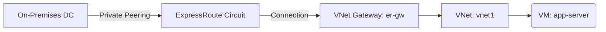

# Deploy ExpressRoute Circuit with VNet Gateway on Azure

This guide demonstrates how to use MechCloud's stateless IaC to provision an ExpressRoute circuit with a Virtual Network Gateway for dedicated private connectivity between on-premises infrastructure and Azure.

## Scenario Overview
**Use Case:** Enterprise hybrid connectivity with a dedicated, private connection to Azure that bypasses the public internet — providing consistent network performance, lower latency, and higher security for workloads requiring compliance-grade connectivity.
**Key MechCloud Features Highlighted:**
- Hierarchical resource nesting (Resource Group → VNet → Gateway → ExpressRoute)
- Cross-resource referencing (`ref:`)
- Gateway and circuit configuration as clean YAML

### Architecture Diagram



***

### Complete Unified Template

```yaml
resources:
  - type: Microsoft.Resources/resourceGroups
    name: rg1
    location: "{{CURRENT_REGION}}"
    resources:
      - type: Microsoft.Network/virtualNetworks
        name: vnet1
        props:
          properties:
            addressSpace:
              addressPrefixes:
                - "10.0.0.0/16"
          resources:
            - type: Microsoft.Network/virtualNetworks/subnets
              name: GatewaySubnet
              props:
                properties:
                  addressPrefix: "10.0.255.0/27"
            - type: Microsoft.Network/virtualNetworks/subnets
              name: app-subnet
              props:
                properties:
                  addressPrefix: "10.0.1.0/24"

      - type: Microsoft.Network/publicIPAddresses
        name: gw-pip
        props:
          sku:
            name: Standard
          properties:
            publicIPAllocationMethod: Static

      - type: Microsoft.Network/expressRouteCircuits
        name: er-circuit
        props:
          sku:
            name: Standard_MeteredData
            tier: Standard
            family: MeteredData
          properties:
            serviceProviderProperties:
              serviceProviderName: "Equinix"
              peeringLocation: "Silicon Valley"
              bandwidthInMbps: 200
            allowClassicOperations: false

      - type: Microsoft.Network/virtualNetworkGateways
        name: er-gw
        props:
          properties:
            gatewayType: ExpressRoute
            sku:
              name: Standard
              tier: Standard
            ipConfigurations:
              - name: gw-ipconfig
                properties:
                  subnet:
                    id: "ref:rg1/vnet1/GatewaySubnet"
                  publicIPAddress:
                    id: "ref:rg1/gw-pip"

      - type: Microsoft.Network/connections
        name: er-connection
        props:
          properties:
            connectionType: ExpressRoute
            virtualNetworkGateway1:
              id: "ref:rg1/er-gw"
            peer:
              id: "ref:rg1/er-circuit"
            routingWeight: 0
```
