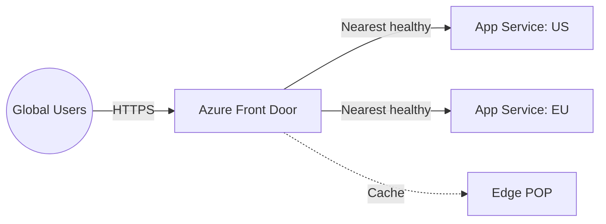

# Deploy Azure Front Door for Global Load Balancing on Azure

This guide demonstrates how to use MechCloud's stateless IaC to provision Azure Front Door for global HTTP load balancing with WAF, SSL offloading, and intelligent routing.

## Scenario Overview
**Use Case:** A globally distributed web application that needs edge caching, SSL termination, and intelligent routing to the nearest healthy backend — with built-in DDoS protection and WAF for enterprise-grade security.
**Key MechCloud Features Highlighted:**
- Hierarchical resource nesting (Resource Group → Front Door resources)
- Cross-resource referencing (`ref:`)
- Routing rules and backend pools as clean YAML

### Architecture Diagram



***

### Complete Unified Template

```yaml
resources:
  - type: Microsoft.Resources/resourceGroups
    name: rg1
    location: "{{CURRENT_REGION}}"
    resources:
      - type: Microsoft.Cdn/profiles
        name: mc-frontdoor
        props:
          sku:
            name: Standard_AzureFrontDoor
          resources:
            - type: Microsoft.Cdn/profiles/afdEndpoints
              name: mc-endpoint
              props:
                properties:
                  enabledState: Enabled

            - type: Microsoft.Cdn/profiles/originGroups
              name: app-origins
              props:
                properties:
                  loadBalancingSettings:
                    sampleSize: 4
                    successfulSamplesRequired: 3
                    additionalLatencyInMilliseconds: 50
                  healthProbeSettings:
                    probePath: "/health"
                    probeRequestType: HEAD
                    probeProtocol: Https
                    probeIntervalInSeconds: 30
              resources:
                - type: Microsoft.Cdn/profiles/originGroups/origins
                  name: us-origin
                  props:
                    properties:
                      hostName: "mc-app-us.azurewebsites.net"
                      httpPort: 80
                      httpsPort: 443
                      priority: 1
                      weight: 1000
                      enabledState: Enabled
                - type: Microsoft.Cdn/profiles/originGroups/origins
                  name: eu-origin
                  props:
                    properties:
                      hostName: "mc-app-eu.azurewebsites.net"
                      httpPort: 80
                      httpsPort: 443
                      priority: 1
                      weight: 1000
                      enabledState: Enabled

            - type: Microsoft.Cdn/profiles/afdEndpoints/routes
              name: default-route
              props:
                properties:
                  originGroup:
                    id: "ref:rg1/mc-frontdoor/app-origins"
                  supportedProtocols:
                    - Http
                    - Https
                  patternsToMatch:
                    - "/*"
                  forwardingProtocol: HttpsOnly
                  httpsRedirect: Enabled
                  linkToDefaultDomain: Enabled
                  cacheConfiguration:
                    queryStringCachingBehavior: UseQueryString
                    compressionSettings:
                      isCompressionEnabled: true
                      contentTypesToCompress:
                        - "text/html"
                        - "text/css"
                        - "application/javascript"
                        - "application/json"
```
