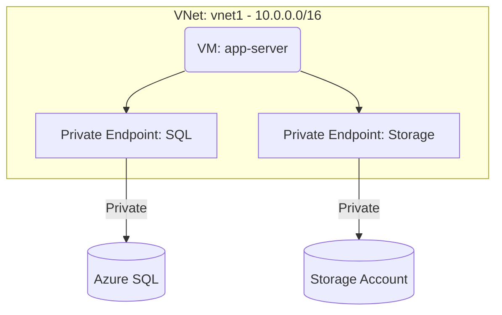

# Deploy Private Endpoints for Azure Services on Azure

This guide demonstrates how to use MechCloud's stateless IaC to provision Private Endpoints for secure private connectivity to Azure PaaS services without traversing the public internet.

## Scenario Overview
**Use Case:** Securing traffic between your VNet and Azure PaaS services (Storage, SQL, Key Vault) by keeping it entirely within the Microsoft backbone network — required for compliance, data exfiltration prevention, and improved security.
**Key MechCloud Features Highlighted:**
- Hierarchical resource nesting (Resource Group → VNet → Subnet → Private Endpoint)
- Cross-resource referencing (`ref:`)
- Private DNS zone integration

### Architecture Diagram



***

### Complete Unified Template

```yaml
resources:
  - type: Microsoft.Resources/resourceGroups
    name: rg1
    location: "{{CURRENT_REGION}}"
    resources:
      - type: Microsoft.Network/virtualNetworks
        name: vnet1
        props:
          properties:
            addressSpace:
              addressPrefixes:
                - "10.0.0.0/16"
          resources:
            - type: Microsoft.Network/virtualNetworks/subnets
              name: app-subnet
              props:
                properties:
                  addressPrefix: "10.0.1.0/24"
            - type: Microsoft.Network/virtualNetworks/subnets
              name: pe-subnet
              props:
                properties:
                  addressPrefix: "10.0.2.0/24"
                  privateEndpointNetworkPolicies: Disabled

      - type: Microsoft.Storage/storageAccounts
        name: mcpestorage1
        props:
          kind: StorageV2
          sku:
            name: Standard_LRS
          properties:
            supportsHttpsTrafficOnly: true
            publicNetworkAccess: Disabled

      - type: Microsoft.Network/privateDnsZones
        name: storage-dns
        props:
          name: "privatelink.blob.core.windows.net"
          resources:
            - type: Microsoft.Network/privateDnsZones/virtualNetworkLinks
              name: storage-dns-link
              props:
                properties:
                  virtualNetwork:
                    id: "ref:rg1/vnet1"
                  registrationEnabled: false

      - type: Microsoft.Network/privateEndpoints
        name: storage-pe
        props:
          properties:
            subnet:
              id: "ref:rg1/vnet1/pe-subnet"
            privateLinkServiceConnections:
              - name: storage-connection
                properties:
                  privateLinkServiceId: "ref:rg1/mcpestorage1"
                  groupIds:
                    - blob
          resources:
            - type: Microsoft.Network/privateEndpoints/privateDnsZoneGroups
              name: storage-dns-group
              props:
                properties:
                  privateDnsZoneConfigs:
                    - name: config1
                      properties:
                        privateDnsZoneId: "ref:rg1/storage-dns"
```
