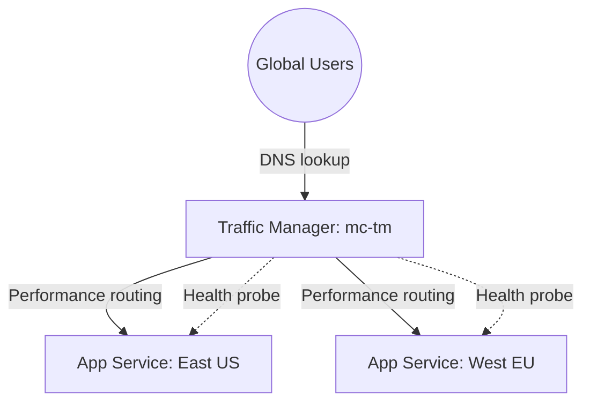

# Deploy Azure Traffic Manager for DNS-Based Load Balancing on Azure

This guide demonstrates how to use MechCloud's stateless IaC to provision Azure Traffic Manager for DNS-based traffic routing across multiple regions with health monitoring.

## Scenario Overview
**Use Case:** Multi-region application deployment where Traffic Manager routes users to the nearest healthy endpoint using DNS — supporting performance, priority, weighted, and geographic routing methods for global availability.
**Key MechCloud Features Highlighted:**
- Hierarchical resource nesting (Resource Group → Traffic Manager → Endpoints)
- Cross-resource referencing (`ref:`)
- Health probe and routing configuration as clean YAML

### Architecture Diagram



***

### Complete Unified Template

```yaml
resources:
  - type: Microsoft.Resources/resourceGroups
    name: rg1
    location: "{{CURRENT_REGION}}"
    resources:
      - type: Microsoft.Web/serverfarms
        name: plan-eastus
        location: eastus
        props:
          sku:
            name: P1v3
            tier: PremiumV3
          properties:
            reserved: true

      - type: Microsoft.Web/sites
        name: mc-app-eastus
        location: eastus
        props:
          kind: app,linux
          properties:
            serverFarmId: "ref:rg1/plan-eastus"
            httpsOnly: true
            siteConfig:
              linuxFxVersion: "NODE|20-lts"

      - type: Microsoft.Web/serverfarms
        name: plan-westeu
        location: westeurope
        props:
          sku:
            name: P1v3
            tier: PremiumV3
          properties:
            reserved: true

      - type: Microsoft.Web/sites
        name: mc-app-westeu
        location: westeurope
        props:
          kind: app,linux
          properties:
            serverFarmId: "ref:rg1/plan-westeu"
            httpsOnly: true
            siteConfig:
              linuxFxVersion: "NODE|20-lts"

      - type: Microsoft.Network/trafficManagerProfiles
        name: mc-tm
        props:
          properties:
            trafficRoutingMethod: Performance
            dnsConfig:
              relativeName: mc-global-app
              ttl: 60
            monitorConfig:
              protocol: HTTPS
              port: 443
              path: "/health"
              intervalInSeconds: 30
              toleratedNumberOfFailures: 3
              timeoutInSeconds: 10
          resources:
            - type: Microsoft.Network/trafficManagerProfiles/azureEndpoints
              name: eastus-endpoint
              props:
                properties:
                  targetResourceId: "ref:rg1/mc-app-eastus"
                  endpointStatus: Enabled
                  weight: 1
            - type: Microsoft.Network/trafficManagerProfiles/azureEndpoints
              name: westeu-endpoint
              props:
                properties:
                  targetResourceId: "ref:rg1/mc-app-westeu"
                  endpointStatus: Enabled
                  weight: 1
```
