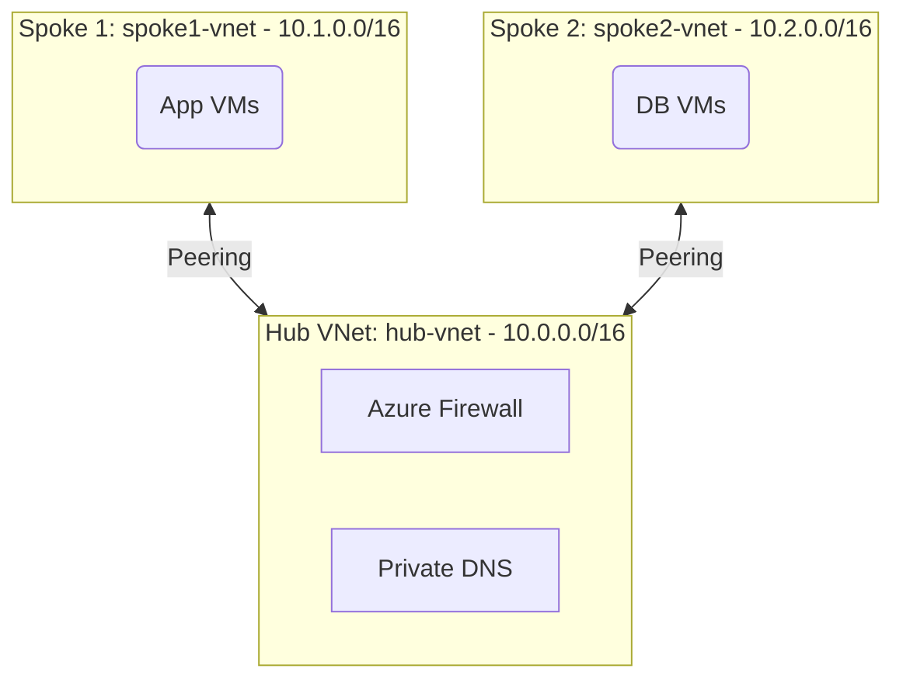

# Deploy a Hub-and-Spoke VNet Topology on Azure

This guide demonstrates how to use MechCloud's stateless IaC to provision a hub-and-spoke network topology with a shared services hub VNet peered to multiple spoke VNets.

## Scenario Overview
**Use Case:** Enterprise network architecture where a central hub VNet hosts shared services (firewall, DNS, VPN gateway) and spoke VNets host isolated workloads — enabling centralized security control, reduced costs, and workload isolation.
**Key MechCloud Features Highlighted:**
- Cross-resource referencing (`ref:`)
- Multiple VNet peerings in a single template
- Hub-spoke topology with shared services

### Architecture Diagram



***

### Complete Unified Template

```yaml
resources:
  - type: Microsoft.Resources/resourceGroups
    name: rg1
    location: "{{CURRENT_REGION}}"
    resources:
      # Hub VNet
      - type: Microsoft.Network/virtualNetworks
        name: hub-vnet
        props:
          properties:
            addressSpace:
              addressPrefixes:
                - "10.0.0.0/16"
          resources:
            - type: Microsoft.Network/virtualNetworks/subnets
              name: shared-services
              props:
                properties:
                  addressPrefix: "10.0.1.0/24"
            - type: Microsoft.Network/virtualNetworks/subnets
              name: AzureFirewallSubnet
              props:
                properties:
                  addressPrefix: "10.0.0.0/26"
            - type: Microsoft.Network/virtualNetworks/subnets
              name: GatewaySubnet
              props:
                properties:
                  addressPrefix: "10.0.255.0/27"

      # Spoke 1 VNet
      - type: Microsoft.Network/virtualNetworks
        name: spoke1-vnet
        props:
          properties:
            addressSpace:
              addressPrefixes:
                - "10.1.0.0/16"
          resources:
            - type: Microsoft.Network/virtualNetworks/subnets
              name: app-subnet
              props:
                properties:
                  addressPrefix: "10.1.1.0/24"

      # Spoke 2 VNet
      - type: Microsoft.Network/virtualNetworks
        name: spoke2-vnet
        props:
          properties:
            addressSpace:
              addressPrefixes:
                - "10.2.0.0/16"
          resources:
            - type: Microsoft.Network/virtualNetworks/subnets
              name: db-subnet
              props:
                properties:
                  addressPrefix: "10.2.1.0/24"

      # Hub to Spoke 1 peering
      - type: Microsoft.Network/virtualNetworks/virtualNetworkPeerings
        name: hub-to-spoke1
        parent: hub-vnet
        props:
          properties:
            remoteVirtualNetwork:
              id: "ref:rg1/spoke1-vnet"
            allowVirtualNetworkAccess: true
            allowForwardedTraffic: true
            allowGatewayTransit: true

      # Spoke 1 to Hub peering
      - type: Microsoft.Network/virtualNetworks/virtualNetworkPeerings
        name: spoke1-to-hub
        parent: spoke1-vnet
        props:
          properties:
            remoteVirtualNetwork:
              id: "ref:rg1/hub-vnet"
            allowVirtualNetworkAccess: true
            allowForwardedTraffic: true
            useRemoteGateways: false

      # Hub to Spoke 2 peering
      - type: Microsoft.Network/virtualNetworks/virtualNetworkPeerings
        name: hub-to-spoke2
        parent: hub-vnet
        props:
          properties:
            remoteVirtualNetwork:
              id: "ref:rg1/spoke2-vnet"
            allowVirtualNetworkAccess: true
            allowForwardedTraffic: true
            allowGatewayTransit: true

      # Spoke 2 to Hub peering
      - type: Microsoft.Network/virtualNetworks/virtualNetworkPeerings
        name: spoke2-to-hub
        parent: spoke2-vnet
        props:
          properties:
            remoteVirtualNetwork:
              id: "ref:rg1/hub-vnet"
            allowVirtualNetworkAccess: true
            allowForwardedTraffic: true
            useRemoteGateways: false
```
