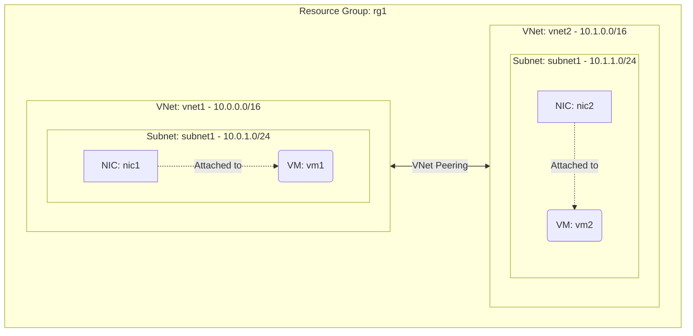

# Deploy Two Peered Virtual Networks on Azure

This guide demonstrates how to use MechCloud's stateless Infrastructure-as-Code (IaC) to provision two Virtual Networks connected via VNet Peering on Azure.

In this scenario, we create two separate VNets — each with its own subnet and VM — and establish bidirectional VNet Peering between them. This allows resources in both VNets to communicate with each other over Azure's private backbone network, as if they were on the same network, without traffic traversing the public internet.

## Scenario Overview
**Use Case:** Connecting separate application environments (e.g., development and staging), linking a shared services VNet to an application VNet, or enabling cross-team resource communication within an organization.
**Key MechCloud Features Highlighted:**
- Default scope inheritance (`resource_group: rg1`)
- Cross-resource referencing (`ref:`)
- Bidirectional VNet Peering configuration

### Architecture Diagram



***

## Step 1: Creating Two Virtual Networks

We provision two VNets with non-overlapping address spaces. This is a requirement for VNet Peering — the address ranges must not conflict.

```yaml
defaults:
  resource_group: rg1

resources:
  # 1. First Virtual Network
  - type: "Microsoft.Network/virtualNetworks"
    api_version: "2025-05-01"
    name: vnet1
    props:
      address_space:
        address_prefixes:
          - "10.0.0.0/16"
      subnets:
        - name: subnet1
          props:
            address_prefixes:
              - "10.0.1.0/24"

  # 2. Second Virtual Network
  - type: "Microsoft.Network/virtualNetworks"
    api_version: "2025-05-01"
    name: vnet2
    props:
      address_space:
        address_prefixes:
          - "10.1.0.0/16"
      subnets:
        - name: subnet1
          props:
            address_prefixes:
              - "10.1.1.0/24"
```

## Step 2: Establishing Bidirectional VNet Peering

We create peering connections in both directions. Each VNet needs its own peering resource that points to the other VNet's ID.

```yaml
# ... (Continuing at the resources block) ...
  # 3. Peering from vnet1 to vnet2
  - type: "Microsoft.Network/virtualNetworks/virtualNetworkPeerings"
    api_version: "2025-05-01"
    name: "vnet1/peer-vnet1-to-vnet2"
    props:
      remote_virtual_network:
        id: "ref:vnet2"
      allow_virtual_network_access: true
      allow_forwarded_traffic: false
      allow_gateway_transit: false
      use_remote_gateways: false

  # 4. Peering from vnet2 to vnet1
  - type: "Microsoft.Network/virtualNetworks/virtualNetworkPeerings"
    api_version: "2025-05-01"
    name: "vnet2/peer-vnet2-to-vnet1"
    props:
      remote_virtual_network:
        id: "ref:vnet1"
      allow_virtual_network_access: true
      allow_forwarded_traffic: false
      allow_gateway_transit: false
      use_remote_gateways: false
```

## Step 3: Creating NSG and Network Interfaces

We create a shared NSG allowing SSH from within both VNet address ranges, and one NIC per VNet.

```yaml
# ... (Continuing at the resources block) ...
  # 5. NSG allowing SSH from both VNets
  - type: "Microsoft.Network/networkSecurityGroups"
    api_version: "2025-05-01"
    name: nsg1
    props:
      security_rules:
        - name: allow-ssh-from-vnets
          props:
            priority: 100
            direction: Inbound
            access: Allow
            protocol: Tcp
            source_port_range: "*"
            destination_port_range: "22"
            source_address_prefix: "10.0.0.0/8"
            destination_address_prefix: "*"

  # 6. NIC in VNet1
  - type: "Microsoft.Network/networkInterfaces"
    api_version: "2025-05-01"
    name: nic1
    props:
      network_security_group:
        id: "ref:nsg1"
      ip_configurations:
        - name: ipconfig1
          props:
            subnet:
              id: "ref:vnet1/subnets/subnet1"
            private_ip_allocation_method: Dynamic

  # 7. NIC in VNet2
  - type: "Microsoft.Network/networkInterfaces"
    api_version: "2025-05-01"
    name: nic2
    props:
      network_security_group:
        id: "ref:nsg1"
      ip_configurations:
        - name: ipconfig1
          props:
            subnet:
              id: "ref:vnet2/subnets/subnet1"
            private_ip_allocation_method: Dynamic
```

## Step 4: Provisioning VMs in Each VNet

We deploy one VM in each VNet. Thanks to VNet Peering, these VMs can communicate with each other using their private IP addresses.

```yaml
# ... (Continuing at the resources block) ...
  # 8. VM in VNet1
  - type: "Microsoft.Compute/virtualMachines"
    api_version: "2025-04-01"
    name: vm1
    props:
      hardware_profile:
        vm_size: Standard_B2pts_v2
      os_profile:
        computer_name: vm1
        admin_username: azureuser
        admin_password: P@ssw0rd1234!
      network_profile:
        network_interfaces:
          - id: "ref:nic1"
      storage_profile:
        image_reference:
          publisher: Canonical
          offer: ubuntu-24_04-lts
          sku: server-arm64
          version: latest
        os_disk:
          create_option: FromImage
          managed_disk:
            storage_account_type: StandardSSD_LRS

  # 9. VM in VNet2
  - type: "Microsoft.Compute/virtualMachines"
    api_version: "2025-04-01"
    name: vm2
    props:
      hardware_profile:
        vm_size: Standard_B2pts_v2
      os_profile:
        computer_name: vm2
        admin_username: azureuser
        admin_password: P@ssw0rd1234!
      network_profile:
        network_interfaces:
          - id: "ref:nic2"
      storage_profile:
        image_reference:
          publisher: Canonical
          offer: ubuntu-24_04-lts
          sku: server-arm64
          version: latest
        os_disk:
          create_option: FromImage
          managed_disk:
            storage_account_type: StandardSSD_LRS
```

### Complete Unified Template

For your convenience, here is the complete, unified MechCloud template combining all steps:

```yaml
defaults:
  resource_group: rg1
resources:
  - type: "Microsoft.Network/virtualNetworks"
    api_version: "2025-05-01"
    name: vnet1
    props:
      address_space:
        address_prefixes:
          - "10.0.0.0/16"
      subnets:
        - name: subnet1
          props:
            address_prefixes:
              - "10.0.1.0/24"

  - type: "Microsoft.Network/virtualNetworks"
    api_version: "2025-05-01"
    name: vnet2
    props:
      address_space:
        address_prefixes:
          - "10.1.0.0/16"
      subnets:
        - name: subnet1
          props:
            address_prefixes:
              - "10.1.1.0/24"

  - type: "Microsoft.Network/virtualNetworks/virtualNetworkPeerings"
    api_version: "2025-05-01"
    name: "vnet1/peer-vnet1-to-vnet2"
    props:
      remote_virtual_network:
        id: "ref:vnet2"
      allow_virtual_network_access: true
      allow_forwarded_traffic: false
      allow_gateway_transit: false
      use_remote_gateways: false

  - type: "Microsoft.Network/virtualNetworks/virtualNetworkPeerings"
    api_version: "2025-05-01"
    name: "vnet2/peer-vnet2-to-vnet1"
    props:
      remote_virtual_network:
        id: "ref:vnet1"
      allow_virtual_network_access: true
      allow_forwarded_traffic: false
      allow_gateway_transit: false
      use_remote_gateways: false

  - type: "Microsoft.Network/networkSecurityGroups"
    api_version: "2025-05-01"
    name: nsg1
    props:
      security_rules:
        - name: allow-ssh-from-vnets
          props:
            priority: 100
            direction: Inbound
            access: Allow
            protocol: Tcp
            source_port_range: "*"
            destination_port_range: "22"
            source_address_prefix: "10.0.0.0/8"
            destination_address_prefix: "*"

  - type: "Microsoft.Network/networkInterfaces"
    api_version: "2025-05-01"
    name: nic1
    props:
      network_security_group:
        id: "ref:nsg1"
      ip_configurations:
        - name: ipconfig1
          props:
            subnet:
              id: "ref:vnet1/subnets/subnet1"
            private_ip_allocation_method: Dynamic

  - type: "Microsoft.Network/networkInterfaces"
    api_version: "2025-05-01"
    name: nic2
    props:
      network_security_group:
        id: "ref:nsg1"
      ip_configurations:
        - name: ipconfig1
          props:
            subnet:
              id: "ref:vnet2/subnets/subnet1"
            private_ip_allocation_method: Dynamic

  - type: "Microsoft.Compute/virtualMachines"
    api_version: "2025-04-01"
    name: vm1
    props:
      hardware_profile:
        vm_size: Standard_B2pts_v2
      os_profile:
        computer_name: vm1
        admin_username: azureuser
        admin_password: P@ssw0rd1234!
      network_profile:
        network_interfaces:
          - id: "ref:nic1"
      storage_profile:
        image_reference:
          publisher: Canonical
          offer: ubuntu-24_04-lts
          sku: server-arm64
          version: latest
        os_disk:
          create_option: FromImage
          managed_disk:
            storage_account_type: StandardSSD_LRS

  - type: "Microsoft.Compute/virtualMachines"
    api_version: "2025-04-01"
    name: vm2
    props:
      hardware_profile:
        vm_size: Standard_B2pts_v2
      os_profile:
        computer_name: vm2
        admin_username: azureuser
        admin_password: P@ssw0rd1234!
      network_profile:
        network_interfaces:
          - id: "ref:nic2"
      storage_profile:
        image_reference:
          publisher: Canonical
          offer: ubuntu-24_04-lts
          sku: server-arm64
          version: latest
        os_disk:
          create_option: FromImage
          managed_disk:
            storage_account_type: StandardSSD_LRS
```
