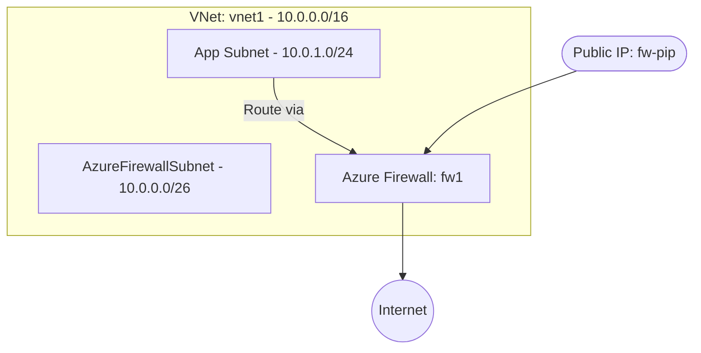

# Deploy a VNet with Azure Firewall for Centralized Traffic Inspection on Azure

This guide demonstrates how to use MechCloud's stateless IaC to provision a VNet with Azure Firewall for centralized egress filtering, network-level threat protection, and traffic inspection.

## Scenario Overview
**Use Case:** Centralized egress control and threat protection for all VNet traffic — required for regulated industries needing FQDN filtering, network/application rules, and IDPS capabilities beyond what NSGs provide.
**Key MechCloud Features Highlighted:**
- Hierarchical resource nesting (Resource Group → VNet → Subnets → Firewall)
- Cross-resource referencing (`ref:`)
- Complex firewall rules as nested YAML

### Architecture Diagram



***

### Complete Unified Template

```yaml
resources:
  - type: Microsoft.Resources/resourceGroups
    name: rg1
    location: "{{CURRENT_REGION}}"
    resources:
      - type: Microsoft.Network/virtualNetworks
        name: vnet1
        props:
          properties:
            addressSpace:
              addressPrefixes:
                - "10.0.0.0/16"
          resources:
            - type: Microsoft.Network/virtualNetworks/subnets
              name: AzureFirewallSubnet
              props:
                properties:
                  addressPrefix: "10.0.0.0/26"
            - type: Microsoft.Network/virtualNetworks/subnets
              name: app-subnet
              props:
                properties:
                  addressPrefix: "10.0.1.0/24"
                  routeTable:
                    id: "ref:rg1/fw-route-table"

      - type: Microsoft.Network/publicIPAddresses
        name: fw-pip
        props:
          sku:
            name: Standard
          properties:
            publicIPAllocationMethod: Static

      - type: Microsoft.Network/firewallPolicies
        name: fw-policy
        props:
          properties:
            sku:
              tier: Standard
            threatIntelMode: Alert
          resources:
            - type: Microsoft.Network/firewallPolicies/ruleCollectionGroups
              name: default-rules
              props:
                properties:
                  priority: 200
                  ruleCollections:
                    - name: allow-web
                      ruleCollectionType: FirewallPolicyFilterRuleCollection
                      priority: 100
                      action:
                        type: Allow
                      rules:
                        - name: allow-https
                          ruleType: ApplicationRule
                          sourceAddresses:
                            - "10.0.1.0/24"
                          protocols:
                            - protocolType: Https
                              port: 443
                          targetFqdns:
                            - "*.microsoft.com"
                            - "*.ubuntu.com"
                    - name: deny-malware
                      ruleCollectionType: FirewallPolicyFilterRuleCollection
                      priority: 200
                      action:
                        type: Deny
                      rules:
                        - name: block-bad-domains
                          ruleType: ApplicationRule
                          sourceAddresses:
                            - "*"
                          protocols:
                            - protocolType: Http
                              port: 80
                            - protocolType: Https
                              port: 443
                          targetFqdns:
                            - "malware.example.com"

      - type: Microsoft.Network/azureFirewalls
        name: fw1
        props:
          properties:
            sku:
              name: AZFW_VNet
              tier: Standard
            firewallPolicy:
              id: "ref:rg1/fw-policy"
            ipConfigurations:
              - name: fw-ipconfig
                properties:
                  subnet:
                    id: "ref:rg1/vnet1/AzureFirewallSubnet"
                  publicIPAddress:
                    id: "ref:rg1/fw-pip"

      - type: Microsoft.Network/routeTables
        name: fw-route-table
        props:
          properties:
            routes:
              - name: default-via-firewall
                properties:
                  addressPrefix: "0.0.0.0/0"
                  nextHopType: VirtualAppliance
                  nextHopIpAddress: "ref:rg1/fw1.privateIpAddress"
```
