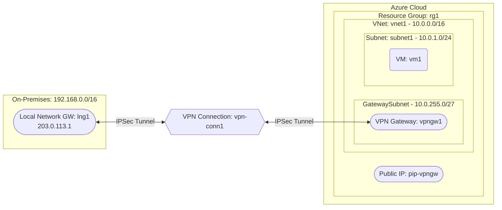

# Deploy a VNet with VPN Gateway for Site-to-Site VPN on Azure

This guide demonstrates how to use MechCloud's stateless Infrastructure-as-Code (IaC) to provision a Virtual Network with a VPN Gateway for establishing a site-to-site VPN connection to an on-premises network on Azure.

In this scenario, we create a VNet with a GatewaySubnet, a VPN Gateway, and a Local Network Gateway representing the on-premises VPN device. A site-to-site VPN connection is established between them for secure hybrid connectivity.

## Scenario Overview
**Use Case:** Securely extending an on-premises data center to Azure, enabling hybrid architectures where cloud workloads communicate with on-premises resources over an encrypted IPSec/IKE VPN tunnel.
**Key MechCloud Features Highlighted:**
- Hierarchical resource nesting (Resource Group → VNet → Subnet)
- Dynamic macros (`{{CURRENT_REGION}}`)
- Cross-resource referencing (`ref:`)
- VPN Gateway and site-to-site connection configuration

### Architecture Diagram



***

### Complete Unified Template

```yaml
resources:
  - type: Microsoft.Resources/resourceGroups
    name: rg1
    location: "{{CURRENT_REGION}}"
    resources:
      - type: Microsoft.Network/virtualNetworks
        name: vnet1
        props:
          properties:
            addressSpace:
              addressPrefixes:
                - "10.0.0.0/16"
          resources:
            - type: Microsoft.Network/virtualNetworks/subnets
              name: GatewaySubnet
              props:
                properties:
                  addressPrefix: "10.0.255.0/27"

            - type: Microsoft.Network/virtualNetworks/subnets
              name: subnet1
              props:
                properties:
                  addressPrefix: "10.0.1.0/24"

      - type: Microsoft.Network/networkSecurityGroups
        name: nsg1
        props:
          properties:
            securityRules:
              - name: AllowSSH
                properties:
                  priority: 100
                  direction: Inbound
                  access: Allow
                  protocol: Tcp
                  sourcePortRange: "*"
                  destinationPortRange: "22"
                  sourceAddressPrefix: "192.168.0.0/16"
                  destinationAddressPrefix: "*"

      - type: Microsoft.Network/publicIPAddresses
        name: pip-vpngw
        props:
          properties:
            publicIPAllocationMethod: Static
          sku:
            name: Standard

      - type: Microsoft.Network/virtualNetworkGateways
        name: vpngw1
        props:
          properties:
            gatewayType: Vpn
            vpnType: RouteBased
            sku:
              name: VpnGw1
              tier: VpnGw1
            ipConfigurations:
              - name: gwipconfig1
                properties:
                  publicIPAddress:
                    id: "ref:rg1/pip-vpngw"
                  subnet:
                    id: "ref:rg1/vnet1/GatewaySubnet"

      - type: Microsoft.Network/localNetworkGateways
        name: lng1
        props:
          properties:
            gatewayIpAddress: "203.0.113.1"
            localNetworkAddressSpace:
              addressPrefixes:
                - "192.168.0.0/16"

      - type: Microsoft.Network/connections
        name: vpn-conn1
        props:
          properties:
            connectionType: IPsec
            virtualNetworkGateway1:
              id: "ref:rg1/vpngw1"
            localNetworkGateway2:
              id: "ref:rg1/lng1"
            sharedKey: "YourSharedKeyHere123!"
            connectionProtocol: IKEv2

      - type: Microsoft.Network/networkInterfaces
        name: nic1
        props:
          properties:
            ipConfigurations:
              - name: ipconfig1
                properties:
                  subnet:
                    id: "ref:rg1/vnet1/subnet1"
            networkSecurityGroup:
              id: "ref:rg1/nsg1"

      - type: Microsoft.Compute/virtualMachines
        name: vm1
        props:
          properties:
            hardwareProfile:
              vmSize: Standard_B2ps_v2
            osProfile:
              computerName: mc-vpn-vm
              adminUsername: azureuser
            storageProfile:
              imageReference: "{{Image|arm64_ubuntu_24_04}}"
            networkProfile:
              networkInterfaces:
                - id: "ref:rg1/nic1"
```
