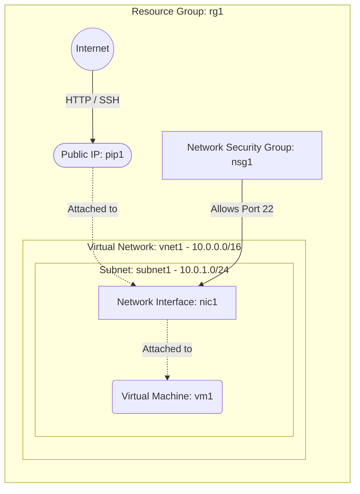

# Deploy a Public Web Application VM with a Public IP on Azure

This guide demonstrates how to use MechCloud's stateless Infrastructure-as-Code (IaC) to provision the foundational infrastructure for a public-facing web application or backend server on Azure. 

In this scenario, we will provision a Virtual Machine inside a Virtual Network (VNet). To make the application accessible to the internet, we will provision an Azure Public IP address and attach it to the VM's Network Interface. MechCloud's logical syntax makes it easy to visualize and deploy these resource relationships without managing complex state files.

## Scenario Overview
**Use Case:** Hosting a web application or API backend that requires a dedicated public IP address and external internet access, while securely restricting SSH access only to your current IP.
**Key MechCloud Features Highlighted:**
- Default scope inheritance (`resource_group: rg1`)
- Dynamic macros (`{{CURRENT_IP}}`)
- Cross-resource referencing (`ref:`)

### Architecture Diagram



***

## Step 1: Setting up Networking and Security

The first step is establishing the network boundary. We create a Virtual Network (VNet) and a subnet. We also define a Network Security Group (NSG) to control inbound traffic, ensuring SSH is securely restricted to your current IP.

```yaml
defaults:
  resource_group: rg1

resources:
  # 1. Define the Virtual Network and Subnet
  - type: "Microsoft.Network/virtualNetworks"
    api_version: "2025-05-01"
    name: vnet1
    props:
      address_space:
        address_prefixes:
          - "10.0.0.0/16"
      subnets:
        - name: subnet1
          props:
            address_prefixes:
              - "10.0.1.0/24"
              
  # 2. Security Group for SSH access
  - type: "Microsoft.Network/networkSecurityGroups"
    api_version: "2025-05-01"
    name: nsg1
    props:
      security_rules:
        - name: allow-ssh
          props:
            priority: 100
            direction: Inbound
            access: Allow
            protocol: Tcp
            source_port_range: "*"
            destination_port_range: "22"
            source_address_prefix: "{{CURRENT_IP}}/32"
            destination_address_prefix: "*"
```

## Step 2: Provisioning a Public IP and Network Interface

To ensure the web application has a static, reliable entry point that survives instance reboots, we allocate a Public IP. We then create a Network Interface (NIC) that ties together the subnet, the NSG, and the newly created Public IP.

```yaml
# ... (Continuing at the resources block) ...
  # 3. Create a Public IP
  - type: "Microsoft.Network/publicIPAddresses"
    api_version: "2025-05-01"
    name: pip1
    props:
      public_ip_allocation_method: Static
      sku:
        name: Standard

  # 4. Create the Network Interface and attach the Public IP
  - type: "Microsoft.Network/networkInterfaces"
    api_version: "2025-05-01"
    name: nic1
    props:
      network_security_group:
        id: "ref:nsg1"
      ip_configurations:
        - name: ipconfig1
          props:
            subnet:
              id: "ref:vnet1/subnets/subnet1"
            private_ip_allocation_method: Dynamic
            public_ip_address:
              id: "ref:pip1"
```

## Step 3: Provisioning a VM

With the networking foundation in place, we can provision the compute resource. We define a single ARM64 Virtual Machine running Ubuntu 24.04 and attach it to our configured Network Interface. Unlike our AWS template, we will rely exclusively on the root OS disk without attaching any additional standalone volumes.

```yaml
# ... (Continuing at the resources block) ...
  # 5. Create the Virtual Machine
  - type: "Microsoft.Compute/virtualMachines"
    api_version: "2025-04-01"
    name: vm1
    props:
      hardware_profile:
        vm_size: Standard_B2pts_v2
      os_profile:
        computer_name: testvm
        admin_username: azureuser
        admin_password: P@ssw0rd1234!
      network_profile:
        network_interfaces:
          - id: "ref:nic1"
      storage_profile:
        image_reference:
          publisher: Canonical
          offer: ubuntu-24_04-lts
          sku: server-arm64
          version: latest
        os_disk:
          create_option: FromImage
          managed_disk:
            storage_account_type: StandardSSD_LRS
```

### Complete Unified Template

For your convenience, here is the complete, unified MechCloud template combining all three steps:

```yaml
defaults:
  resource_group: rg1
resources:
  - type: "Microsoft.Network/virtualNetworks"
    api_version: "2025-05-01"
    name: vnet1
    props:
      address_space:
        address_prefixes:
          - "10.0.0.0/16"
      subnets:
        - name: subnet1
          props:
            address_prefixes:
              - "10.0.1.0/24"
              
  - type: "Microsoft.Network/networkSecurityGroups"
    api_version: "2025-05-01"
    name: nsg1
    props:
      security_rules:
        - name: allow-ssh
          props:
            priority: 100
            direction: Inbound
            access: Allow
            protocol: Tcp
            source_port_range: "*"
            destination_port_range: "22"
            source_address_prefix: "{{CURRENT_IP}}/32"
            destination_address_prefix: "*"
            
  - type: "Microsoft.Network/publicIPAddresses"
    api_version: "2025-05-01"
    name: pip1
    props:
      public_ip_allocation_method: Static
      sku:
        name: Standard
        
  - type: "Microsoft.Network/networkInterfaces"
    api_version: "2025-05-01"
    name: nic1
    props:
      network_security_group:
        id: "ref:nsg1"
      ip_configurations:
        - name: ipconfig1
          props:
            subnet:
              id: "ref:vnet1/subnets/subnet1"
            private_ip_allocation_method: Dynamic
            public_ip_address:
              id: "ref:pip1"
              
  - type: "Microsoft.Compute/virtualMachines"
    api_version: "2025-04-01"
    name: vm1
    props:
      hardware_profile:
        vm_size: Standard_B2pts_v2
      os_profile:
        computer_name: testvm
        admin_username: azureuser
        admin_password: P@ssw0rd1234!
      network_profile:
        network_interfaces:
          - id: "ref:nic1"
      storage_profile:
        image_reference:
          publisher: Canonical
          offer: ubuntu-24_04-lts
          sku: server-arm64
          version: latest
        os_disk:
          create_option: FromImage
          managed_disk:
            storage_account_type: StandardSSD_LRS
```
