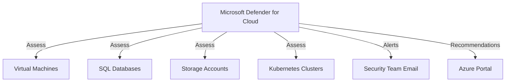

# Deploy Microsoft Defender for Cloud Configuration on Azure

This guide demonstrates how to use MechCloud's stateless IaC to enable Microsoft Defender for Cloud with security contacts and auto-provisioning for comprehensive cloud security posture management.

## Scenario Overview
**Use Case:** Centralized cloud security posture management (CSPM) and cloud workload protection (CWP) — continuously assessing resources against security benchmarks, detecting threats, and providing remediation recommendations across all Azure subscriptions.
**Key MechCloud Features Highlighted:**
- Simple security service enablement
- Cross-resource referencing (`ref:`)
- Security contacts and pricing tiers as clean YAML

### Architecture Diagram



***

### Complete Unified Template

```yaml
resources:
  - type: Microsoft.Resources/resourceGroups
    name: rg1
    location: "{{CURRENT_REGION}}"
    resources:
      - type: Microsoft.Security/pricings
        name: VirtualMachines
        props:
          properties:
            pricingTier: Standard

      - type: Microsoft.Security/pricings
        name: SqlServers
        props:
          properties:
            pricingTier: Standard

      - type: Microsoft.Security/pricings
        name: StorageAccounts
        props:
          properties:
            pricingTier: Standard

      - type: Microsoft.Security/pricings
        name: KubernetesService
        props:
          properties:
            pricingTier: Standard

      - type: Microsoft.Security/pricings
        name: KeyVaults
        props:
          properties:
            pricingTier: Standard

      - type: Microsoft.Security/securityContacts
        name: default
        props:
          properties:
            emails: "security-team@example.com"
            notificationsByRole:
              state: "On"
              roles:
                - Owner
                - ServiceAdmin
            alertNotifications:
              state: "On"
              minimalSeverity: Medium

      - type: Microsoft.Security/autoProvisioningSettings
        name: default
        props:
          properties:
            autoProvision: "On"

      - type: Microsoft.Insights/actionGroups
        name: security-alerts
        props:
          properties:
            enabled: true
            groupShortName: sec-alerts
            emailReceivers:
              - name: security-team
                emailAddress: "security-team@example.com"
                useCommonAlertSchema: true
```
