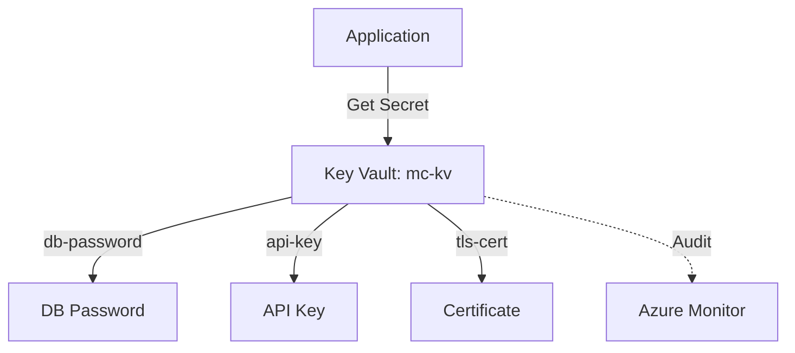

# Deploy Azure Key Vault with Secrets and Access Policies on Azure

This guide demonstrates how to use MechCloud's stateless IaC to provision an Azure Key Vault for centralized secrets, keys, and certificate management with fine-grained access control.

## Scenario Overview
**Use Case:** Centralized secrets management for database credentials, API keys, certificates, and encryption keys — eliminating hardcoded secrets in application code and enabling audit logging of all secret access.
**Key MechCloud Features Highlighted:**
- Hierarchical resource nesting (Resource Group → Key Vault → Secrets)
- Cross-resource referencing (`ref:`)
- Access policies as nested YAML

### Architecture Diagram



***

### Complete Unified Template

```yaml
resources:
  - type: Microsoft.Resources/resourceGroups
    name: rg1
    location: "{{CURRENT_REGION}}"
    resources:
      - type: Microsoft.KeyVault/vaults
        name: mc-kv
        props:
          properties:
            sku:
              family: A
              name: standard
            tenantId: "{{TENANT_ID}}"
            enableSoftDelete: true
            softDeleteRetentionInDays: 90
            enablePurgeProtection: true
            enableRbacAuthorization: false
            enabledForDeployment: false
            enabledForDiskEncryption: true
            enabledForTemplateDeployment: false
            accessPolicies:
              - tenantId: "{{TENANT_ID}}"
                objectId: "{{OBJECT_ID}}"
                permissions:
                  keys:
                    - get
                    - list
                    - create
                    - delete
                  secrets:
                    - get
                    - list
                    - set
                    - delete
                  certificates:
                    - get
                    - list
                    - create
                    - delete
            networkAcls:
              defaultAction: Allow
              bypass: AzureServices
          resources:
            - type: Microsoft.KeyVault/vaults/secrets
              name: db-password
              props:
                properties:
                  value: "ChangeMe123!"
                  contentType: "text/plain"
                  attributes:
                    enabled: true
            - type: Microsoft.KeyVault/vaults/secrets
              name: api-key
              props:
                properties:
                  value: "sk-placeholder-api-key"
                  contentType: "text/plain"
                  attributes:
                    enabled: true

      - type: Microsoft.Insights/diagnosticSettings
        name: kv-diagnostics
        props:
          scope: "ref:rg1/mc-kv"
          properties:
            logs:
              - category: AuditEvent
                enabled: true
                retentionPolicy:
                  days: 90
                  enabled: true
```
