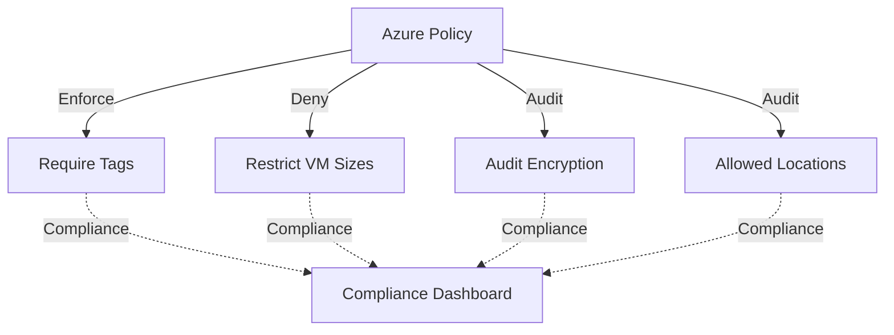

# Deploy Azure Policy Assignments for Governance on Azure

This guide demonstrates how to use MechCloud's stateless IaC to provision Azure Policy assignments for automated governance, compliance enforcement, and cost control.

## Scenario Overview
**Use Case:** Automated governance that enforces organizational standards — requiring tags on resources, restricting VM sizes for cost control, enforcing encryption, and auditing non-compliant resources for regulatory compliance.
**Key MechCloud Features Highlighted:**
- Policy definition and assignment as clean YAML
- Parameter configuration inline
- Multiple policy assignments in a single template

### Architecture Diagram



***

### Complete Unified Template

```yaml
resources:
  - type: Microsoft.Resources/resourceGroups
    name: rg1
    location: "{{CURRENT_REGION}}"
    resources:
      # Custom policy: require CostCenter tag
      - type: Microsoft.Authorization/policyDefinitions
        name: require-costcenter-tag
        props:
          properties:
            displayName: "Require CostCenter tag on resources"
            description: "Enforces a CostCenter tag on all resources"
            policyType: Custom
            mode: Indexed
            policyRule:
              if:
                field: "tags['CostCenter']"
                exists: false
              then:
                effect: deny

      # Assign: require CostCenter tag
      - type: Microsoft.Authorization/policyAssignments
        name: assign-costcenter-tag
        props:
          properties:
            displayName: "Require CostCenter tag"
            policyDefinitionId: "ref:rg1/require-costcenter-tag"
            enforcementMode: Default

      # Built-in: allowed VM sizes
      - type: Microsoft.Authorization/policyAssignments
        name: allowed-vm-sizes
        props:
          properties:
            displayName: "Restrict to cost-effective VM sizes"
            policyDefinitionId: "/providers/Microsoft.Authorization/policyDefinitions/cccc23c7-8427-4f53-ad12-b6a63eb452b3"
            parameters:
              listOfAllowedSKUs:
                value:
                  - Standard_B2ps_v2
                  - Standard_B4ps_v2
                  - Standard_D2ps_v5
                  - Standard_D4ps_v5
            enforcementMode: Default

      # Built-in: allowed locations
      - type: Microsoft.Authorization/policyAssignments
        name: allowed-locations
        props:
          properties:
            displayName: "Restrict resource locations"
            policyDefinitionId: "/providers/Microsoft.Authorization/policyDefinitions/e56962a6-4747-49cd-b67b-bf8b01975c4c"
            parameters:
              listOfAllowedLocations:
                value:
                  - eastus
                  - eastus2
                  - westus2
                  - westeurope
            enforcementMode: Default

      # Built-in: audit unencrypted SQL databases
      - type: Microsoft.Authorization/policyAssignments
        name: audit-sql-encryption
        props:
          properties:
            displayName: "Audit SQL databases without TDE"
            policyDefinitionId: "/providers/Microsoft.Authorization/policyDefinitions/17k78e20-9358-41c9-923c-fb736d382a4d"
            enforcementMode: Default
```
