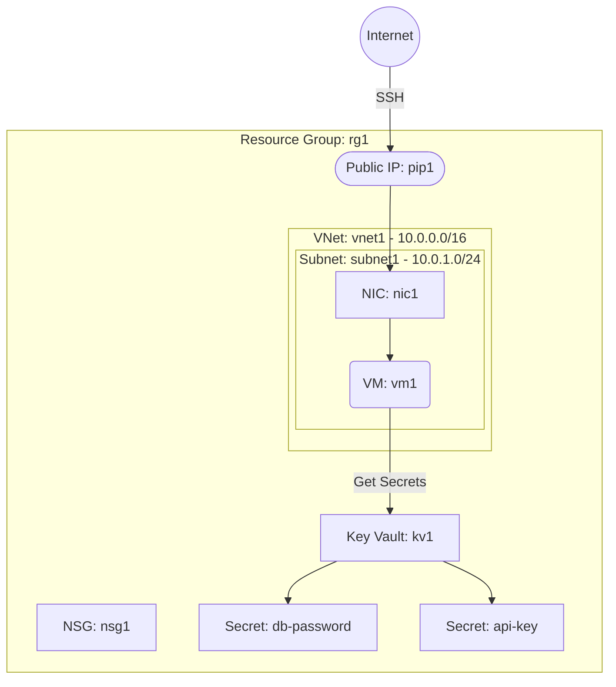

# Deploy a VM with Azure Key Vault for Secrets Management on Azure

This guide demonstrates how to use MechCloud's stateless Infrastructure-as-Code (IaC) to provision a Virtual Machine with Azure Key Vault for centralized secrets management on Azure.

In this scenario, we deploy a VM alongside an Azure Key Vault that stores application secrets, database connection strings, and API keys. Key Vault provides secure, audited access to sensitive configuration data with fine-grained access policies.

## Scenario Overview
**Use Case:** An application that needs to securely store and retrieve secrets (e.g., database passwords, API keys, certificates) without hardcoding them in application code or configuration files.
**Key MechCloud Features Highlighted:**
- Hierarchical resource nesting (Resource Group → VNet → Subnet → VM)
- Dynamic macros (`{{CURRENT_REGION}}`, `{{CURRENT_IP}}`, `{{Image|arm64_ubuntu_24_04}}`)
- Cross-resource referencing (`ref:`)
- Azure Key Vault with access policies and secrets

### Architecture Diagram



***

### Complete Unified Template

```yaml
resources:
  - type: Microsoft.Resources/resourceGroups
    name: rg1
    location: "{{CURRENT_REGION}}"
    resources:
      - type: Microsoft.Network/virtualNetworks
        name: vnet1
        props:
          properties:
            addressSpace:
              addressPrefixes:
                - "10.0.0.0/16"
          resources:
            - type: Microsoft.Network/virtualNetworks/subnets
              name: subnet1
              props:
                properties:
                  addressPrefix: "10.0.1.0/24"

      - type: Microsoft.Network/networkSecurityGroups
        name: nsg1
        props:
          properties:
            securityRules:
              - name: AllowSSH
                properties:
                  priority: 100
                  direction: Inbound
                  access: Allow
                  protocol: Tcp
                  sourcePortRange: "*"
                  destinationPortRange: "22"
                  sourceAddressPrefix: "{{CURRENT_IP}}/32"
                  destinationAddressPrefix: "*"

      - type: Microsoft.Network/publicIPAddresses
        name: pip1
        props:
          properties:
            publicIPAllocationMethod: Static
          sku:
            name: Standard

      - type: Microsoft.Network/networkInterfaces
        name: nic1
        props:
          properties:
            ipConfigurations:
              - name: ipconfig1
                properties:
                  subnet:
                    id: "ref:rg1/vnet1/subnet1"
                  publicIPAddress:
                    id: "ref:rg1/pip1"
            networkSecurityGroup:
              id: "ref:rg1/nsg1"

      - type: Microsoft.Compute/virtualMachines
        name: vm1
        props:
          properties:
            hardwareProfile:
              vmSize: Standard_B2ps_v2
            osProfile:
              computerName: mc-kv-vm
              adminUsername: azureuser
            storageProfile:
              imageReference: "{{Image|arm64_ubuntu_24_04}}"
            networkProfile:
              networkInterfaces:
                - id: "ref:rg1/nic1"

      - type: Microsoft.KeyVault/vaults
        name: kv1
        props:
          properties:
            sku:
              family: A
              name: standard
            tenantId: "{{TENANT_ID}}"
            enableSoftDelete: true
            softDeleteRetentionInDays: 90
            enableRbacAuthorization: true
          resources:
            - type: Microsoft.KeyVault/vaults/secrets
              name: db-password
              props:
                properties:
                  value: "ChangeMe123!"

            - type: Microsoft.KeyVault/vaults/secrets
              name: api-key
              props:
                properties:
                  value: "your-api-key-here"
```
