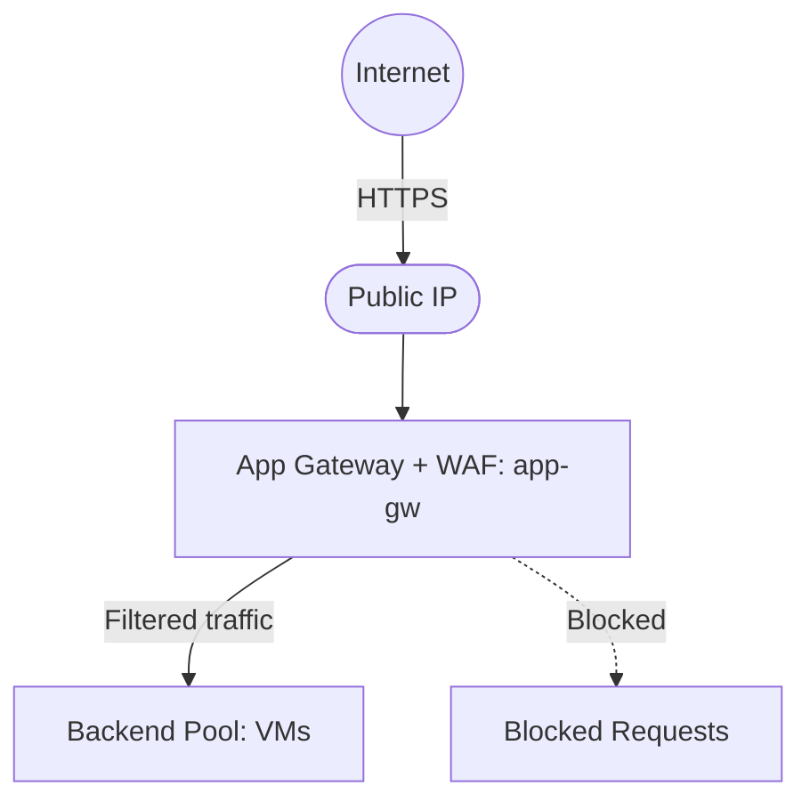

# Deploy WAF with Application Gateway on Azure

This guide demonstrates how to use MechCloud's stateless IaC to provision an Application Gateway with Web Application Firewall (WAF) for web application protection against OWASP threats.

## Scenario Overview
**Use Case:** Protecting web applications from common attacks like SQL injection, XSS, and CSRF using OWASP Core Rule Set — while also providing Layer 7 load balancing, SSL termination, and URL-based routing.
**Key MechCloud Features Highlighted:**
- Hierarchical resource nesting (Resource Group → VNet → App Gateway)
- Cross-resource referencing (`ref:`)
- WAF policy and rules as nested YAML

### Architecture Diagram



***

### Complete Unified Template

```yaml
resources:
  - type: Microsoft.Resources/resourceGroups
    name: rg1
    location: "{{CURRENT_REGION}}"
    resources:
      - type: Microsoft.Network/virtualNetworks
        name: vnet1
        props:
          properties:
            addressSpace:
              addressPrefixes:
                - "10.0.0.0/16"
          resources:
            - type: Microsoft.Network/virtualNetworks/subnets
              name: agw-subnet
              props:
                properties:
                  addressPrefix: "10.0.0.0/24"
            - type: Microsoft.Network/virtualNetworks/subnets
              name: backend-subnet
              props:
                properties:
                  addressPrefix: "10.0.1.0/24"

      - type: Microsoft.Network/publicIPAddresses
        name: agw-pip
        props:
          sku:
            name: Standard
          properties:
            publicIPAllocationMethod: Static

      - type: Microsoft.Network/ApplicationGatewayWebApplicationFirewallPolicies
        name: waf-policy
        props:
          properties:
            policySettings:
              requestBodyCheck: true
              maxRequestBodySizeInKb: 128
              fileUploadLimitInMb: 100
              state: Enabled
              mode: Prevention
            managedRules:
              managedRuleSets:
                - ruleSetType: OWASP
                  ruleSetVersion: "3.2"
              exclusions: []
            customRules:
              - name: block-bad-bots
                priority: 1
                ruleType: MatchRule
                action: Block
                matchConditions:
                  - matchVariables:
                      - variableName: RequestHeaders
                        selector: User-Agent
                    operator: Contains
                    matchValues:
                      - "BadBot"
                      - "EvilCrawler"

      - type: Microsoft.Network/applicationGateways
        name: app-gw
        props:
          properties:
            sku:
              name: WAF_v2
              tier: WAF_v2
              capacity: 2
            firewallPolicy:
              id: "ref:rg1/waf-policy"
            gatewayIPConfigurations:
              - name: gateway-ip-config
                properties:
                  subnet:
                    id: "ref:rg1/vnet1/agw-subnet"
            frontendIPConfigurations:
              - name: frontend-ip
                properties:
                  publicIPAddress:
                    id: "ref:rg1/agw-pip"
            frontendPorts:
              - name: port-80
                properties:
                  port: 80
            backendAddressPools:
              - name: backend-pool
                properties:
                  backendAddresses:
                    - ipAddress: "10.0.1.10"
                    - ipAddress: "10.0.1.11"
            backendHttpSettingsCollection:
              - name: http-settings
                properties:
                  port: 80
                  protocol: Http
                  requestTimeout: 30
                  pickHostNameFromBackendAddress: false
            httpListeners:
              - name: http-listener
                properties:
                  frontendIPConfiguration:
                    id: "ref:rg1/app-gw.frontendIPConfigurations[0]"
                  frontendPort:
                    id: "ref:rg1/app-gw.frontendPorts[0]"
                  protocol: Http
            requestRoutingRules:
              - name: routing-rule
                properties:
                  ruleType: Basic
                  priority: 100
                  httpListener:
                    id: "ref:rg1/app-gw.httpListeners[0]"
                  backendAddressPool:
                    id: "ref:rg1/app-gw.backendAddressPools[0]"
                  backendHttpSettings:
                    id: "ref:rg1/app-gw.backendHttpSettingsCollection[0]"
```
