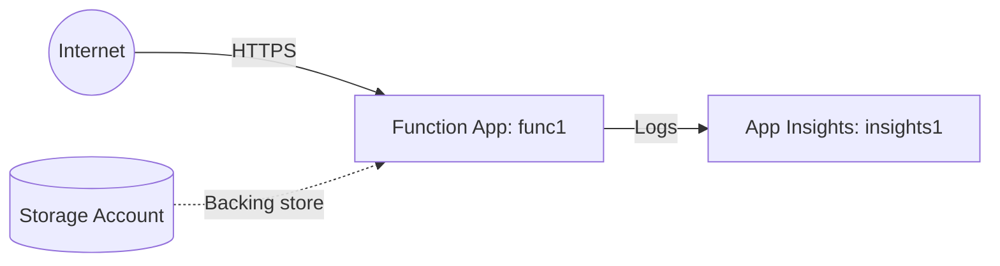

# Deploy an Azure Function App with HTTP Trigger on Azure

This guide demonstrates how to use MechCloud's stateless IaC to provision an Azure Function App with a consumption plan for serverless HTTP endpoints.

## Scenario Overview
**Use Case:** A serverless REST API that scales automatically and costs nothing when idle — ideal for webhooks, microservices, and lightweight APIs with variable traffic patterns.
**Key MechCloud Features Highlighted:**
- Hierarchical resource nesting (Resource Group → resources)
- Cross-resource referencing (`ref:`)
- Serverless compute without infrastructure management

### Architecture Diagram



***

### Complete Unified Template

```yaml
resources:
  - type: Microsoft.Resources/resourceGroups
    name: rg1
    location: "{{CURRENT_REGION}}"
    resources:
      - type: Microsoft.Storage/storageAccounts
        name: mcfuncstorage1
        props:
          kind: StorageV2
          sku:
            name: Standard_LRS
          properties:
            supportsHttpsTrafficOnly: true
            minimumTlsVersion: TLS1_2

      - type: Microsoft.Insights/components
        name: insights1
        props:
          kind: web
          properties:
            Application_Type: web
            RetentionInDays: 30

      - type: Microsoft.Web/serverfarms
        name: plan1
        props:
          sku:
            name: Y1
            tier: Dynamic
          properties:
            reserved: true

      - type: Microsoft.Web/sites
        name: func1
        props:
          kind: functionapp,linux
          properties:
            serverFarmId: "ref:rg1/plan1"
            httpsOnly: true
            siteConfig:
              linuxFxVersion: "Python|3.11"
              appSettings:
                - name: AzureWebJobsStorage
                  value: "ref:rg1/mcfuncstorage1.connectionString"
                - name: FUNCTIONS_EXTENSION_VERSION
                  value: "~4"
                - name: FUNCTIONS_WORKER_RUNTIME
                  value: python
                - name: APPINSIGHTS_INSTRUMENTATIONKEY
                  value: "ref:rg1/insights1.instrumentationKey"
```
