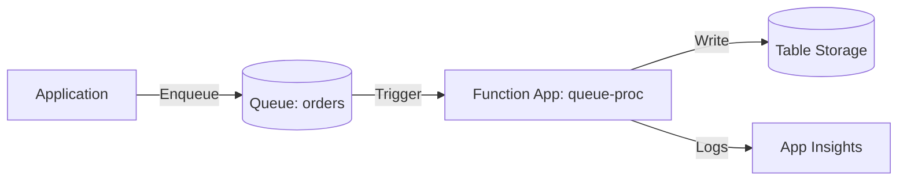

# Deploy an Azure Function App with Queue Storage Trigger on Azure

This guide demonstrates how to use MechCloud's stateless IaC to provision an Azure Function App triggered by Queue Storage messages for asynchronous processing.

## Scenario Overview
**Use Case:** Asynchronous message processing where a Function App automatically processes messages from a Storage Queue — ideal for order processing, email sending, image resizing, and any workload that benefits from decoupled producer-consumer patterns.
**Key MechCloud Features Highlighted:**
- Hierarchical resource nesting (Resource Group → resources)
- Cross-resource referencing (`ref:`)
- Queue and function configuration in a single template

### Architecture Diagram



***

### Complete Unified Template

```yaml
resources:
  - type: Microsoft.Resources/resourceGroups
    name: rg1
    location: "{{CURRENT_REGION}}"
    resources:
      - type: Microsoft.Storage/storageAccounts
        name: mcqueuestorage1
        props:
          kind: StorageV2
          sku:
            name: Standard_LRS
          properties:
            supportsHttpsTrafficOnly: true
            minimumTlsVersion: TLS1_2
          resources:
            - type: Microsoft.Storage/storageAccounts/queueServices
              name: default
              resources:
                - type: Microsoft.Storage/storageAccounts/queueServices/queues
                  name: orders
                - type: Microsoft.Storage/storageAccounts/queueServices/queues
                  name: orders-poison

      - type: Microsoft.Insights/components
        name: insights1
        props:
          kind: web
          properties:
            Application_Type: web

      - type: Microsoft.Web/serverfarms
        name: plan1
        props:
          sku:
            name: Y1
            tier: Dynamic
          properties:
            reserved: true

      - type: Microsoft.Web/sites
        name: queue-proc
        props:
          kind: functionapp,linux
          properties:
            serverFarmId: "ref:rg1/plan1"
            httpsOnly: true
            siteConfig:
              linuxFxVersion: "Python|3.11"
              appSettings:
                - name: AzureWebJobsStorage
                  value: "ref:rg1/mcqueuestorage1.connectionString"
                - name: FUNCTIONS_EXTENSION_VERSION
                  value: "~4"
                - name: FUNCTIONS_WORKER_RUNTIME
                  value: python
                - name: APPINSIGHTS_INSTRUMENTATIONKEY
                  value: "ref:rg1/insights1.instrumentationKey"
                - name: QUEUE_NAME
                  value: orders
```
