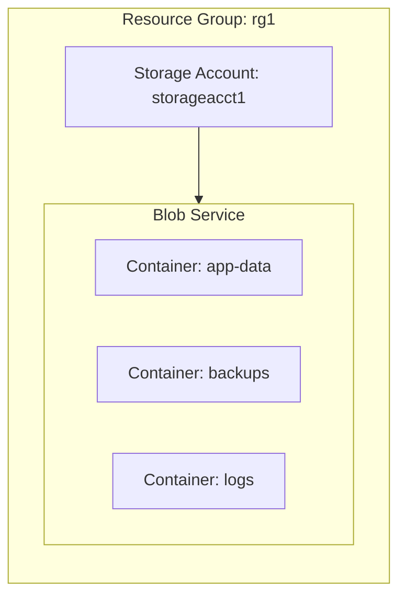

# Deploy a Storage Account with Blob Container on Azure

This guide demonstrates how to use MechCloud's stateless Infrastructure-as-Code (IaC) to provision an Azure Storage Account with a Blob Container for object storage.

In this scenario, we will provision a Storage Account with a Blob Container that can be used for storing application data, backups, static website assets, or log files. The storage account is configured with secure defaults including HTTPS-only access and a private access level on the container.

## Scenario Overview
**Use Case:** Setting up cloud object storage for application data, static assets, log archival, or backup storage with secure access controls.
**Key MechCloud Features Highlighted:**
- Default scope inheritance (`resource_group: rg1`)
- Cross-resource referencing (`ref:`)
- Non-compute Azure resource provisioning

### Architecture Diagram



***

## Step 1: Creating the Storage Account

We provision a Standard general-purpose v2 Storage Account with locally redundant storage (LRS) and HTTPS-only access enforced.

```yaml
defaults:
  resource_group: rg1

resources:
  # 1. Create the Storage Account
  - type: "Microsoft.Storage/storageAccounts"
    api_version: "2024-01-01"
    name: storageacct1
    props:
      sku:
        name: Standard_LRS
      kind: StorageV2
      enable_https_traffic_only: true
      minimum_tls_version: TLS1_2
      allow_blob_public_access: false
```

## Step 2: Creating Blob Containers

We create three Blob Containers inside the Storage Account for different purposes: application data, backups, and logs. All containers are set to private access.

```yaml
# ... (Continuing at the resources block) ...
  # 2. Blob Container for application data
  - type: "Microsoft.Storage/storageAccounts/blobServices/containers"
    api_version: "2024-01-01"
    name: "storageacct1/default/app-data"
    props:
      public_access: None

  # 3. Blob Container for backups
  - type: "Microsoft.Storage/storageAccounts/blobServices/containers"
    api_version: "2024-01-01"
    name: "storageacct1/default/backups"
    props:
      public_access: None

  # 4. Blob Container for logs
  - type: "Microsoft.Storage/storageAccounts/blobServices/containers"
    api_version: "2024-01-01"
    name: "storageacct1/default/logs"
    props:
      public_access: None
```

### Complete Unified Template

For your convenience, here is the complete, unified MechCloud template combining all steps:

```yaml
defaults:
  resource_group: rg1
resources:
  - type: "Microsoft.Storage/storageAccounts"
    api_version: "2024-01-01"
    name: storageacct1
    props:
      sku:
        name: Standard_LRS
      kind: StorageV2
      enable_https_traffic_only: true
      minimum_tls_version: TLS1_2
      allow_blob_public_access: false

  - type: "Microsoft.Storage/storageAccounts/blobServices/containers"
    api_version: "2024-01-01"
    name: "storageacct1/default/app-data"
    props:
      public_access: None

  - type: "Microsoft.Storage/storageAccounts/blobServices/containers"
    api_version: "2024-01-01"
    name: "storageacct1/default/backups"
    props:
      public_access: None

  - type: "Microsoft.Storage/storageAccounts/blobServices/containers"
    api_version: "2024-01-01"
    name: "storageacct1/default/logs"
    props:
      public_access: None
```
