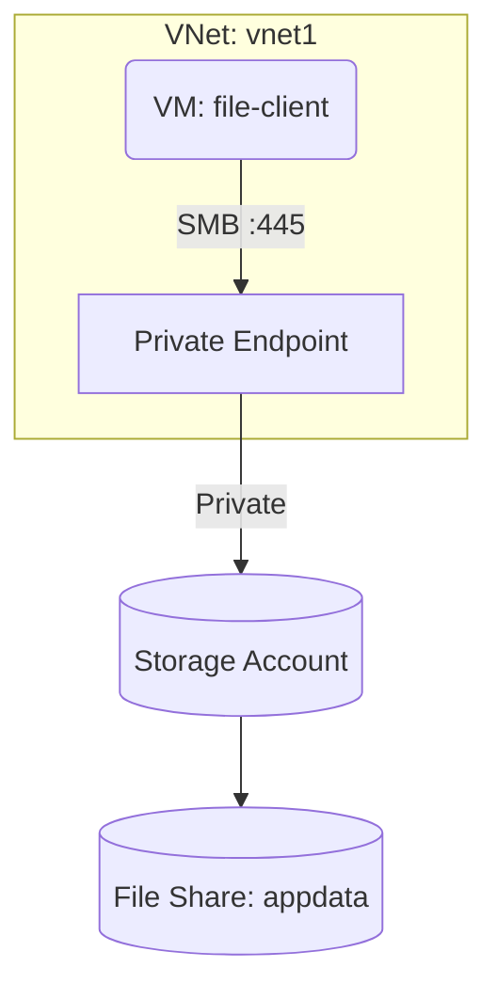

# Deploy Azure Files Share with Private Endpoint on Azure

This guide demonstrates how to use MechCloud's stateless IaC to provision an Azure Files share with SMB/NFS access and a private endpoint for secure connectivity.

## Scenario Overview
**Use Case:** A fully managed cloud file share accessible via SMB or NFS protocols — ideal for lift-and-shift migrations, shared application data, and replacing on-premises file servers with a serverless alternative.
**Key MechCloud Features Highlighted:**
- Hierarchical resource nesting (Resource Group → Storage → File Share)
- Cross-resource referencing (`ref:`)
- Private endpoint configuration for secure access

### Architecture Diagram



***

### Complete Unified Template

```yaml
resources:
  - type: Microsoft.Resources/resourceGroups
    name: rg1
    location: "{{CURRENT_REGION}}"
    resources:
      - type: Microsoft.Network/virtualNetworks
        name: vnet1
        props:
          properties:
            addressSpace:
              addressPrefixes:
                - "10.0.0.0/16"
          resources:
            - type: Microsoft.Network/virtualNetworks/subnets
              name: app-subnet
              props:
                properties:
                  addressPrefix: "10.0.1.0/24"
            - type: Microsoft.Network/virtualNetworks/subnets
              name: pe-subnet
              props:
                properties:
                  addressPrefix: "10.0.2.0/24"
                  privateEndpointNetworkPolicies: Disabled

      - type: Microsoft.Storage/storageAccounts
        name: mcfilestorage1
        props:
          kind: StorageV2
          sku:
            name: Premium_LRS
          properties:
            supportsHttpsTrafficOnly: true
            minimumTlsVersion: TLS1_2
            publicNetworkAccess: Disabled
            largeFileSharesState: Enabled
          resources:
            - type: Microsoft.Storage/storageAccounts/fileServices
              name: default
              resources:
                - type: Microsoft.Storage/storageAccounts/fileServices/shares
                  name: appdata
                  props:
                    properties:
                      shareQuota: 100
                      enabledProtocols: SMB
                      accessTier: Premium
                - type: Microsoft.Storage/storageAccounts/fileServices/shares
                  name: backups
                  props:
                    properties:
                      shareQuota: 500
                      enabledProtocols: SMB
                      accessTier: Premium

      - type: Microsoft.Network/privateDnsZones
        name: files-dns
        props:
          name: "privatelink.file.core.windows.net"
          resources:
            - type: Microsoft.Network/privateDnsZones/virtualNetworkLinks
              name: files-dns-link
              props:
                properties:
                  virtualNetwork:
                    id: "ref:rg1/vnet1"
                  registrationEnabled: false

      - type: Microsoft.Network/privateEndpoints
        name: files-pe
        props:
          properties:
            subnet:
              id: "ref:rg1/vnet1/pe-subnet"
            privateLinkServiceConnections:
              - name: files-connection
                properties:
                  privateLinkServiceId: "ref:rg1/mcfilestorage1"
                  groupIds:
                    - file
          resources:
            - type: Microsoft.Network/privateEndpoints/privateDnsZoneGroups
              name: files-dns-group
              props:
                properties:
                  privateDnsZoneConfigs:
                    - name: config1
                      properties:
                        privateDnsZoneId: "ref:rg1/files-dns"
```
