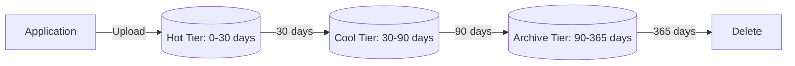

# Deploy Storage Account with Blob Lifecycle Management on Azure

This guide demonstrates how to use MechCloud's stateless IaC to provision a Storage Account with lifecycle management policies for automated tier transitions and data retention.

## Scenario Overview
**Use Case:** Automated data lifecycle management that moves blobs from Hot to Cool to Archive tiers based on age — reducing storage costs by up to 90% for infrequently accessed data while maintaining accessibility.
**Key MechCloud Features Highlighted:**
- Hierarchical resource nesting (Resource Group → Storage → Containers → Lifecycle)
- Cross-resource referencing (`ref:`)
- Lifecycle rules as clean YAML

### Architecture Diagram



***

### Complete Unified Template

```yaml
resources:
  - type: Microsoft.Resources/resourceGroups
    name: rg1
    location: "{{CURRENT_REGION}}"
    resources:
      - type: Microsoft.Storage/storageAccounts
        name: mclifecyclestorage1
        props:
          kind: StorageV2
          sku:
            name: Standard_LRS
          properties:
            accessTier: Hot
            supportsHttpsTrafficOnly: true
            minimumTlsVersion: TLS1_2
            allowBlobPublicAccess: false
          resources:
            - type: Microsoft.Storage/storageAccounts/blobServices
              name: default
              resources:
                - type: Microsoft.Storage/storageAccounts/blobServices/containers
                  name: documents
                  props:
                    properties:
                      publicAccess: None
                - type: Microsoft.Storage/storageAccounts/blobServices/containers
                  name: logs
                  props:
                    properties:
                      publicAccess: None
            - type: Microsoft.Storage/storageAccounts/managementPolicies
              name: default
              props:
                properties:
                  policy:
                    rules:
                      - name: move-to-cool
                        enabled: true
                        type: Lifecycle
                        definition:
                          filters:
                            blobTypes:
                              - blockBlob
                            prefixMatch:
                              - documents/
                          actions:
                            baseBlob:
                              tierToCool:
                                daysAfterModificationGreaterThan: 30
                              tierToArchive:
                                daysAfterModificationGreaterThan: 90
                              delete:
                                daysAfterModificationGreaterThan: 365
                            snapshot:
                              delete:
                                daysAfterCreationGreaterThan: 90
                      - name: delete-old-logs
                        enabled: true
                        type: Lifecycle
                        definition:
                          filters:
                            blobTypes:
                              - blockBlob
                            prefixMatch:
                              - logs/
                          actions:
                            baseBlob:
                              tierToCool:
                                daysAfterModificationGreaterThan: 7
                              delete:
                                daysAfterModificationGreaterThan: 30
```
