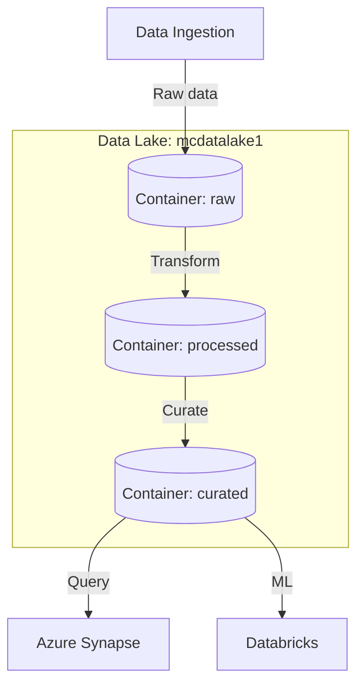

# Deploy Azure Data Lake Storage Gen2 on Azure

This guide demonstrates how to use MechCloud's stateless IaC to provision Azure Data Lake Storage Gen2 with hierarchical namespace for big data analytics workloads.

## Scenario Overview
**Use Case:** A scalable data lake for storing structured and unstructured data with hierarchical file system semantics — ideal for big data analytics with Azure Synapse, Databricks, and HDInsight, supporting ABFS protocol and fine-grained ACLs.
**Key MechCloud Features Highlighted:**
- Hierarchical resource nesting (Resource Group → Storage → Containers)
- Cross-resource referencing (`ref:`)
- Data Lake-specific configuration as clean YAML

### Architecture Diagram



***

### Complete Unified Template

```yaml
resources:
  - type: Microsoft.Resources/resourceGroups
    name: rg1
    location: "{{CURRENT_REGION}}"
    resources:
      - type: Microsoft.Storage/storageAccounts
        name: mcdatalake1
        props:
          kind: StorageV2
          sku:
            name: Standard_GRS
          properties:
            isHnsEnabled: true
            supportsHttpsTrafficOnly: true
            minimumTlsVersion: TLS1_2
            allowBlobPublicAccess: false
            networkAcls:
              defaultAction: Deny
              bypass: AzureServices
              ipRules:
                - value: "{{CURRENT_IP}}"
                  action: Allow
          resources:
            - type: Microsoft.Storage/storageAccounts/blobServices
              name: default
              props:
                properties:
                  deleteRetentionPolicy:
                    enabled: true
                    days: 30
                  containerDeleteRetentionPolicy:
                    enabled: true
                    days: 7
              resources:
                - type: Microsoft.Storage/storageAccounts/blobServices/containers
                  name: raw
                  props:
                    properties:
                      publicAccess: None
                      metadata:
                        zone: landing
                - type: Microsoft.Storage/storageAccounts/blobServices/containers
                  name: processed
                  props:
                    properties:
                      publicAccess: None
                      metadata:
                        zone: silver
                - type: Microsoft.Storage/storageAccounts/blobServices/containers
                  name: curated
                  props:
                    properties:
                      publicAccess: None
                      metadata:
                        zone: gold
            - type: Microsoft.Storage/storageAccounts/managementPolicies
              name: default
              props:
                properties:
                  policy:
                    rules:
                      - name: archive-raw-data
                        enabled: true
                        type: Lifecycle
                        definition:
                          filters:
                            blobTypes:
                              - blockBlob
                            prefixMatch:
                              - raw/
                          actions:
                            baseBlob:
                              tierToCool:
                                daysAfterModificationGreaterThan: 30
                              tierToArchive:
                                daysAfterModificationGreaterThan: 180
```
